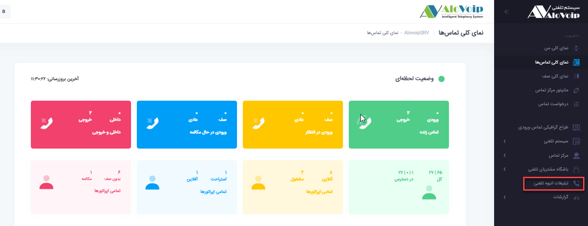
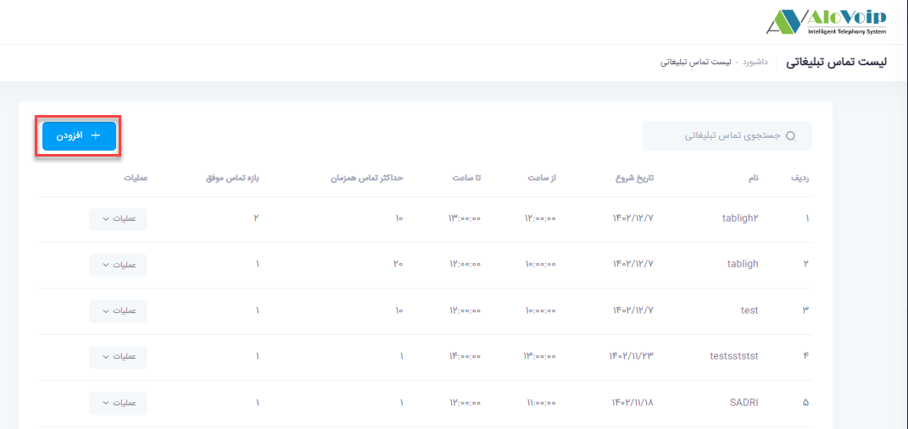
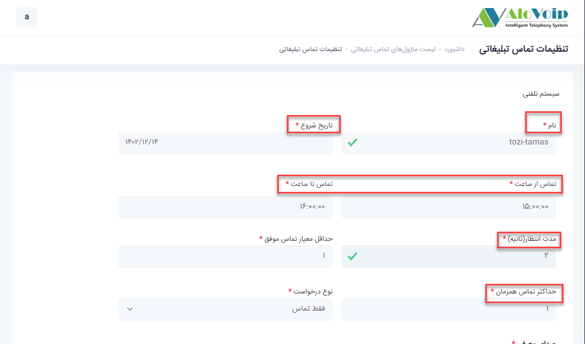
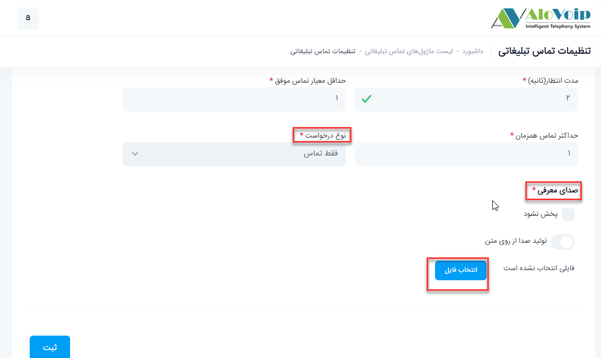
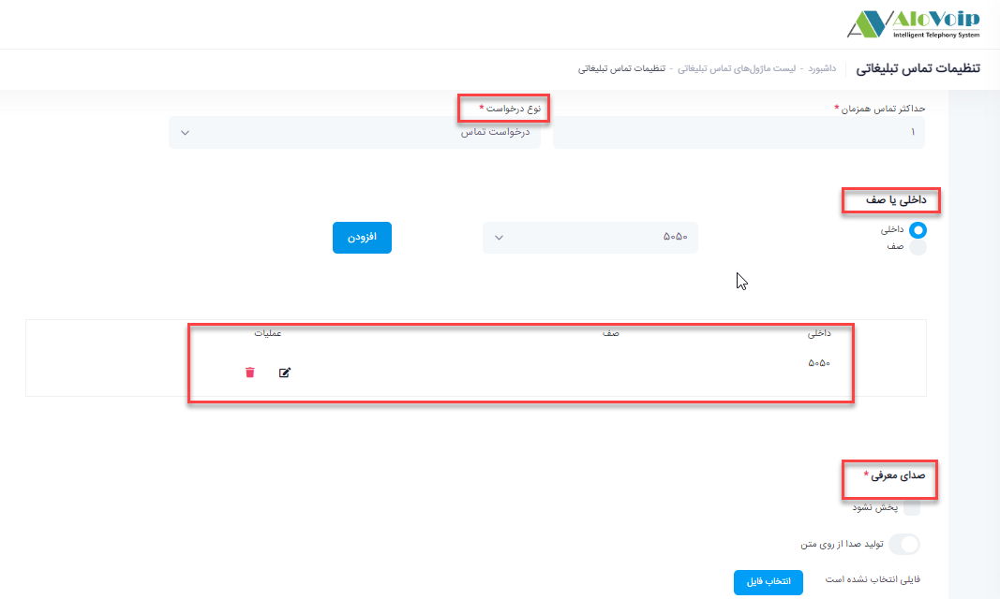
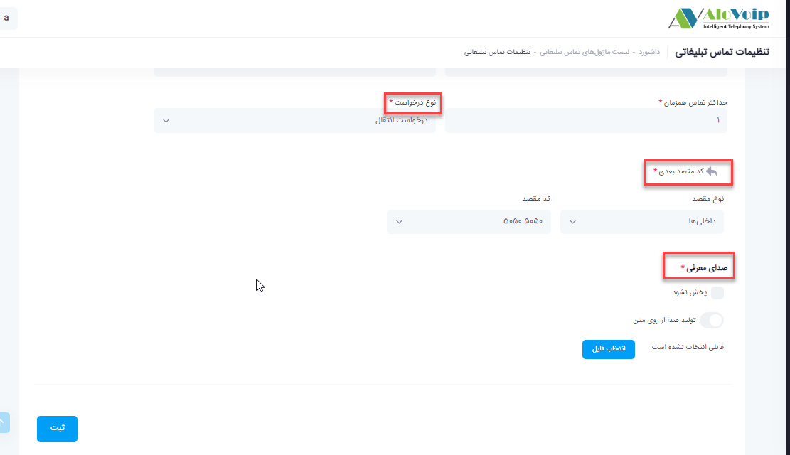
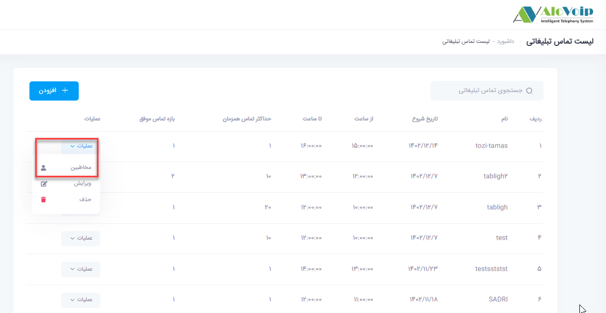
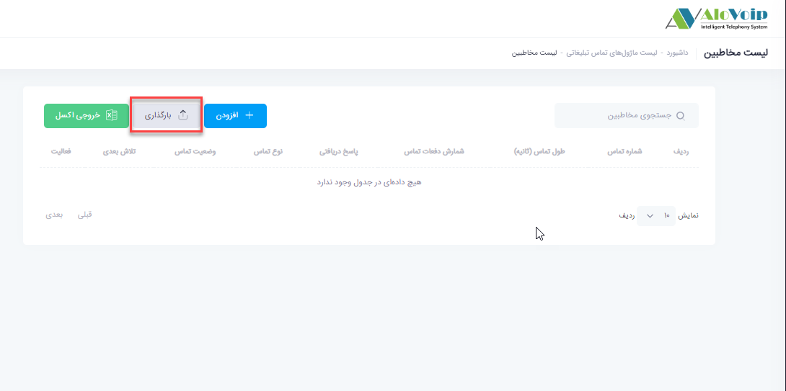
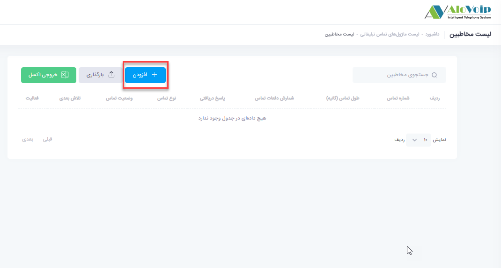
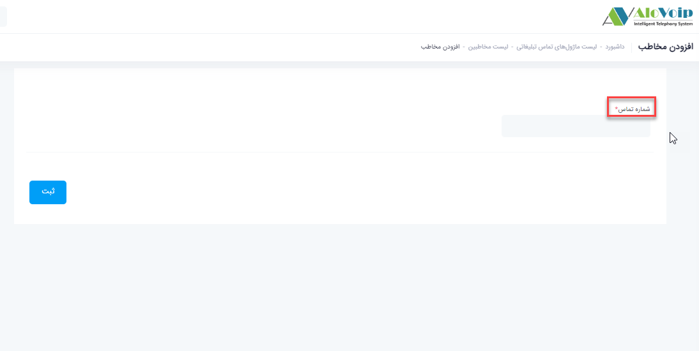

## تبلیغات انبوه تلفنی

در این بخش به موضوعات زیر می‌پردازیم:

- [هدف از تنظیم تبلیغات انبوه تلفنی](#ThePurposeOfSettingUpTelephoneAdvertising)
- [تنظیم ماژول تنظیم تبلیغات انبوه تلفنی در پنل الوویپ](#SettingTheModuleForSettingBulkTelephoneAdsInTheAlovoipPanel)

## هدف از تنظیم تبلیغات انبوه تلفنی{#ThePurposeOfSettingUpTelephoneAdvertising}

در این ماژول شما می‌توانید در یک زمان خاصی به یکسری شماره ها بصورت اتوماتیک تماس ایجاد کنید و صدای مدنظر خودتان را پخش کنید.این کار برای بحث تبلیغات به سازمان شما می‌تواند کمک کند.

## تنظیم ماژول تنظیم تبلیغات انبوه تلفنی در پنل الوویپ{#SettingTheModuleForSettingBulkTelephoneAdsInTheAlovoipPanel}

- برای تنظیم این ماژول، در پنل الویپ **تبلیغات انبوه تلفنی** را انتخاب کنید، سپس روی **افزودن** کلیک کنید.

- در صفحه باز شده یک **نام** برایش انتخاب کنید و **تاریخ شروع** تماس ها را مشخص کنید.

- در قسمت های  **تماس از ساعت و تماس تا ساعت**، تعیین کنید از چه ساعت تا چه ساعتی تماس ها گرفته شود.

- در قسمت **مدت انتظار** مشخص کنید که سیستم تا چند ثانیه صبر کند که آن شماره پاسخگو باشد و بعد به شماره دیگر تماس بگیرد.

- **حداکثر تماس همزمان** را اگر روی 1 بگذارید شماره ها یکی یکی تماس می‌گیرد.

- در قسمت **نوع درخواست**  3 حالت وجود دارد:

**فقط تماس**

- می‌توانید مشخص کنید که وقتی سیستم بصورت اتوماتیک به شماره ایی زنگ زد فقط یک فایل صوتی پخش کند.این ویس را از قسمت **صدای معرفی** .انتخاب و آپلود کنید

**درخواست تماس**
•	در این حالت سیستم بصورت اتوماتیک تماس می‌گیرد و بعد از اینکه فرد به شما پاسخ داد بعد از شنیدن صدای معرفی به ماژول درخواست تماس وصل می‌شود و پس از ثبت شماره خود کاربران شما می‌توانند با آن شماره تماس بگیرند. شما می‌توانید داخلی یا صفی که می‌خواهید برای آن درخواست تماس ثبت شود را در قسمت داخلی یا صف انتخاب کنید.

**درخواست انتقال**

- در این حالت سیستم بصورت اتوماتیک به شماره های داده شده تماس می‌گیرد و بعد از پخش صدای مدنظر در قسمت **کد مقصد بعدی** تماس را به یک داخلی،صف و... وصل می‌کند

- بعد از انجام تنظیمات روی دکمه ثبت کلیک کنید.

- در مرحله بعد باید شماره های مدنظر خود را به این ماژول اضافه کنید.از این رو ماژول ساخته شده را جستجو کرده و روی دکمه **عملیات** کلیک کرده و گزینه **مخاطبین** را انتخاب کنید

- می‌توانید به دو طریق شماره ها را اضافه کنید:
از طریق فایل اکسل 
  شما می‌توانید از طریق فایل اکسل شماره ها را اضافه کنید.که این کار را از قسمت **بارگذاری** انجام  می‌دهید

**بصورت تک شماره**

- می‌توانید بصورت جداگانه شماره ها را وارد کنید که برای این کار روی دکمه **افزودن** کلیک کنید و شماره مدنظر خود را وارد نمایید.

- بعد از انجام تنظیمات در ساعت تعیین شده با شماره های وارد شده سیستم بصورت اتوماتیک تماس گرفته می‌شود

>**نکته**     برای استفاده از این ماژول بهتر است از خط سیپ و یا ایوان استفاده کنید.

>**نکته** 
در این ماژول شما میتوانید در انتهای ویس از ماژول ارسال پیامک استفاده کنید

