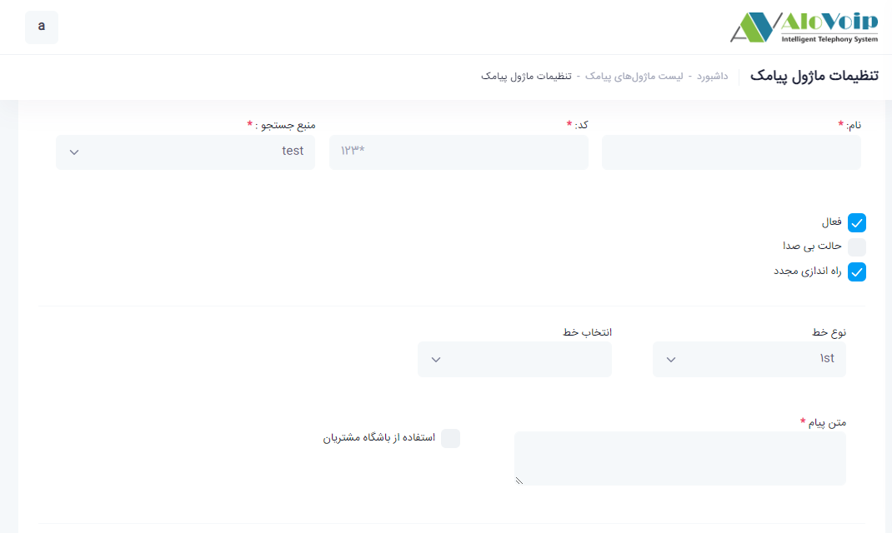

## پنل پیامکی

در این بخش به موضوعات زیر می‌پردازیم:

-	[هدف از تنظیم ماژول پیامکی ](#ThePurposeOfSettingTheSMSModule)

-	 [تنظیم ماژول پیامکی ](#SMSModuleSetting)

## هدف از تنظیم ماژول پیامکی{#ThePurposeOfSettingTheSMSModule}

از این ماژول می‌توانید در بخش های مختلفی از پنل الوویپ از قبیل منشی تلفنی جهت ارسال آدرس یا لینک سایت و یا در انتهای نظرسنجی و... استفاده کرد. 

## تنظیم ماژول پیامکی{SMSModuleSetting}
برای  تنظیمات ماژول پیامکی باید مراحل زیر را طی کنید:

در پنل الویپ باید وارد **مرکز تماس** شوید و در این قسمت گزینه **ارسال پیامک** را انتخاب کنید.سپس روی گزینه **افزودن** کلیک کنید.

•	در صفحه باز شده یک **نام** انتخاب کنید و یک **کد** به آن بدهید.
•	**نوع خط** را مشخص ‌کنید که از طریق1st یا Url خریداری کرده اید.
•	در قسمت **انتخاب خط** مشخص می‌کنید از کدام خط می‌خواهید استفاده کنید(در صورتیکه بیش از یک خط ثبت کرده باشید).
•	در انتها **متن پیام** هم در کادر مربوطه می‌نویسید.

برای استفاده از این ماژول به عنوان مثال در قسمت نظرسنجی، **کد مقصد بعدی** را می‌توانید به ماژول پیامکی بدهید که با انتخاب **مقاصد متفرقه** ،این امکان را فراهم می‌کنید.

**نکته**
> لازم به ذکر است این ماژول به صورت پنل پیامکی جهت ارسال پیامک به تعدادی شماره تلفن نمی‌باشد صرفا جهت استفاده در بخش های مختلفی از پنل بکار گرفته می‌شود.

