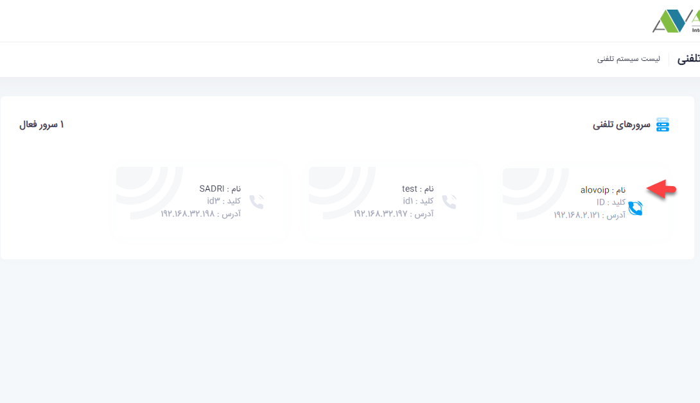
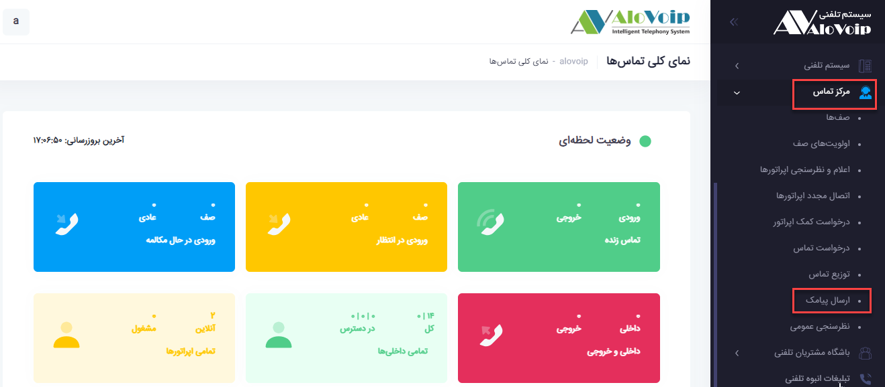
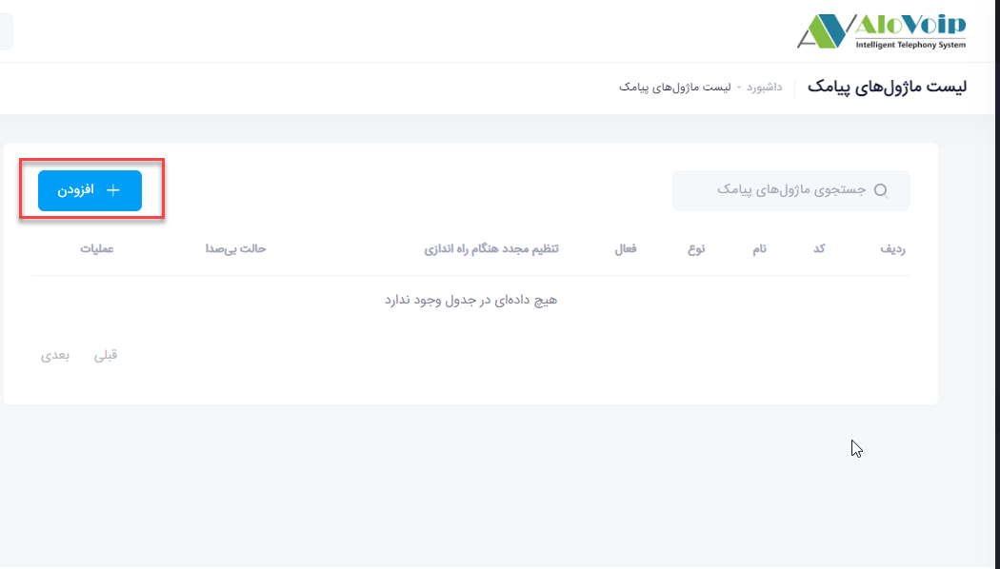

# تنظیم ماژول پیامکی{#SMSModuleSetting}
برای  تنظیمات ماژول پیامکی باید مراحل زیر را طی کنید:

در پنل الویپ باید وارد مرکز تماس شوید و در این قسمت گزینه ارسال پیامک را انتخاب کنید.سپس روی گزینه افزودن کلیک کنید.

• در صفحه باز شده یک اسم انتخاب کنید و یک کد به آن بدهید.

•	نوع خط را مشخص ‌کنید که از طریق1st یا Url خریداری کرده اید.

• 	در قسمت انتخاب خط مشخص می‌کنید از کدام خط می‌خواهید استفاده کنید(در صورتیکه بیش از یک خط ثبت کرده باشید).

• 	در انتها متن پیام هم در کادر مربوطه می‌نویسید.

•	از این ماژول می‌توانید در باشگاه مشتریان هم استفاده کنید.سپس دکمه ثبت را می‌زنید

برای استفاده از این ماژول   به عنوان مثال در قسمت نظرسنجی، کد مقصد بعدی را می‌توانید به ماژول پیامکی بدهید که با انتخاب مقاصد متفرقه ،این امکان را فراهم می‌کنید

**نکته**
> لازم به ذکر است این ماژول به صورت پنل پیامکی جهت ارسال پیامک به تعدادی شماره تلفن نمی‌باشد صرفا جهت استفاده در بخش های مختلفی از پنل بکار گرفته می‌شود.