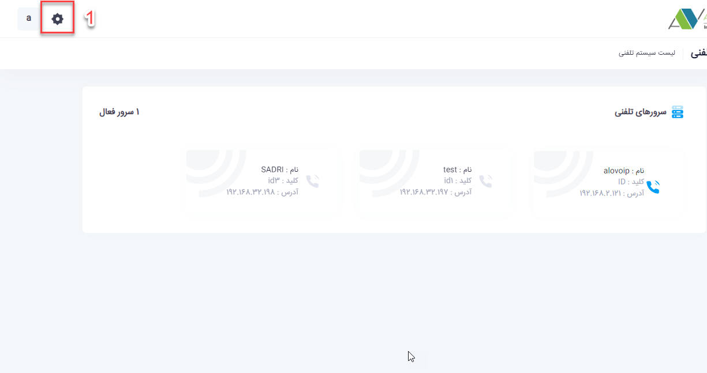
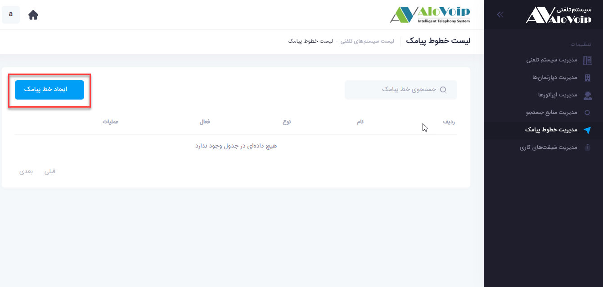
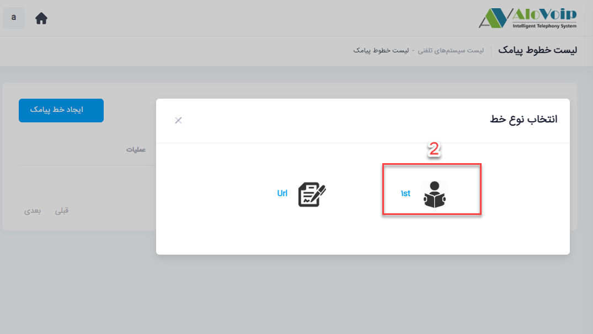
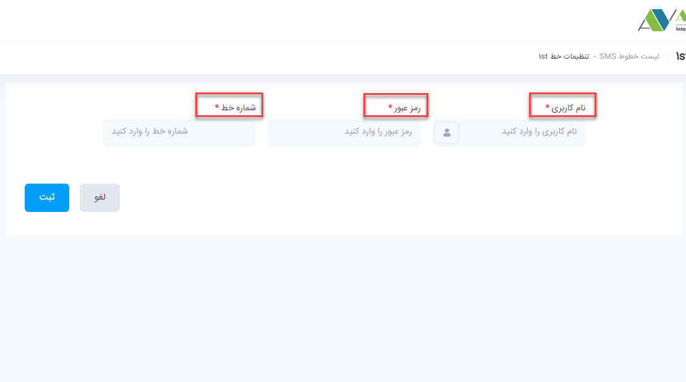
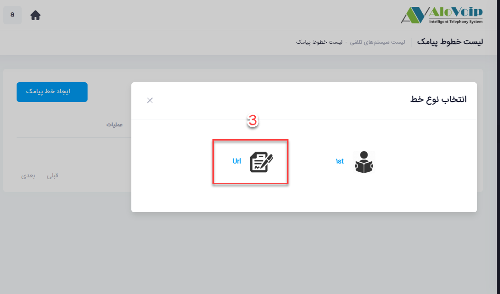
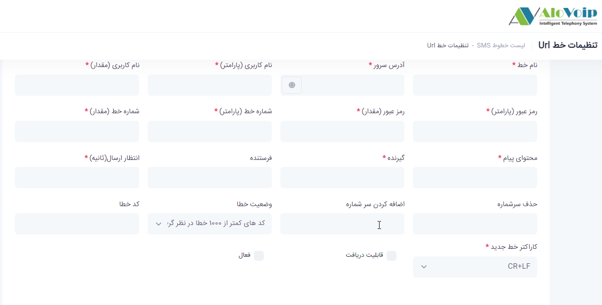

# پنل پیامکی

در این بخش به موضوعات زیر می‌پردازیم:
- [هدف از ایجاد پنل پیامکی](#PurposeOfCreatingAnSMSPanel)
- [نحوه عمکلرد پنل پیامکی](#HowToUseSMSPanel)
- [تنظیمات بخش پیامکی در پنل الوویپ](#SettingsOfTheSMS)
- [تنظیم ماژول پیامکی](#SMSModuleSetting)

## هدف از تنظیم خطوط پیامکی{#PurposeOfCreatingAnSMSPanel}
از خطوط پیامکی شما می‌توانید برای ارسال آدرس شرکت استفاده کنید. همچنین افرادی که تماس می‌گیرند بعد از نظرسنجی می‌توانید برایشان پیامک ارسال کنید. پنل الوویپ یک پنل پیامکی نیست یعنی بدین صورت نیست که شما یکسری شماره به آن بدهید و به آن شماره ها پیامک ارسال کند.

## نحوه عمکلرد پنل پیامکی{#HowToUseSMSPanel}
نحوه عملکرد الوویپ در قسمت پیامکی بصورت تماس است  یعنی یک تماس باید وارد سازمان شود تا شما بتوانید روی منشی تلفنی یا بعد از نظرسنجی به فرد تماس گیرنده پیامک ارسال کنید.بدین صورت روی منشی تلفنی می‌توانید به عنوان مثال  تنظیم کنید که افراد تماس گیرنده با زدن دکمه 5 برایشان آدرس شرکت پیامک شود.یا پس از اینکه فرد تماس گیرنده وارد نظرسنجی شد بعد از شرکت در نظرسنجی برایش پیامک تشکر ارسال شود.

## تنظیمات بخش پیامکی در پنل الوویپ{#SettingsOfTheSMS}
در این بخش در مورد تنظیمات صحبت می‌کنیم که چطوری می‌توانید یک خط را در پنل الوویپ ثبت کنید.برای تنظیمات باید مراحل زیر را طی کنید

وارد پنل الوویپ شوید و از قسمت تنظیمات سیستم،قسمت مدیریت خطوط پیامک را انتخاب کنید.در این بخش  می‌توانید خط هایی که پیامک ارسال می‌شود را وارد کنید. سپس روی ایجاد خط پیامکی کلیک کنید

اگر خط را از شرکت تجارت اول تهیه کرده باشید،  **1st** را انتخاب کنید و بعد نام کاربری، رمز عبور و شماره خطی که برایتان ایجاد کرده اند را وارد کنید و در انتها روی ثبت کلیک کنید

3.	اگر از سایر سامانه های پیامکی استفاده می‌کنید،Url را انتخاب کنید.در صفحه باز شده فیلدهای ستاره دار باید پر شود که این اطلاعات را می‌توانید از سامانه پیامکی خود دریافت کنید.وطبق عکس زیر موارد مربوطه را پر کنید

