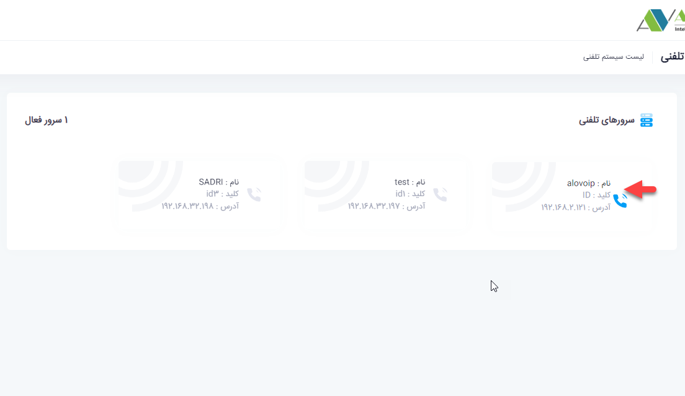
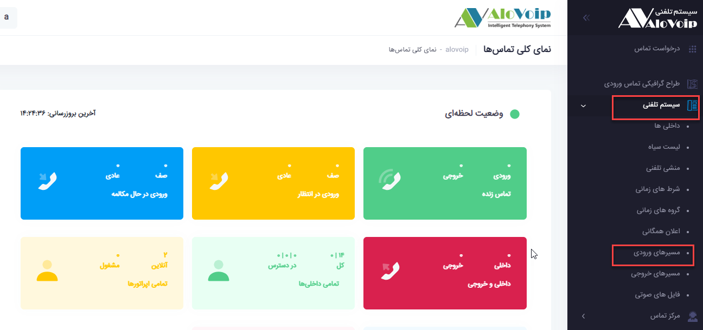
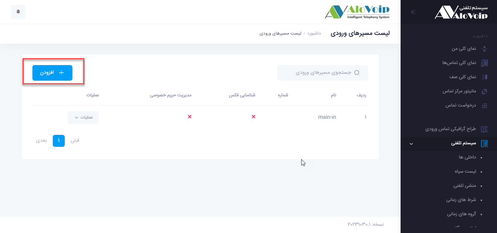
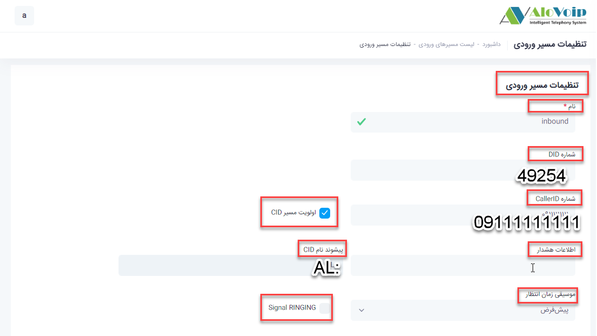
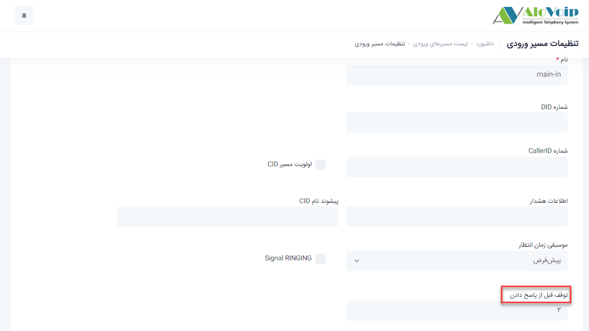
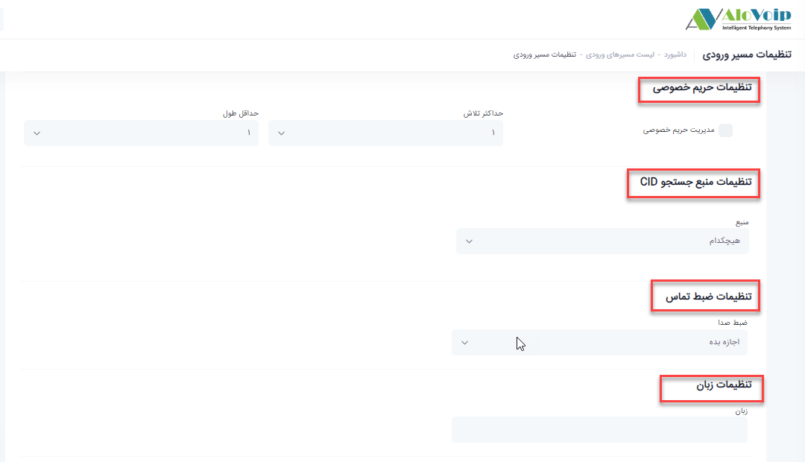

در این بخش به موضوعات زیر می‌پردازیم:
-	هدف از مسیرهای ورودی
-	تنظیمات مسیر ورودی 
-	تنظیمات شناسایی فکس
-	تنظیمات حریم خصوصی
-	تنظیمات منبع جستجوی CID
-	تنظیمات ضبط تماس
-	تنظیمات زبان
-	تنظیمات مقصد
## هدف از مسیر ورودی
منظور از مسیر های ورودی همان  تماس های ورودی به سازمان است که شما می‌توانید این تماس ها را به یک مسیر خاص هدایت کنید.این مسیر می‌تواند منشی تلفنی،شرط زمانی،داخلی یا یک صف خاص و.... باشد.

## تنظیم مسیر ورودی
برای تنظیم مسیر ورودی در پنل الوویپ وارد شده و در قسمت سیستم تلفنی<  مسیرهای ورودی را انتخاب کرده و سپس روی افزودن کلیک کنید.

•	در صفحه باز شده در فیلد اول یک نام بصورت انگلیسی وارد کنید.
•	در قسمت شماره DID شماره خط سازمان خود را وارد کنید.به عنوان مثال شماره خط سازمان شما 49254 است که آن را در این قسمت وارد می‌‌کنید.
•	در قسمت شماره CallerID می‌توانید به یک شماره خاصی اشاره کنید .مثلا هرکسی با شماره 09111111111 به سازمانتان زنگ بزند (یعنی همان خط49254)، به یک بخش خاصی وصل شود.اگر بخواهید این مورد را داشته باشید حتما باید تیک اولویت مسیر (CallerID)CID را بزنید.حالا اگر بخواهید هم DID و هم CallerID را با هم داشته باشید،آن زمان فقط افرادی که شماره خطشان در قسمت CallerID تعریف شده می‌توانند با سازمان شما تماس بگیرند.اما اگر بخواهید همه افراد تماس بگیرند بایدCallerID را خالی بزارید و تیک اولویت مسیرDID را هم بردارید که می‌شود هرکسی با هر شماره ایی تماس گرفت به قسمتی که شما مشخص می‌کنید وصل شود.
•	در قسمت اطلاعات هشدار اگر شما یک مقدار قرار دهید ، یک هشدار را به سمت تلفن ها ارسال می‌کنید که تلفن هایی که این هشدار را دریافت می‌کنند زنگ هایشان متفاوت خواهد بود. که البته   این مورد باید توسط تلفن ها پشتیبانی گردد.
•	در قسمت پیشوند نام CID یا پیشوند نام CallerID شما می‌توانید مشخص کنید که هرکسی به خط 49254 زنگ زد وبه کارشناس وصل شد قبل از شماره یک عبارتی قرار دهد مثلا( AL:) .با این اتفاق هرکسی به شماره 49254 زنگ بزند و به بخش مربوطه وصل شود قبل از CallerId یک AL: می‌افتد

می‌توانید موسیقی زمان انتظار تعریف کنید که در حالت پیش فرض از موسیقی زمان انتظار پیش فرض خودش استفاده می‌کند..اگر بخواهید موسیقی نداشته باشید روی هیچکدام قرار دهید.با فعال کردنSignal RINGING  این امکان را می‌توانید فراهم کنید که اگر داخلی جواب نداد یا به منشی تلفنی وصل نشد،برای فرد تماس گیرنده یک بوق قطع تماس ارسال شود

## تنظیمات شناسایی فکس
 اگر بخواهید سیستم بصورت اتوماتیک سیگنال فکس را تشخیص دهد نیاز است که مراحل زیر طی شود:
- ابتدا توقف قبل از پاسخ دادن را تنظیم کنید.با تنظیم این قسمت این امکان فراهم می‌شود تماس قبل از اینکه به سیستم تلفنی وصل شود سیستم تشخیص دهد که این تماس یک تماس فکس است یا خیر.اگر در این قسمت یک مدت زمانی بدهید سیستم به اندازه آن زمان صبر می‌کند.به عنوان مثال 2 ثانیه تعیین می‌کنید.
- 	سپس در قسمت تنظیمات شناسایی فکس، شناسایی فکس را فعال کنید.نوع شناسایی فکس را SIP و زمان شناسایی فکس را مثلا 3 ثانیه انتخاب کنید.
- 	نوع مقصد فکس را هم داخلی فکسی که ایجاد کردید انتخاب کنید.
اتفاقی که می‌افتد این است که اگر تماسی به 49254 وصل شود 2 ثانیه جلوی تماس را می‌گیرد،3 ثانیه هم تشخیص فکس می‌دهد که در مجموع 5 ثانیه می‌شود و اگر آن سیگنال،سیگنال فکس باشد به داخلی فکس وصل می‌شود و اگر سیگنال فکس نباشد آن را به قسمت تنظیمات مقصد وصل می‌کند

## تنظیمات حریم خصوصی
اگر این بخش را فعال کنید یعنی تیک مدیریت حریم خصوصی را بزنید این امکان را برای شما فراهم می‌کند که اگر یک تماسی به سیستم وصل شد و CID(CallerID) وجود نداشت از فرد تماس گیرنده بخواهد که شماره تماس خود را وارد کند از این رو در قسمت حداکثر تلاش مشخص می‌کنید چقدر مهلت دارد شماره تماس خود را وارد کند ودر حداقل طول هم مشخص می‌کنید که حداقل طول یک CallerID چقدر می‌تواند باشد.
## تنظیمات منبع جستجوی CID
در این قسمت می‌توانید منبع جستجو یا نرم افزار مدیریت مشتری خود را مشخص کنید که هر تماسی که به 49254 وصل شد از این منبع جستجو استفاده کند.در واقع این بخش بلااستفاده است چون به عنوان مثال اگر از منبع جستجوی پیامگستر استفاده می‌کنید تنظیمات آن را  در قسمت تنظیمات سیستم تلفنی انجام می‌دهید دیگر نیاز به تنظیم آن در این قسمت ندارید.
## تنظیمات ضبط تماس 
      در قسمت تنظیمات ضبط تماس شما می‌توانید مشخص کنید که ضبط بر روی تماس های ورودی شما  با توجه به 4 گزینه موجود به چه صورت انجام شود.
## تنظیمات زبان
در این قسمت زبان مورد استفاده سیستم تلفنی را مشخص کنید که بطور پیش فرض فارسی است.
## تنظیمات مقصد
  در قسمت تنظیمات مقصد می‌توانید مشخص کنید که وقتی با شماره سازمان شما تماس گرفته        می‌شود به کدام بخش وصل شود. به عنوان مثال می‌توانید مشخص کنید هرکسی با 49254 تماس گرفت به منشی تلفنی وصل شود

-  بعد از اتمام تنظیمات دکمه ثبت را می‌زنید.تمامی این اطلاعات قابل ویرایش می‌باشد.
-  برای تنظیم مسیر ورودی فیلدهای مربوطه بنا بر سیاست سازمان شما پر می‌شود و در صورت عدم نیاز به آنها میتوانید این فیلدها را پر نکنید

