# تنظیمات صف

در این بخش به موضوعات زیر می‌پردازیم:

-  [هدف از ساخت یک صف ](#ThePurposeOfMakingAQueue)

- [ایجاد یک صف جدید ](#CreateNewQueue)

- [ویرایش یک صف ](#EditAQueue)

-	[استراتژی زنگ خوردن داخلی ها در یک صف ](#StrategyOfRingingExtensionsInAQueue)

-	[نحوه تنظیم ضبط مکالمه در صف ](#HowToRecordCallInQueue)

-	[حداکثر زمان انتظار ](#MaximumWaitingTime)

-	[اطلاعیه های تماس گیرنده ](#CallerNotifications)

-	[نحوه تنظیم موسیقی زمان هولد ](#HowToSetHoldTimeMusic)

-   [تنظیم SLA در صف](#SetSLAInTheQueue)

## هدف از ساخت یک صف:{#ThePurposeOfMakingAQueue}

اگر در سازمانتان واحد هایی دارید که تماس در آن واحدها زیاد است مانند واحد فروش،پشتیبانی و...شما می‌خواهید تماس ها را طبق استراژی خاصی به همه کارشناسان وصل کنید می‌‌‌توانید از صف استفاده کنید.زمانی از صف استفاده می‌کنیم که تعداد تماس های ورودی به واحد مورد نظر بیش از تعدادکاربران پاسخگوی آن واحد می‌باشد از این رو اگر تمامی کاربران در حال مکالمه باشند آن تماس در صف انتظار قرار می‌گیرد تا یکی از کاربران آزاد شده و به آن تماس پاسخ دهد. امکان دیگری که صف به شما می‌دهد این است که می‌توانید  در صف نظرسنجی داشته باشید و متوجه شوید کارشناسانی که در این صف ها هستند آیا مشتریان از آنها راضی هستند یا خیر.همچنین اپراتورها  یا داخلی هایی که در صف هستند با توجه به بسته ایی که خریداری کرده اید می‌توانند خودشان را آنلاین،مشغول بکار،استراحت و یا آفلاین بگذارند.

## ایجاد یک صف جدید{#CreateNewQueue}

-	در پنل الویپ از قسمت مرکز تماس وارد صف ها شوید.سپس روی گزینه افزودن کلیک کنید.

-	در صفحه باز شده ابتدا در قسمت شماره صف یک عدد منحصر به فرد که با رنج داخلی های شما تداخل نداشته باشد وارد کنید.

-	سپس یک نام فارسی برای صف در نظر بگیرید.نام انگلیسی آن بصورت اتوماتیک وارد می‌شود.

-	می‌توانید کاربرانی که بصورت ثابت در صف هستند را انتخاب کنید.کاربران ثابت در صف یعنی این داخلی ها امکان آفلاین شدن در صف را ندارند و همیشه آنلاین هستند.امکان آنلاین و آفلاین شدن را با توجه به بسته ایی که تهیه کردید فراهم می‌شود.در این حالت اپراتورها وقتی وارد پنل خود می‌شوند این امکان را دارند که خودشان را آنلاین و آفلاین کنند.در انتها دکمه ثبت را می‌زنید و صف شما ساخته می‌شود

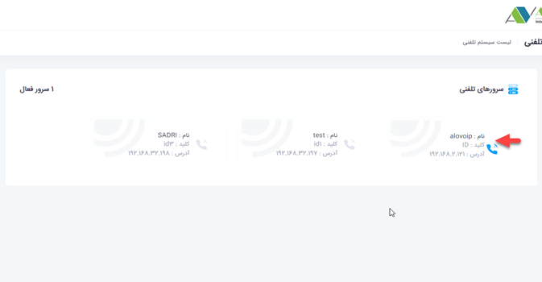

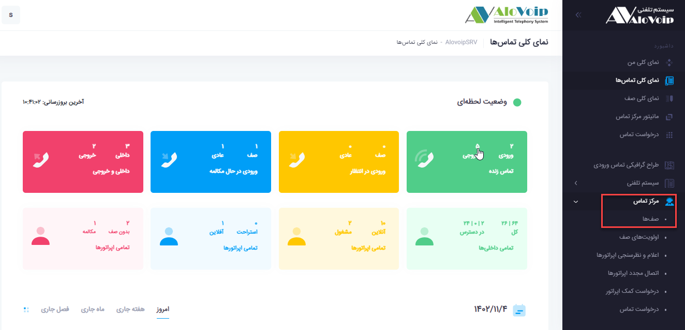

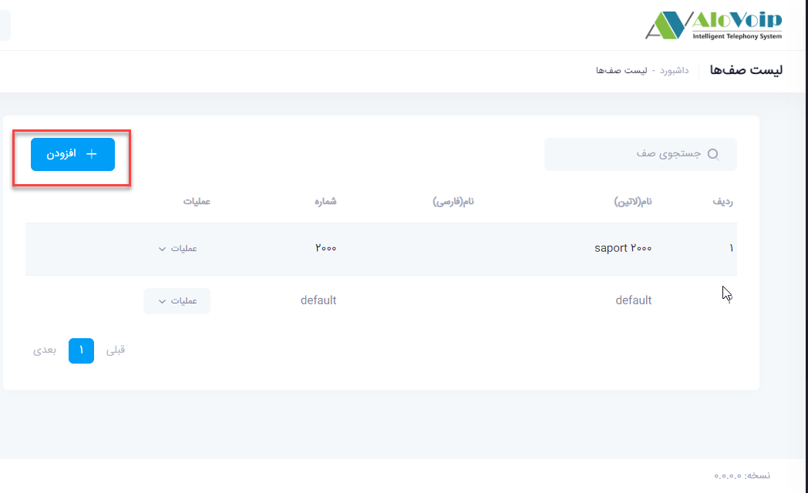

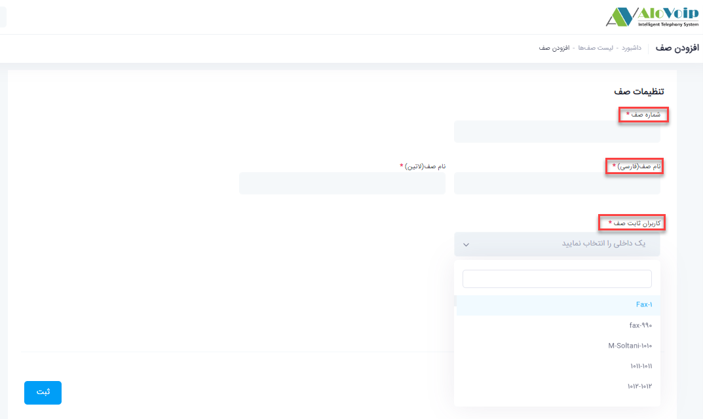

## ویرایش یک صف{#EditAQueue}

برای اینکه بتوانید تنظیمات یک صف را ویرایش کنید،باید صف مورد نظر را انتخاب کنید سپس روی دکمه عملیات کلیک کرده و گزینه ویرایش را انتخاب کنید که با این کار شما وارد تنظیمات بیشتری از صف می‌شوید

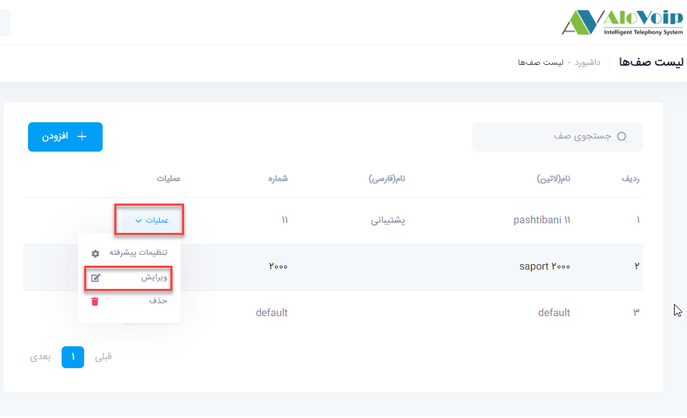

در صفحه باز شده شما می‌توانید اگر دپارتمانی مربوط به این صف دارید آنرا انتخاب کنید.
با توجه به بسته ایی که خریداری کرده اید اگر این امکان را دارید که اپراتورها بتوانند وضعیت خود را تغییر دهند مانند آفلاین،آنلاین و ..... باید آن داخلی هایی که می خواهند این امکانات را داشته باشند در قسمت کاربران متغیر صف قرار بگیرند. با این کار اپراتورهایی که در صف ثابت هستند امکان آفلاین کردن برایشان وجود ندارد مانند داخلی 550 اما اپراتورهایی که در صف داینامیک هستند می‌توانند خودشان را آنلاین،آفلاین،مشغول بکار و استراحت بگذارند.مانند داخلی551منظور از آنلاین یعنی می‌توانند خودشان را وارد صف کنند و منظور از آفلاین یعنی می‌توانند خودشان را از صف بیرون بیاورند

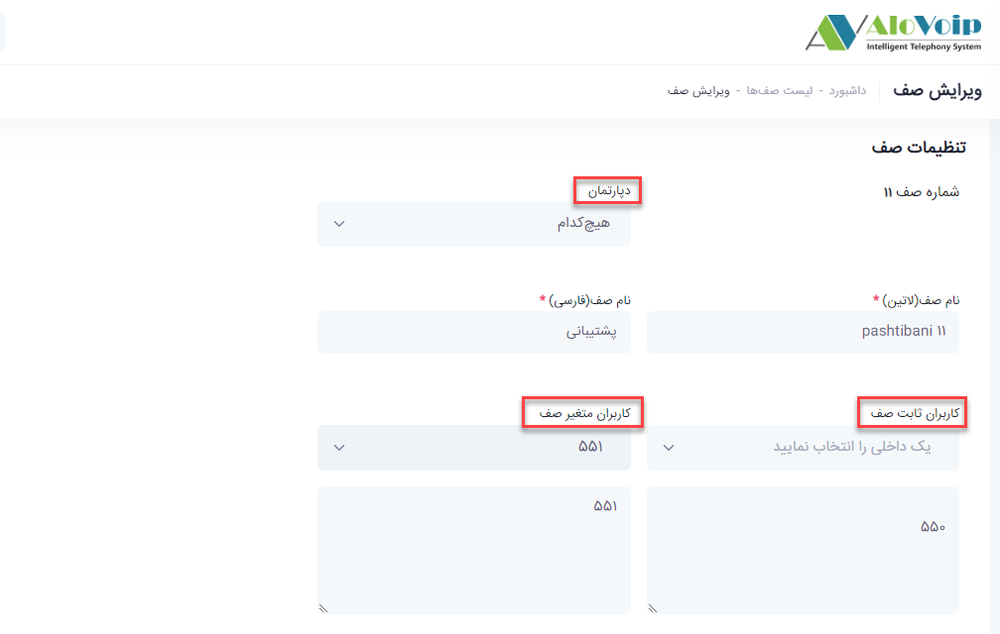

## استراتژی زنگ زدن صف{#StrategyOfRingingExtensionsInAQueue}
اگر شما در بخش کاربران ثابت یا متغیر صف تعداد زیادی داخلی دارید بهتر است با توجه به سیاست سازمانی،استراتژی زنگ خوردن آنها را مشخص کنید.برای این کار در قسمت تنظیمات عمومی صف>استراتژی زنگ زدن صف، می‌توانید استراتژی خود را انتخاب کنید. استراتژی های پرکاربرد در صف بصورت زیر هستند:

1.	Ringall :
بر اساس این استراتژی همه داخلی های تعریف شده در صف بطور همزمان زنگ می‌خورند.این استراتژی خیلی پیشنهاد نمی‌شود چون ممکن است  بر روی گزارش تماس های شما تاثیر بگذارد.زیرا وقتی همه داخلی ها زنگ می‌خورند و یک داخلی تماس را جواب می‌دهد آن تماس برای آن داخلی بصورت موفق و برای بقیه داخلی ها بصورت ناموفق خواهد بود.

2.	Fewestcall 
داخلی هایی که کمترین تماس را داشتند،تماس ها را به آنها وصل می‌کند.

3.	rrmemory
تماس ها بصورت یکسان و چرخشی بین تمامی کاربران پخش می‌شود.

4.	Linear
همه تماس ها را اول به اولین داخلی تعریف شده در صف وصل می‌کند.

>	**در قسمت کاربران مشغول را در نظر نگیر هم می‌توانید مشخص کنید کاربرانی که خطشان مشغول است را در نظر بگیرد یا نه**

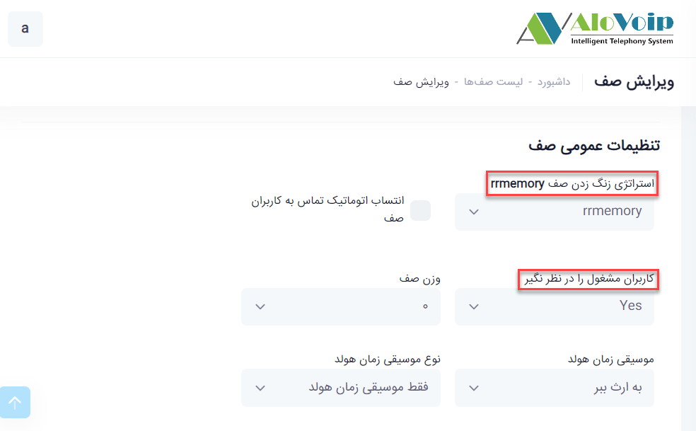

## نحوه تنظیم ضبط مکالمه{#HowToRecordCallInQueue}
- 	ضبط پیام: این گزینه مربوط به ضبط مکالمات صف است که باید روی WAV باشد..
-	تنظیم حجم صدای تماس گیرنده و پاسخ دهنده هم که مربوط به تنظیم حجم صدا در صف است روی +4 که  حالت حداکثر است قرار دهید.
نکته
توجه داشته باشید که حتما مقدار ضبط پیام را انتخاب کنید در غیر این صورت مکالمه وارد شده به آن صف ضبط نمی‌گردد

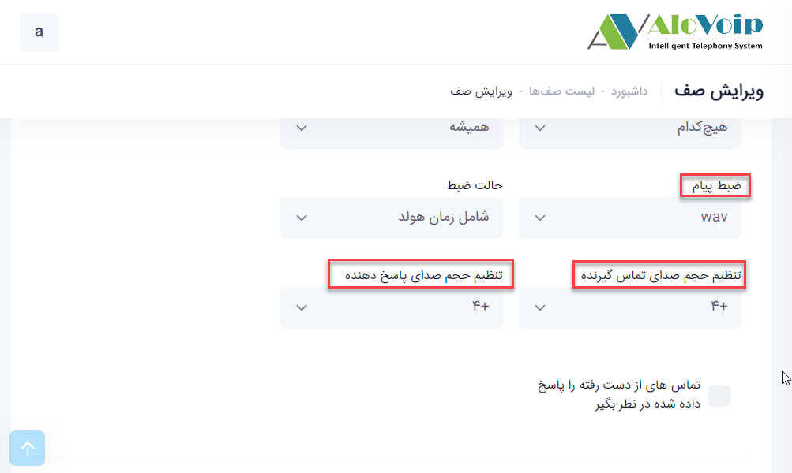

##  حداکثر زمان انتظار{#MaximumWaitingTime}
اگر این گزینه را به عنوان مثال روی 10 دقیقه قرار دهید بدین معنی است که اگر یک تماسی در صف آمد و 10 دقیقه هم منتظر ماند و کسی به آن جواب نداد آن تماس به کدام بخش وصل شود.این زمان بسته به سناریو شما قابل تغییر است.پس از این زمان تعیین شده در قسمت تنظیمات مقصد تماس ناموفق می‌توانید مشخص کنید تماس به کجا وصل شود. بصورت پیش فرض روی حالت قطع تماس است ولی می‌توانید انتخاب کنید که به یک داخلی یا صف و... این تماس وصل شود.

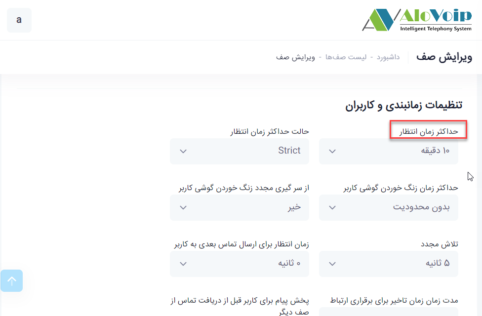

## اطلاعیه های تماس گیرنده{#CallerNotifications}

شما می‌توانید وقتی یک تماسی وارد صف شد به آن اعلام شود که نفر چندم صف انتظار است.این مقدار در فیلد تکرار بصورت پیش فرض  روی 45 ثانیه است و با توجه به نیازتان قابل تغییر است.درصورت تعیین مقدار برای  فیلد تکرار،فیلد اعلام موقعیت تماس گیرنده باید روی گزینه بله قرار گیرد.اگر مقدار زمان هولد شدن تماس را بله انتخاب کنیم،زمان تقریبی وصل شدن تماس به کاربر را اعلام می‌کند.

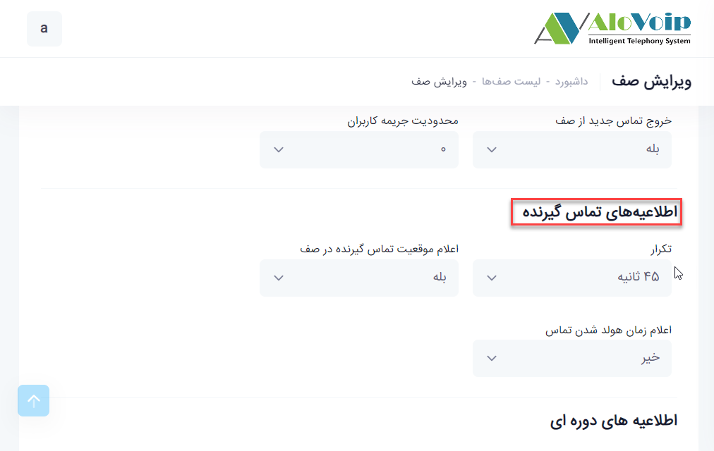

## نحوه تنظیم موسیقی زمان هولد{#HowToSetHoldTimeMusic}
زمانی که تماسی به صف وارد می‌شود تا قبل از اینکه آن تماس به اپراتور وصل شود یک موزیک پیش فرض برای تماس گیرنده پخش می‌شود.شما می‌توانید در صورت نیاز موزیک مورد نظر خود را در سیستم بارگذاری کرده و از آن بجای موزیک پیش فرض استفاده کنید.در نوع موسیقی زمان هولد می‌توانید مشخص کنید که تماس گیرنده تا قبل از اتصال به کاربر صدای موزیک هولد و یا صدای بوق معمولی بشنود.

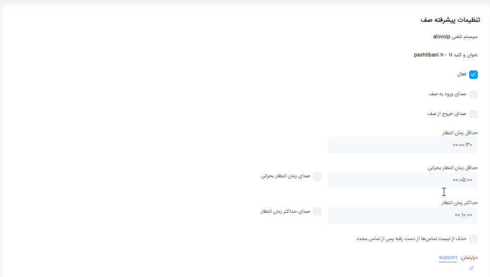

## تنظیم SLA در صف {#SetSLAInTheQueue}
برای تنظیم SLA، صف مورد نظرتان را انتخاب کرده و از منوی عملیات گزینه تنظیمات پیشرفته را انتخاب کنید.وقتی وارد این بخش می‌شوید گزینه هایی مانند فعال بودن را دارید که با کلیک روی آن می‌توانید یک صف را فعال کنید. همچنین می‌توانید صدای ورود و خروج به صف را داشته باشید یعنی اگر یک تماس وارد صف شد یا از صف خارج شد یک صدایی پخش شود.این امکان زمانی فراهم می‌شود که شما پنل الوویپ را روی مانیتوری که قابلیت پخش صدا  داشته باشد.مثلا مرکز تماسی دارید و می خواهید همه کارشناسان، زمانی که تماسی به صف وارد یا از صف خارج شد متوجه شوند.

- 	حداقل زمان انتظار: این مورد مربوط به SLA می‌شود.در اینجا می‌توانید مشخص کنید که اگر به یک تماسی تا چند ثانیه جواب ندادید آن تماس به عنوان یک تماس از دست رفته در نظر گرفته شود.به عنوان مثال اگر حداقل زمان انتظار 30 ثانیه در نظر گرفته شود،هر کسی بالای 30 ثانیه تماسش را در صف قطع کند به عنوان تماس از دست رفته در نظر گرفته می‌شود که آن را در نمای کلی صف،قسمت تماس های از دست رفته می‌توانید مشاهده کنید.حالا اگر تماسی  در صف آمده و زیر 30 ثانیه قطع کرده است گزارش آن را در قسمت گزارشات، گزارش تماس می‌توانید مشاهده کنید. برای دیدن SLA یی که برای صف در نظر گرفتید باید  در نمای کلی صف،صف مورد نظر را انتخاب کنید و در قسمت SLA می‌توانید موارد مورد نظر را ببینید.

-  حداقل زمان  انتظار بحرانی و حداکثر زمان انتظار:
با انتخاب این مقادیر و فعال کردن صداهای مربوطه، در صورتیکه مانیتوری که به آن اسپیکر وصل است داشته باشید،در زمان های تعیین شده صدای آلارم شنیده می‌شود.لازم به ذکر است هنگام مانیتور کردن،صفحه نمای کلی صف باید باز باشد.

-  در قسمت دپارتمان ها هم می‌توانید دپارتمان صف خود را تعیین کنید

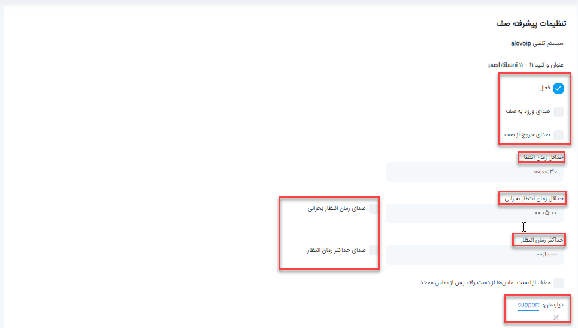

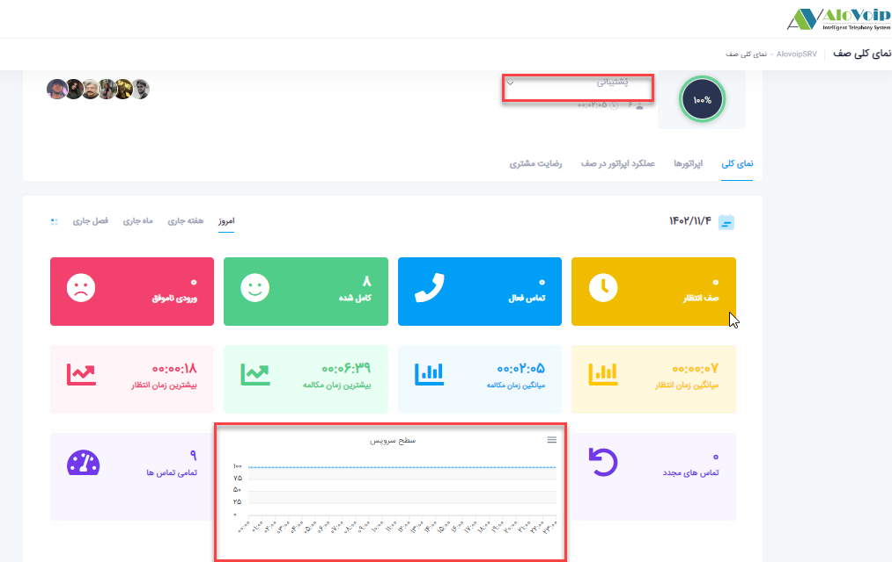