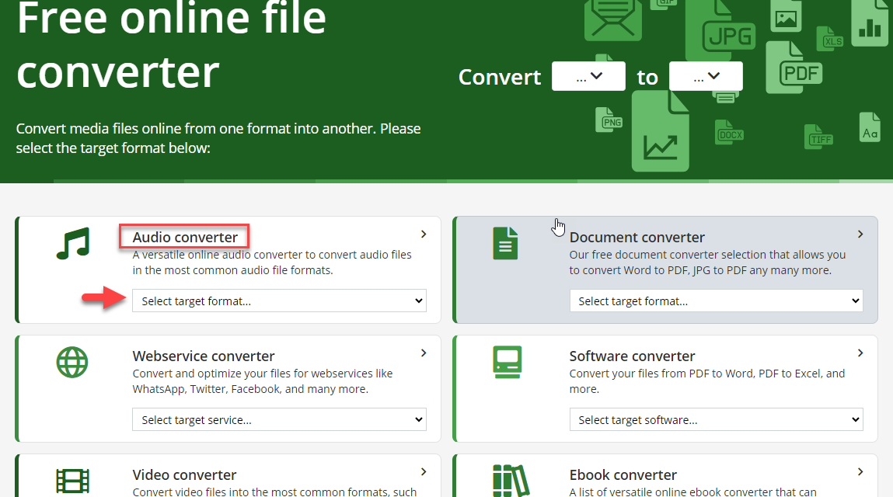
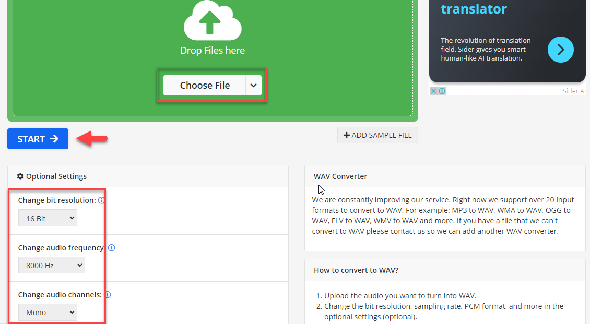
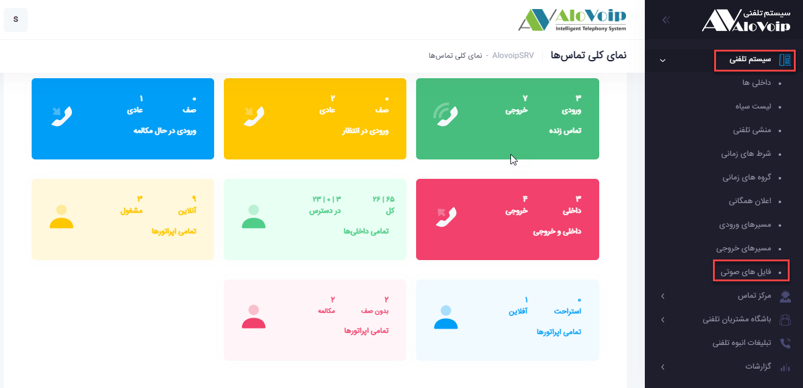
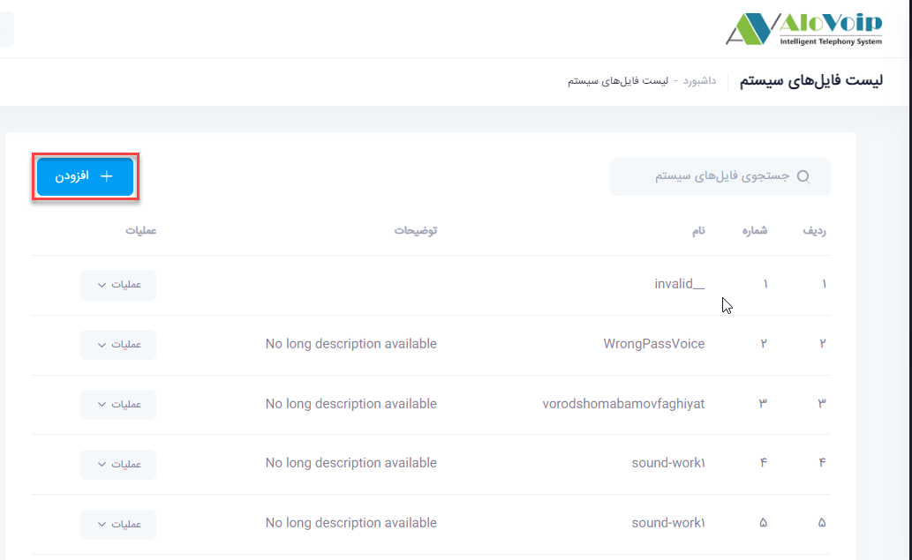
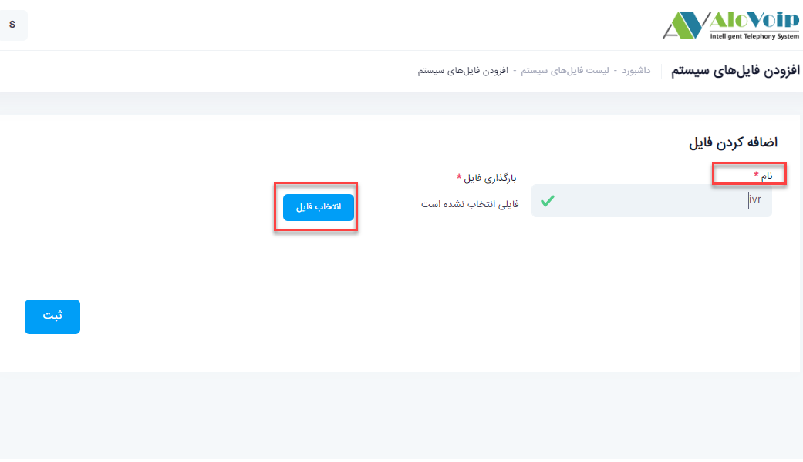

## فایل های صوتی

در این بخش به موضوعات زیر می‌پردازیم:
-	[کاربرد  فایل های صوتی](#UseOfAudioFiles)
-	[تبدیل یک فایل صوتی به فرمت WAV](#ConvertAnAudioFileToWAVFormat)
-	[بارگذاری یک فایل صوتی در پنل الوویپ](#UploadAnAudioFileToThePanel)

## کاربرد فایل های صوتی{#UseOfAudioFiles}

شما می‌توانید روی سیستم تلفنی خود از صداهای مختلفی استفاده کنید.به عنوان مثال صدای منشی تلفنی،هولد،پایان ساعت کاری و....این صدا ها می‌توانند به بهبود روند مدیریت تماس ها و ارتباطات کمک کنند.

##  تبدیل یک فایل صوتی به فرمت WAV{#ConvertAnAudioFileToWAVFormat}

برای بارگذاری یک صدا در پنل الوویپ باید اول آن را به فرمت درست تبدیل کنید.برای این کار وارد سایت www.online-convert.com شوید و از قسمت ****Audio Converter فرمت WAV**** را انتخاب کنید.

در قسمت **ChooseFile**،فایل صدا را آپلود کرده و سپس در 3 فیلد **Resolution**,**Frequency** و**Channels** مقادیر را بصورت زیر مشخص کنید. سپس روی Start کلیک کرده و فایل تبدیل شده را دانلود کنید.

## بارگذاری یک فایل صوتی در پنل الوویپ{#UploadAnAudioFileToThePanel}

فایلی که در مرحله قبل به فرمت WAV تبدیل شده است را می‌توانید در پنل الویپ بارگذاری کنید . برای این کار از **منوی سیستم تلفنی > فایل های صوتی** را انتخاب کنید . سپس روی گزینه **افزودن ** کلیک کنید . در صفحه باز شده  از طریق **انتخاب فایل** می‌توانید صدا با فرمت WAV را آپلود کنید. یک **نام انگلیسی** برای آن در نظر بگیرید ، سپس روی ثبت کلیک کرده و منتظر بمانید که صدا روی سیستم تلفنی قرار گیرد . بعد از آن می‌توانید صدا را در بخش مربوطه استفاده کنید .

