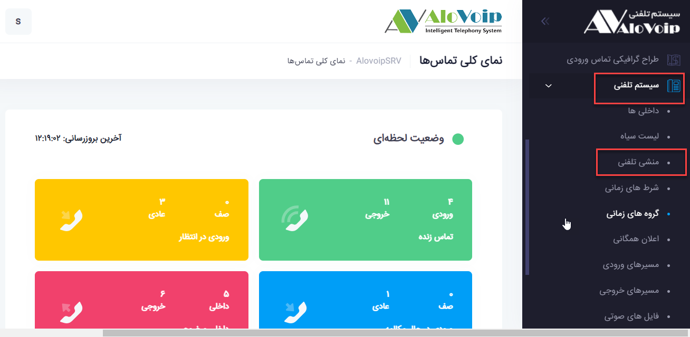
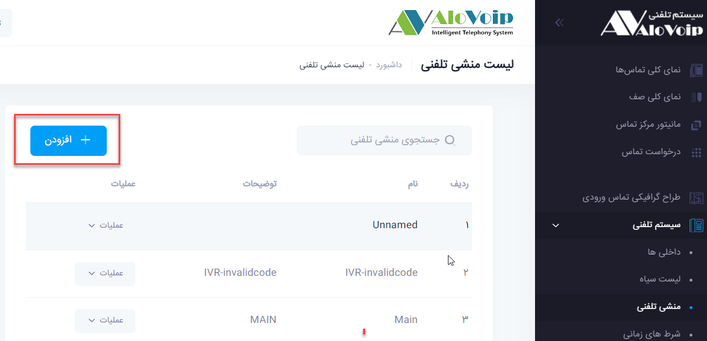
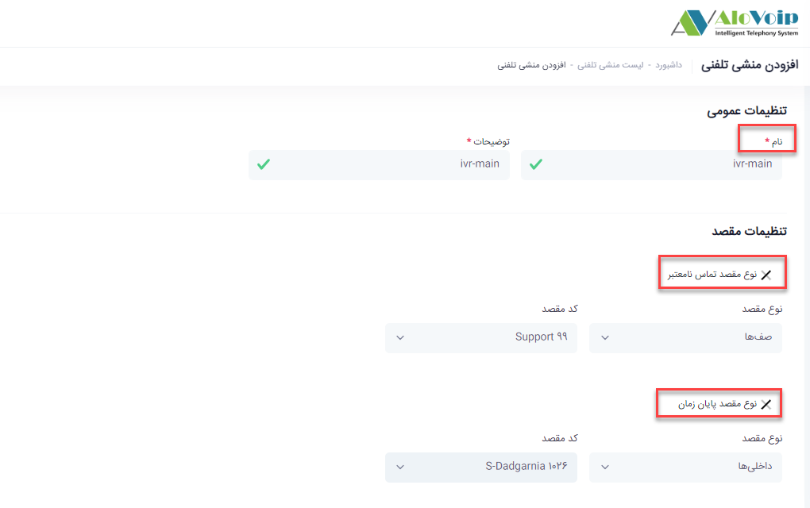
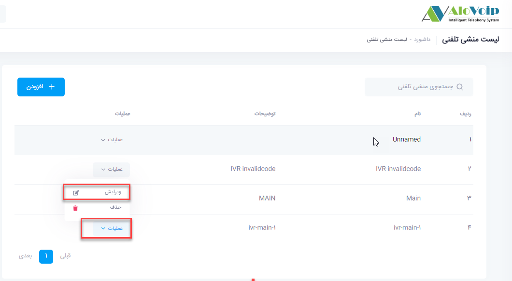
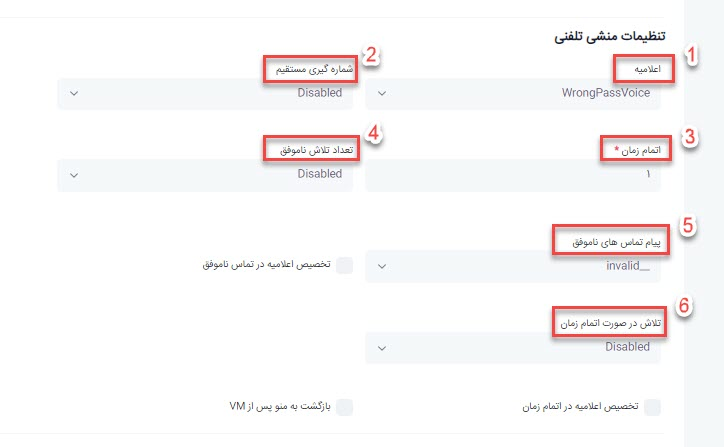
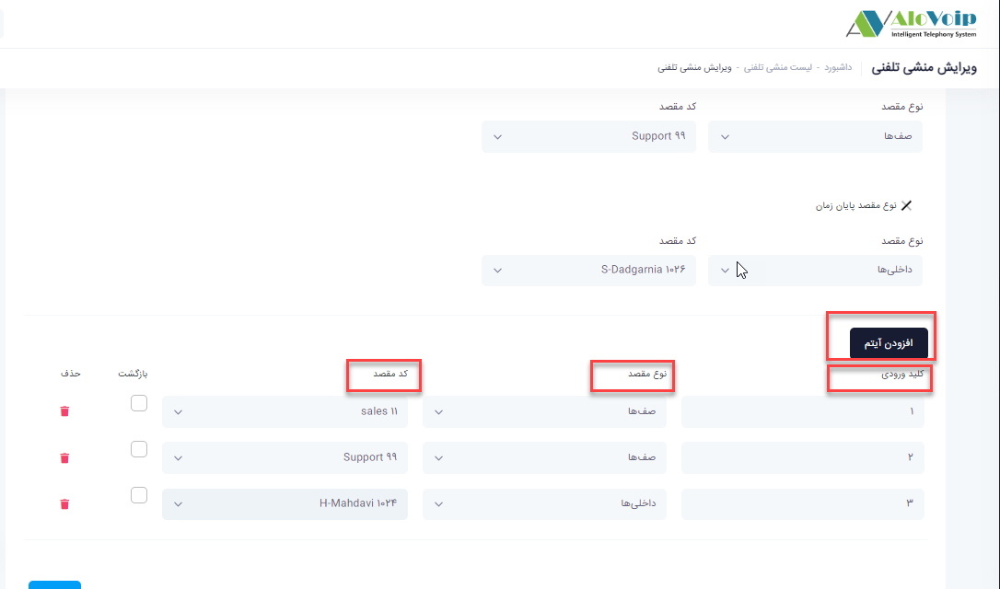

# منشی تلفنی

در این بخش به موضوعات زیر می‌پردازیم:

- [هدف از تنظیم منشی تلفنی](#PurposeOfIVR)
- [ایجاد یک منشی تلفنی جدید](#CreateANewIVR)
- [ویرایش منشی تلفنی](#EditIVR)

## هدف از تنظیم منشی تلفنی{#PurposeOfIVR}

با استفاده از منشی تلفنی (IVR) که یک صدای ضبط شده ایی است شما می‌توانید یک تماس ورودی را بر اساس سناریو سازمان خود به مقصد تعریف شده هدایت ‌کنید.با این کار شما از ارتباطات تلفنی غیر ضروری
با داخلی های غیر مرتبط جلوگیری می‌کنید در نتیجه هم در وقت و هم انرژی صرفه جویی می‌گردد.

## ایجاد یک منشی تلفنی جدید{#CreateANewIVR}

برای ایجاد یک منشی تلفنی جدید مراحل زیر را باید طی کنید: 
•	روی **سیستم تلفنی** کلیک کرده،**منشی تلفنی** را انتخاب کنید. در صفحه باز شده روی گزینه **افزودن** کلیک کنید 

•	**نام و توضیحات** : اول یک نام را انتخاب کنید مثلا ivr-main و یک توضیحات درباره آن بدهید. 
•	**نوع مقصد تماس نامعتبر** : در قسمت  نوع مقصد تماس نامعتبر می‌توانید تعریف کنید که وقتی یک تماسی روی منشی تلفنی شما قرار گرفت و تماس گیرنده به اشتباه عددی را وارد کرد چه اتفاقی بیفتد برای مثال می‌توانید تعیین کنید به صف پشتیبانی وصل شود. 
•	**نوع مقصد پایان زمان** : در این قسمت می‌توانید تعریف کنید که اگر تماسی روی منشی تلفنی شما آمد و تماس گیرنده عددی را وارد نکرد بعد از اتمام IVR چه اتفاقی بیفتد.مثلا به داخلی   1026 وصل شود. 
•	در انتها روی دکمه ثبت کلیک کنید. تنظیمات اولیه منشی تلفنی شما انجام شد و برای تکمیل آن باید به قسمت ویرایش منشی تلفنی بروید.

## ویرایش منشی تلفنی{#EditIVR}

برای ویرایش یک منشی تلفنی ،آن را  انتخاب کنید و روی **عملیات** کلیک کنید سپس از منوی باز شده گزینه **ویرایش** را انتخاب کنید. 

1.	**اعلامیه** : در صفحه باز شده در قسمت اعلامیه شما می‌توانید مشخص کنید چه صدایی پخش شود. لازم به ذکر است،صدای مدنظر خود را از منوی **سیستم تلفنی> فایل های صوتی** باید بارگذاری کنید(جهت بارگذاری به مقاله فایل های صوتی مراجعه شود).<vr>
2.	**شماره گیری مستقیم** : در این قسمت تعیین می‌کنید اگر تماسی روی منشی تلفنی آمد، تماس گیرنده بتواند داخلی را مستقیم بگیرد یا نه.برای فعال کردن این امکان باید گزینه **Extension** را انتخاب کنید. 
3.	**اتمام زمان** : در قسمت تنظیمات اولیه مشخص گردید که اگر تماس گیرنده صدای منشی تلفنی را شنید و عددی وارد نکرد به داخلی 1026 وصل شود.حالا در این قسمت می‌توانید مشخص کنید وقتی تماس گیرنده صدای IVR را شنید و تمام شد بعد از چند ثانیه آن تماس را به داخلی 1026 وصل کند.default آن روی 10 ثانیه است که ممکن است زیاد باشد از این رو می‌توانید آن را روی 2 ثانیه بگذارید.

>نکته:  
هیچوقت اتمام زمان را روی صفر قرار ندهید چون روی حالت پیش فرض خودش می‌رود که همان 10 ثانیه است

4.	**تعداد تلاش های ناموفق**: در تعداد تلاش های ناموفق شما می‌توانید تعیین کنید چه تعداد دفعاتی تماس گیرنده روی منشی تلفنی می‌تواند عدد اشتباهی وارد کند. به عنوان مثال می‌توانید بگویید بعد از 3 بار وارد کردن عدد اشتباه آن تماس به صف پشتیبانی وصل گردد.شما مقصد را قبلا در تنظیمات اولیه مشخص کردید

5.	**پیام تماس های ناموفق**: در این قسمت هم می‌توانید مشخص کنید که بعد از 3بار عدد اشتباهی که تماس گیرنده  وارد کرد یک پیغامی پخش شود. برای مثال، صدای ورودی های شما نامعتبر بود لطفا منتظر باشید که به بخش مربوطه وصل شوید

6.	**تلاش در صورت اتمام زمان**: در قسمت تلاش در صورت اتمام زمان می‌توانید تعیین کنید که آن تماس در صورت اتمام زمان تا چند بار وقت داشته باشد که عدد یا داخلی وارد کند.

در قسمت افزودن آیتم هم تعریف می‌کنید که اگر تماسی وارد این منشی تلفنی شود تماس گیرنده با وارد کردن اعداد1،2،3و... بتواند به بخش های مربوطه وصل شود.مثلا فرض کنید شما برای سازمان خود تعریف کردید،اگر عدد 1 وارد شد به صف پشتیبانی وصل شود یا اگر عدد 2را زد به یک داخلی خاصی وصل شود.برای انجام این کار روی **افزودن آیتم** کلیک کنید.در قسمت **کلید ورودی** عدد مدنظر را وارد کنید و در قسمت **نوع مقصد و کد مقصد** هم باید مشخص کنید به کدام داخلی،صف و......وصل شود

پیاده سازی یک سناریو: 
به عنوان مثال یک سناریو را در ساده ترین حالت می‌توانید بصورت زیر در نظر بگیرید که روی منشی تلفنی تماس گیرنده با زدن عدد 1 به صف فروش وصل شود،با زدن عدد 2 به صف پشتیبانی و اگر عدد 3 را بزند به داخلی1024  وصل شود.برای انجام این کار اول منشی تلفنی باید ایجاد شود که این کار را  مطابق با قسمت ایجاد یک منشی تلفنی جدید انجام دهید.سپس در قسمت ویرایش منشی تلفنی در قسمت اعلامیه، صدای منشی تلفنی خود را انتخاب ‌کنید. در قسمت افزودن آیتم، با زدن روی این دکمه، عدد 1 را در قسمت عدد ورودی وارد ‌کنید. نوع مقصد را صف انتخاب کنید و کد مقصد را صف فروش تعیین کنید. مجدد روی افزودن آیتم کلیک کنید و برای عدد 2 هم به همین صورت پیش بروید فقط کد مقصد را صف پشتیبانی در نظر بگیرید.در نهایت برای عدد 3 هم نوع مقصد را داخلی ها و کد مقصد را هم داخلی 1024 انتخاب کنید. نهایت روی دکمه ثبت کلیک تا تنظیمات ذخیره گردد.
