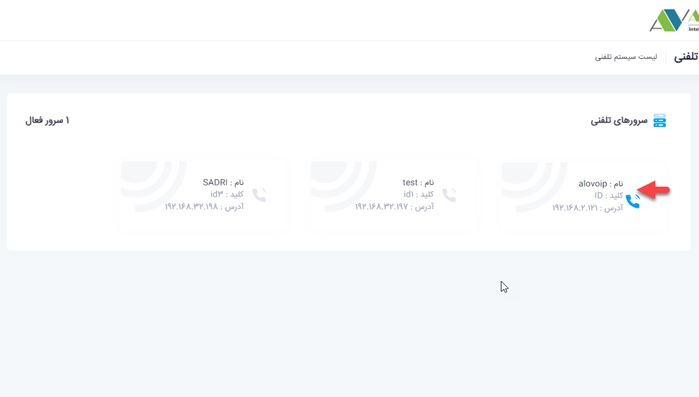
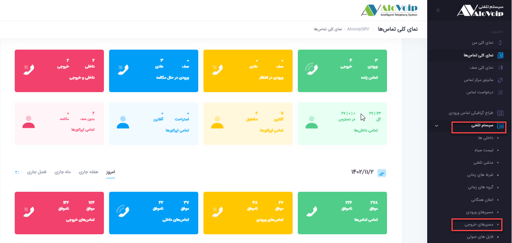
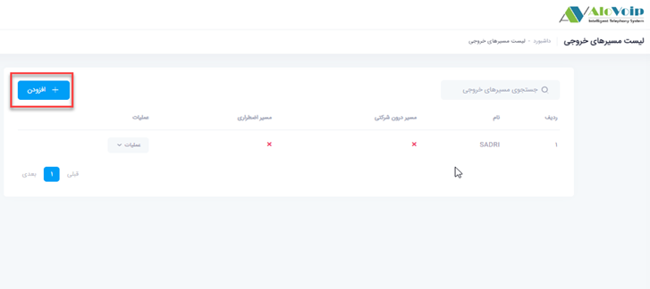
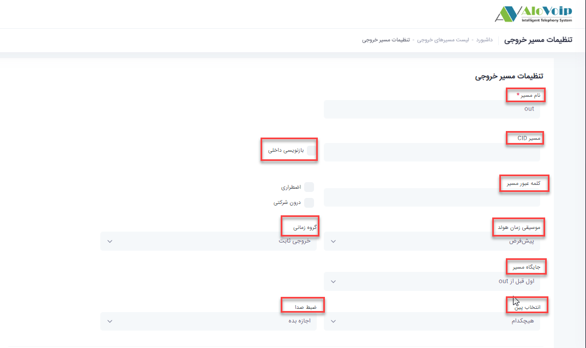
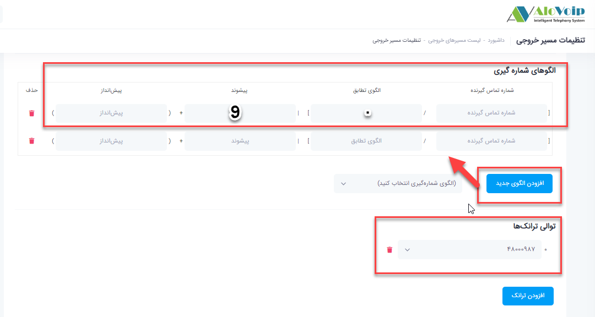
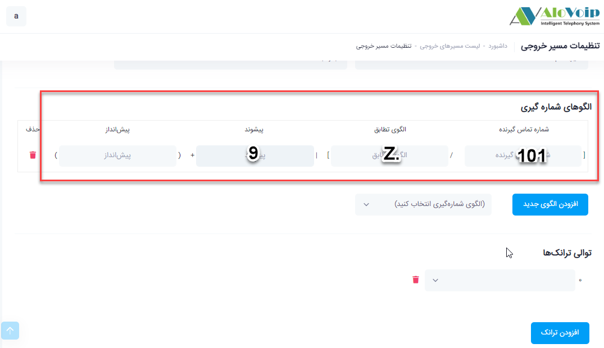
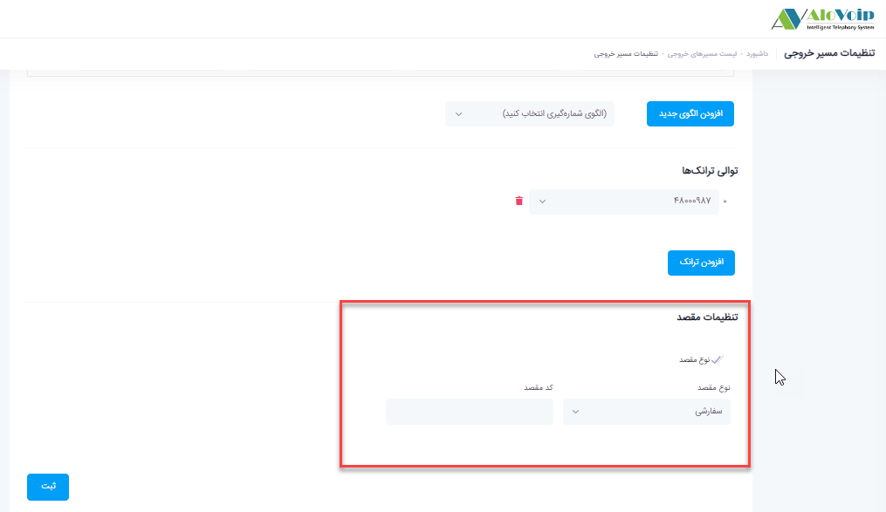

# مسیر خروجی

در این بخش به موضوعات زیر می‌پردازیم:

-	[هدف از تنظیم مسیرهای خروجی ](#PurposeOfSettingTheExitRoutes)

-	[تنظیمات مسیر خروجی ](#OutputRouteSettings)

-	[الگوهای شماره گیری ](#DialerPatterns)

-	[تنظیمات مقصد ](#DestinationSettings)

## هدف از تنظیم مسیرهای خروجی{#PurposeOfSettingTheExitRoutes}

مشخص کردن مسیرهای خروجی این امکان را برای شما فراهم می‌کند که داخلی های سازمان بتوانند با خارج از شرکت 
ارتباط برقرار کنند.مثلا به یک شماره موبایلی زنگ بزنند.

## تنظیمات مسیر خروجی{#OutputRouteSettings}

برای تنظیم مسیر خروجی در پنل الوویپ وارد شوید و در قسمت **سیستم تلفنی**، **مسیرهای خروجی** را انتخاب کنید.سپس روی **افزودن** کلیک کنید.در صفحه باز شده می‌توانید تنظیمات لازم را انجام دهید

-	در قسمت **نام مسیر** یک اسم را بصورت انگلیسی انتخاب کنید.به عنوان مثال out 

-	در قسمت **مسیر CID یا CallerID** می‌توانید مشخص کنید که وقتی با خارج از سازمان تماس می‌گیرید روی دستگاه های تلفن چه شماره ایی بیفتد. تنظیمات این قسمت مستلزم این است مخابرات منطقه شما بتواند این مورد را پشتیبانی کند.قسمت بازنویسی داخلی هم بدین معنی است که وقتی به بیرون زنگ می‌زنید شماره داخلی هم بیفتد که باز هم این مورد  به پشتیبانی منطقه مخابراتی شما برمی‌گردد.

-	در قسمت **کلمه مسیر عبور** می‌توانید مشخص کنید افرادی که می‌خواهند خروجی بگیرند یک کلمه عبور وارد کنند و بعد تماس خروجی بگیرند.
-	می‌توانید یک **موسیقی زمان هولد** داشته باشید که اگر حالت پیش فرض باشد از موسیقی هولد پیش فرض سیستم استفاده می‌کند. همچنین می‌توانید یک گروه زمانی برایش مشخص کنید و بگویید به عنوان مثال از 8:30 صبح تا 17:30 بعداظهر از این مسیر خروجی استفاده شود.

-	می‌توانید **جایگاه مسیرش** را مشخص کنید.یعنی اگر چند مسیر خروجی داشته باشید می‌توانید مشخص کنید این مسیر خروجی جدیدی که دارید ایجاد می‌کنید کجا قرار بگیرد و اگر اولویت بندی دهید این مسیر خروجی در اولویت قرار می‌گیرد و هرکسی از سازمان تماس خروجی می‌گیرد بر اساس اولویت مسیر خروجی اش مشخص می‌شود.

-	می‌توانید **پین** داشته باشید. اگر از این قسمت دارید استفاده می‌کنید باید کلمه عبور مسیر را خالی بگذارید.

-	می‌توانید روی تماس های خروجی **ضبط صدا** داشته باشید که بصورت پیش فرض روی تمام داخلی ها ضبط مکالمه انجام می‌شود.بر اساس سناریو تماس خود از بین 4 گزینه موجودمی‌توانید ضبط مکالمات خود را انتخاب کنید

## الگوهای شماره گیری{#DialerPatterns}
در بخش الگوی شماره گیری شما می توانید نحوه شماره گیری برای تماس های خروجی را بر طبق فیلدهای مورد نظر تنظیم کنید.به عنوان مثال برای خروجی گرفتن با پیش شماره از یک ترانک خاص خط های مجموعه، می‌توانید پیش
شماره موردنظر را در قسمت **پیشوند** قرار دهید.اگر این فیلد را خالی بگذارید تماس های خروجی بدون پیش شماره خواهد بود.همچنین **الگوی تطابق** نشان دهنده تعداد ارقامی که پس از گرفتن پیش شماره می‌توانید استفاده کنید.به عنوان مثال پارامتر[.] مشخص می‌کند، هر تعداد شماره ایی که می‌خواهید بگیرید.وارد کردن این قسمت با هر الگویی الزامی است.در قسمت شماره تماس گیرنده هم می‌توان مشخص کرد که چه داخلی از الگوی فوق استفاده کند.لازم به ذکر است اگر این مقدار خالی باشد تمامی داخلی های مجموعه می‌توانند از این الگو استفاده کنند. با **افزودن الگوی جدید** یک الگوی شماره گیری جدید می‌توانید اضافه کنید.

-	توالی ترانک
در قسمت توالی ترانک هم ترانک یا همان خط موردنظرتان را برای این مسیر خروجی تعریف شده در نظر می‌گیرید.در این قسمت به بررسی دو سناریو می‌پردازیم:

سناریو1:می‌خواهید یک مسیر خروجی داشته باشید که همه داخلی ها بتوانند  با پیش شماره 9 بدون محدودیت در گرفتن ارقام با خارج از سازمان تماس داشته باشند.این الگو بصورت زیر تعریف می‌شود

سناریو2:می‌خواهید یک مسیر خروجی داشته باشید که فقط داخلی های خاصی از این مسیر خروجی و با محدودیت در گرفتن ارقام استفاده کنند

در مثال فوق فقط داخلی  101 می‌تواند از این الگو استفاده کند با این شرایط که شماره هایی که با صفر شروع شود را نمیتواند شماره گیری کند.
پارامتر=Zاعداد بین 1 تا 9
پارامترX =اعداد بین 0 تا 9

-	در صورت نیاز در قسمت **پیش انداز** هم می‌توانید مشخص کنید که وقتی تماس از سیستم خارج می‌شود یک عددی هم پشت آن شماره قرار داده شود که این بیشتر برای ارتباط با گیتوی های مخابراتی استفاده می‌شود. به عنوان مثال اگر گیتوی یا روتر سیسکو برای خطوط مخابراتی استفاده میکنید از این قسمت استفاده می‌کنید.

## تنظیمات مقصد{#DestinationSettings}

در قسمت **تنظیمات مقصد** هم می‌توانید مشخص کنید‌ اگر برای مثال ترانک 4800987تماس خروجی نداشت و تمام تماس هایی که از این ترانک رد می‌شود پر هستند  و امکان تماس خروجی وجود ندارد به کدام بخش وصل شود. می‌توانید ترانک دیگری را در این قسمت انتخاب کنید

