# تنظیمات صف

در این بخش به موضوعات زیر می‌پردازیم:  

•	[هدف از ساخت یک صف ](#ThePurposeOfMakingAQueue)    
•	[ایجاد یک صف جدید در پنل الوویپ ](#CreateANewQueueInTheAloVoIP)   
•	[ویرایش یک صف ](#EditAQueue)   
•	[تنظیمات عمومی صف ](#GeneralQueueSettings)   
•	[تنظیمات زمانبندی و کاربران ](#SchedulerSettingsAndUsers)   
•	[اطلاعیه های تماس گیرنده ](#CallerNotifications)   
•	[تنظیمات پیشرفته  ](#AdvancedSettings)   

## هدف از ساخت یک صف:{#ThePurposeOfMakingAQueue} 
اگر در سازمانتان واحد هایی دارید که تماس در آن واحدها زیاد است مانند واحد فروش،پشتیبانی و...شما می‌خواهید تماس ها را طبق استراژی خاصی به همه کارشناسان وصل کنید می‌‌‌توانید از صف استفاده کنید. چون صف این امکان را برای شما فراهم می‌کند که تماس ها را طبق استراتژی مناسب سازمانی خودتان به کارشناسان وصل کنید.امکان دیگری که صف به شما می‌دهد این است که می‌توانید  در صف نظرسنجی داشته باشید و متوجه شوید کارشناسانی که در این صف ها هستند آیا مشتریان از آنها راضی هستند یا خیر.همچنین اپراتورها  یا داخلی هایی که در صف هستند با توجه به بسته ایی که خریداری کرده اید می‌توانند خودشان را آنلاین،مشغول بکار،استراخت و یا آفلاین بگذارند.

## ایجاد یک صف جدید در پنل الوویپ
•	در پنل الوویپ از قسمت **مرکز تماس < صف ها** را انتخاب کنید.سپس روی گزینه **افزودن** کلیک کنید. 
•	**شماره صف** : در صفحه باز شده ابتدا شماره صف را وارد کنید. 
•	**نام صف**: سپس یک نام فارسی برای صف در نظر بگیرید.نام انگلیسی آن بصورت اتوماتیک وارد می‌شود. 
•	**کاربران ثابت صف**: می‌توانید کاربرانی که بصورت ثابت در صف هستند را انتخاب کنید.(توجه داشته باشید که هیچ فضای خالی در قسمت بالای کادر کاربران ثابت صف قبل از اولین داخلی انتخاب شده نباید باشد.) کاربران ثابت در صف یعنی این داخلی ها امکان آفلاین شدن در صف را ندارند و همیشه آنلاین هستند.امکان آنلاین و آفلاین شدن را با توجه به بسته ایی که انتخاب کردید فراهم می‌شود.در این حالت اپراتورها وقتی وارد پنل خود می‌شوند این امکان را دارند که خودشان را آنلاین و آفلاین کنند. 
•	در انتها دکمه ثبت را می‌زنید و صف شما ساخته می‌شود 

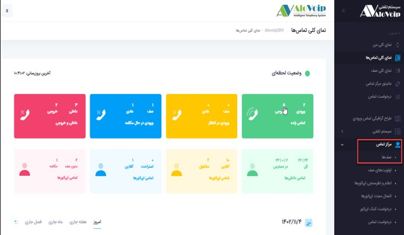 

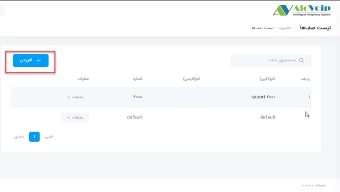 

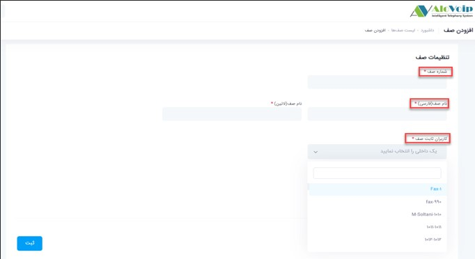 

## ویرایش یک صف
برای اینکه بتوانید تنظیمات یک صف را ویرایش کنید،باید صف مورد نظر را انتخاب کنید کنید سپس روی دکمه  **عملیات** کلیک کرده و گزینه **ویرایش** را انتخاب کنید که با این کار شما وارد تنظیمات بیشتری از صف می‌شوید.

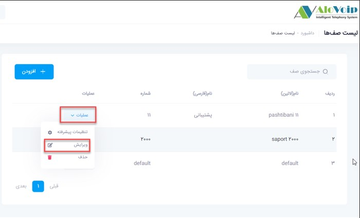 

•	**دپارتمان**: در صفحه باز شده شما می‌توانید اگر دپارتمانی مربوط به این صف دارید آنرا انتخاب کنید. 
•	**کاربران متغیر صف**: با توجه به بسته ایی که خریداری کرده اید اگر این امکان را دارید که اپراتورها بتوانند وضعیت خود را تغییر دهند مانند آفلاین،آنلاین و ..... باید آن داخلی هایی که می خواهند این امکانات را داشته باشند در قسمت کاربران متغیر صف قرار بگیرند.(توجه داشته باشید که هیچ فضای خالی در قسمت بالای کادر کاربران متغیر صف قبل از اولین داخلی انتخاب شده نباید باشد.) با این کار اپراتورهایی که در صف ثابت هستند امکان آفلاین کردن برایشان وجود ندارد مانند داخلی 550 اما اپراتورهایی که در صف داینامیک هستند می‌توانند خودشان را آنلاین،آفلاین،مشغول بکار و استراحت بگذارند.مانند داخلی 551) .منظور از آنلاین یعنی می‌توانند خودشان را وارد صف کنند و منظور از آفلاین یعنی می‌توانند خودشان را از صف بیرون بیاورند.(

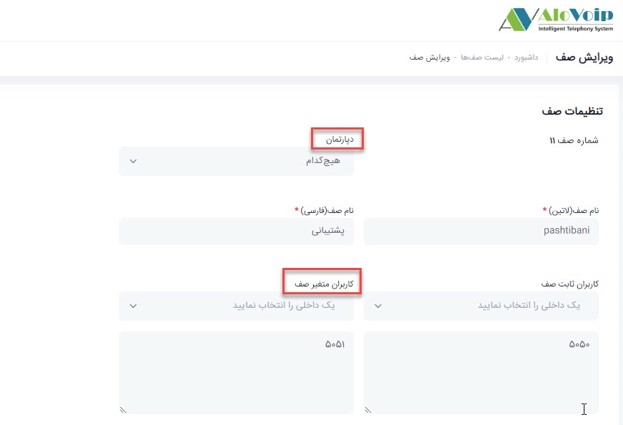 

## تنظیمات عمومی صف

### استراتژی زنگ خوردن داخلی ها در یک صف
اگر شما در کاربران ثابت یا متغیر صف تعداد زیادی داخلی دارید بهتر است با توجه به سیاست سازمانی، استراتژی زنگ خوردن آنها را مشخص کنید.برای این کار در قسمت **تنظیمات عمومی صف>استراتژی زنگ زدن صف**، می‌توانید استراتژی خود را انتخاب کنید. استراتژی های پرکاربرد در صف بصورت زیر هستند: 

1. **Fewestcall** : داخلی هایی که کمترین تماس را داشتند،تماس ها را به آنها وصل می‌کند. 

2.	**Ringall** : بر اساس این استراتژی همه داخلی های تعریف شده در صف بطور همزمان زنگ می‌خورند.این استراتژی خیلی پیشنهاد نمی‌شود چون ممکن است  بر روی گزارش تماس های شما را تاثیر بگذارد. زیرا وقتی همه داخلی ها زنگ می‌خورند و یک داخلی تماس را جواب می‌دهد آن تماس برای آن داخلی بصورت موفق و برای بقیه داخلی ها بصورت ناموفق خواهد بود.
3.	**rrmemory** :  سعی می‌کند به همه داخلی ها ی صف، تماس به تعداد یکسان وارد شود. 

4.	**Linear** : همه تماس ها را اول به اولین داخلی تعریف شده در صف وصل می‌کند. 

5.	**کاربران مشغول را در نظر نگیر** : در این قسمت هم می‌توانید مشخص کنید کاربرانی که خطشان مشغول است را در نظر بگیرد یا نه. 

6.	**انتساب اتوماتیک تماس به کاربران صف** :  با انتخاب این گزینه سیستم، تماس ها بطور خودکار به اعضاء صف اختصاص می‌دهد.در واقع وقتی یک تماس به صف وارد می‌شود، سیستم بطور خودکار و بر اساس تنظیمات مشخص شده تماس را به یکی از اعضای صف تخصیص می‌دهد. 

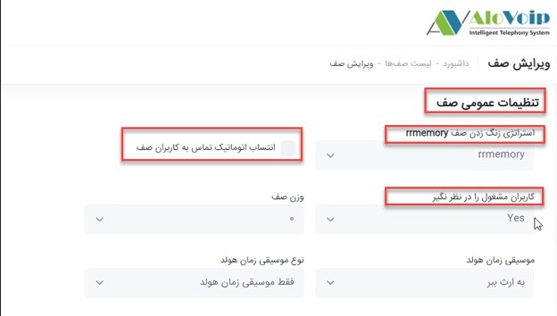 

### نحوه تنظیم صدای هولد

•	**موسیقی زمان هولد**: زمانی که تماسی به صف وارد می‌شود تا قبل از اینکه آن تماس به اپراتور وصل شود یک موزیک پیش فرض برای تماس گیرنده پخش می‌شود.شما می‌توانید در صورت نیاز موزیک مورد نظر خود را در سیستم بارگذاری کرده و از آن بجای موزیک پیش فرض استفاده کنید. 
•	**نوع موسیقی زمان هولد**: در نوع موسیقی زمان هولد می‌توانید مشخص کنید که تماس گیرنده تا قبل از اتصال به کاربر صدای موزیک هولد و یا صدای بوق معمولی بشنود

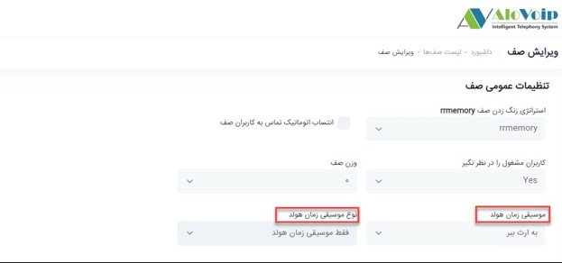 

### نحوه تنظیم ضبط مکالمه در صف
1.	**ضبط پیام**: این گزینه مربوط به ضبط مکالمات صف است که باید روی WAV باشد. 

2.	**حالت ضبط**: دو حالت برای ضبط تماس ها وجود دارد: 

3.	**شامل زمان هولد**: در این حالت مکالمات از زمان ورود به صف که شامل زمان انتظار می‌باشد ضبط می‌شود. 

4.	**شروع ضبط بعد از پاسخگویی**: در این حالت مکالمات از لحظه پاسخگویی اپراتور ضبط می‌شود. 

5.	**تنظیم حجم صدای تماس گیرنده و پاسخ دهنده**:  این مورد هم مربوط به تنظیم حجم صدا در صف است روی +4 که  حالت حداکثر است قرار دهید. 

6.	**تماس های از دست رفته را پاسخ داده شده در نظر بگیر**: با انتخاب این گزینه زمانی که تماسی در صف وارد شد و اپراتور پاسخگو نبود این تماس به عنوان تماس ناموفق در نظر گرفته نمی‌شود. 

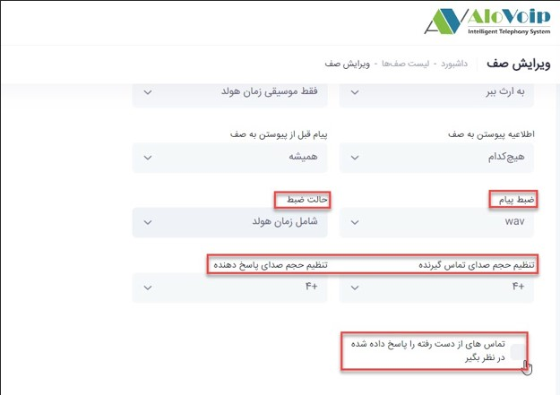 

## تنظیمات زمانبندی و کاربران
  ###  حداکثر زمان انتظار 

1.	**حداکثر زمان انتظار**: اگر این گزینه را به عنوان مثال روی 10 دقیقه قرار دهید بدین معنی است که اگر یک تماسی در صف آمد و 10 دقیقه هم منتظر ماند و هیچکدام از داخلی ها به آن تماس پاسخ نداد آن تماس به کدام بخش وصل شود.این زمان بسته به سناریو شما قابل تغییر است.حالا اگر تماسی در صف آمد و 10 دقیقه منتظر بود چه اتفاقی بعد از آن بیفتد. در قسمت **تنظیمات مقصد تماس ناموفق** می‌توانید مشخص کنید بعد از 10 دقیقه چه اتفاقی بیفتد بصورت پیش فرض روی حالت قطع تماس است ولی می‌توانید انتخاب کنید که به یک داخلی یا صف و... این تماس وصل شود. 

2.	**حداکثر زمان رنگ خوردن گوشی کاربر**: در این قسمت می‌توانید مشخص کنید هر داخلی در صف چند ثانیه یا دقیقه زنگ بخورد. 

3.	بقیه تنظیمات به همان صورتی که در تصویر زیر مشخص است باقی بماند 

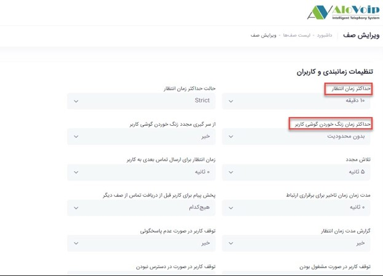 

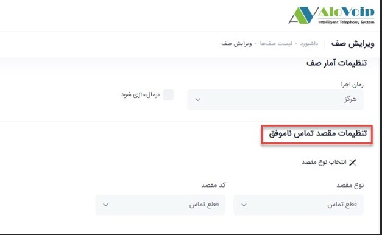 

## اطلاعیه های تماس گیرنده 
•	**تکرار**: شما می‌توانید وقتی یک تماسی وارد صف شد به آن اعلام شود که نفر چندم صف انتظار است.این گزینه بصورت پیش فرض  روی 45 ثانیه است که این مقدار با توجه به نیازتان قابل تغییر است. 
•	**اعلام موقعیت تماس گیرنده در صف**: اگر در قسمت تکرار، زمانی را تعیین کردید اعلام موقعیت تماس گیرنده در صف را باید روی گزینه بله انتخاب کنید تا موقعیت برایتان اعلام شود.  
•	**اعلام زمان هولد شدن تماس**: اعلام تخمين مدت زمان براي انتظار در صف است که این زمان بصورت تقریبی توسط سیستم محاسبه می‌شود، اگر اين مدت زمان كمتر از یک دقيقه باشد اعلام نمي گردد، اگر یکبار‌ را انتخاب كنيد، پيام فقط يكبار پخش خواهد شد 

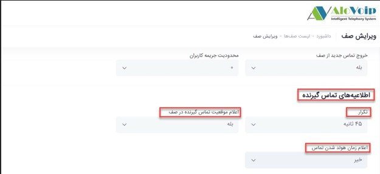 

## تنظیمات پیشرفته
### تنظیم SLA در صف
برای تنظیم sla که در پنل الوویپ قسمت **داشبورد > نمای کلی صف** مشاهده می‌کنید، صف مورد نظرتان را انتخاب کرده و از منوی **عملیات**گزینه **تنظیمات پیشرفته** را انتخاب کنید. 

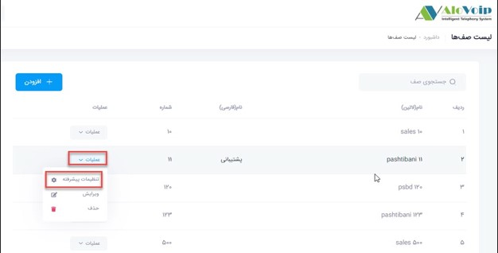 
•	**فعال بودن**: وقتی وارد این بخش می‌شوید گزینه هایی مانند فعال بودن را دارید که با کلیک روی آن می‌توانید یک صف را فعال کنید. 
•	**صدای ورود و خروج به صف** : همچنین می‌توانید صدای ورود و خروج به صف را داشته باشید یعنی اگر یک تماس وارد صف شد یا از صف خارج شد یک صدایی پخش شود.این امکان زمانی فراهم می‌شود که شما پنل الوویپ قسمت نمای کلی صف را روی تلویزیون داشته باشید.مثلا مرکز تماسی دارید و می خواهید همه حواسشان به این صف باشد تا اگر تماسی به صف وارد یا از صف خارج شد متوجه شوند. 
•	**حداقل زمان انتظار**: در اینجا می‌توانید مشخص کنید که اگر به یک تماسی تا چند ثانیه جواب ندادید آن تماس به عنوان یک تماس از دست رفته در نظر گرفته شود. به عنوان مثال اگر حداقل زمان انتظار 30 ثانیه در نظر گرفته شود،هر کسی بالای 30 ثانیه تماسش را در صف قطع کند به عنوان تماس از دست رفته در نظر گرفته می‌شود که آن را در نمای کلی صف،قسمت تماس های از دست رفته می‌توانید مشاهده کنید.حالا اگر تماسی  در صف آمده و زیر 30 ثانیه قطع کرده است گزارش آن را در قسمت گزارشات، گزارشات تماس می‌توانید مشاهده کنید. 
•	**حداقل زمان  انتظار بحرانی و حداکثر زمان انتظار**(SLA) : شما وقتی این قسمت ها را بر اساس دقیقه تعیین می‌کنید در نمای کلی صف در قسمت SLA آن را بصورت ثانیه به شما نشان می‌دهد.شما می‌توانید این قسمت ها را بر اساس SLAیی که می‌خواهید برای صف در نظر بگیرید تعیین کنید. 
•	**صدای زمان انتظار بحرانی و صدای حداکثر زمان انتظار**: حتی می‌توانید برای حداقل زمان انتظار بحرانی و حداکثر زمان انتظار صدا هم در نظر بگیرید یعنی اگر یک تماسی آمد و در حالت بحرانی قرار گرفت برای شما یک صدا پخش کند که حتما باید اسپیکری باشد تا شما متوجه صدا شوید 

•   **دپارتمان ها**: در قسمت دپارتمان ها هم می‌توانید دپارتمان صف خود را تعیین کنید  
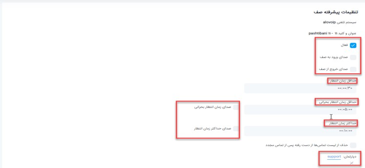 

•	برای دیدن SLA یی که برای صف در نظر گرفتید باید  در **نمای کلی صف**،صف مورد نظر را انتخاب کنید و در قسمت SLA می‌توانید موارد مورد نظر را بینید.
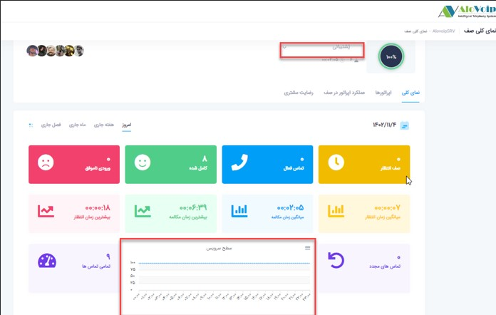 