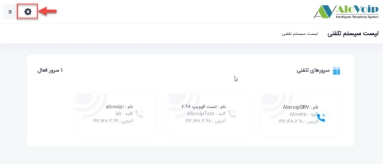
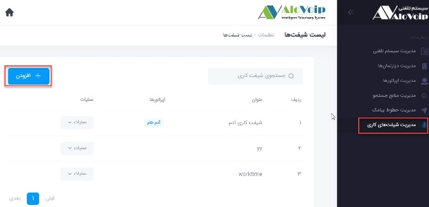
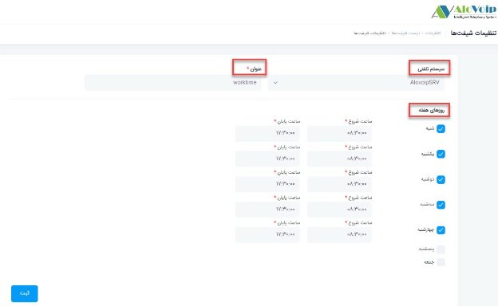
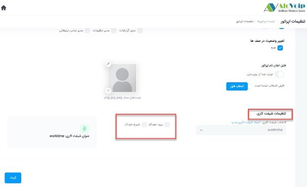

# شیفت کاری

در این بخش به موضوعات زیر می‌پردازیم:

• [هدف از ایجاد شیفت کاری ](#PurposeOfCreatingAShift) 
• [تنظیم ماژول شیفت کاری در پنل الوویپ ](#CreateAShiftModules) 

## هدف از ایجاد شیفت کاری{#PurposeOfCreatingAShift}

شما در سازمان خود می‌توانید برای بخش ها و دپارتمان های مختلف، تایم های کاری مختلفی تعریف کنید.به عنوان مثال واحد پشتیبانی از ساعت 8:30 تا 17:30 پاسخگوی تماس باشد و  واحد فروش هم از ساعت 8:30 تا 17 پاسخگوی تماس ها باشد.شما با شیفت کاری این امکان را برای خودتان فراهم می‌کنید که داخلی ها و یا اپراتورهای این واحدها بصورت اتوماتیک وارد صف  مخصوص به خودشان شوند و  به تماس ها پاسخ دهند.یعنی از ساعت 8:30 داخلی اپراتورها و یا کارشناسان وارد دپارتمان و یا صف مخصوص به خودشان می‌شوند و بعد از تایم مورد نظر شما یعنی همان 17:30 آن داخلی ها و اپراتورها از آن صف پاسخگویی خارج می‌شوند که با این کار نظارت بهتر و بیشتری روی اپراتورها و داخلی ها دارید.

## تنظیم ماژول شیفت کاری در پنل الوویپ{#CreateAShiftModules}

برای استفاده از این ماژول باید مراحل زیر را انجام دهید:

• شیفت کاری مدنظر تنظیم شود.  
• برای کارشناسی که می‌خواهید بر اساس شیفت کاری تعریف شده ورود و خروج داشته باشد اپراتور تعریف کنید. 
• داخلی اپراتور را در صف داینامیک قرار دهید. 
• شیفت کاری را به اپراتور تخصیص دهید. 

**1.تنظیم شیفت کاری**

برای تنظیم یک شیفت کاری جدید در پنل الوویپ قسمت \*\***تنظیمات سیستم\*\*** را انتخاب ‌کنید.  

در صفحه باز شده \*\***مدیریت شیفت های کاری** \*\*را انتخاب و سپس روی دکمه \*\***افزودن\*\*** کلیک کنید.  

اگر از سیستم تلفنی های مختلفی استفاده می‌کنید، در قسمت **سیستم تلفنی** آن را انتخاب کنید و در بخش **عنوان** هم اسم مورد نظر را تایپ کنید و در انتها **روزهای هفته** مدنظر را مشخص کنید.به عنوان مثال شنبه تا چهارشنبه از ساعت 8:30 تا 17:30 ساعات کاری شما می‌باشد که آنها را انتخاب و دکمه ثبت را بزنید. 

**2.ایجاد اپراتور**

برای استفاده از شیفت کاری نیاز دارید اپراتور بسازید و شیفت کاری تنظیم شده را به اپراتور اختصاص دهید.برای ساخت یک اپراتور جدید می‌توانید به مقاله مربوط به ایجاد اپراتور مراجعه کنید. 

**3.قرار دادن داخلی اپراتور در صف داینامیک**

برای تخصیص شیفت کاری تنظیم شده به اپراتور نیاز دارید داخلی اپراتور را در صف داینامیک قرار دهید.برای انجام این کار می‌توانید به مقاله مربوط به تنظیمات صف مراجعه کنید.
 

**4.تخصیص شیفت کاری به اپراتور**

در پنل اپراتور در قسمت تنظیمات شیفت کاری،شیفت کاری مدنظر را انتخاب کنید. 

**ورود و خروج خودکار:**

با انتخاب ورود خودکار و خروج خودکار، این اپراتور می‌تواند در ساعات شیفت کاری خود بصورت خودکار وارد صف خودش شود و پاسخگوی تماس ها باشد و بعد از پایان شیفت کاری اتوماتیک از صف پاسخگویی خارج شود.اگر این گزینه را انتخاب نکنید خود کاربر در پنل کاربری خود باید برای ورود به صف دکمه آنلاین و برای خروج از صف دکمه آفلاین را بزند.
 