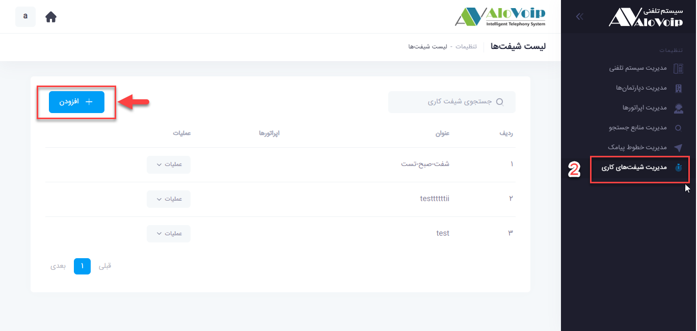
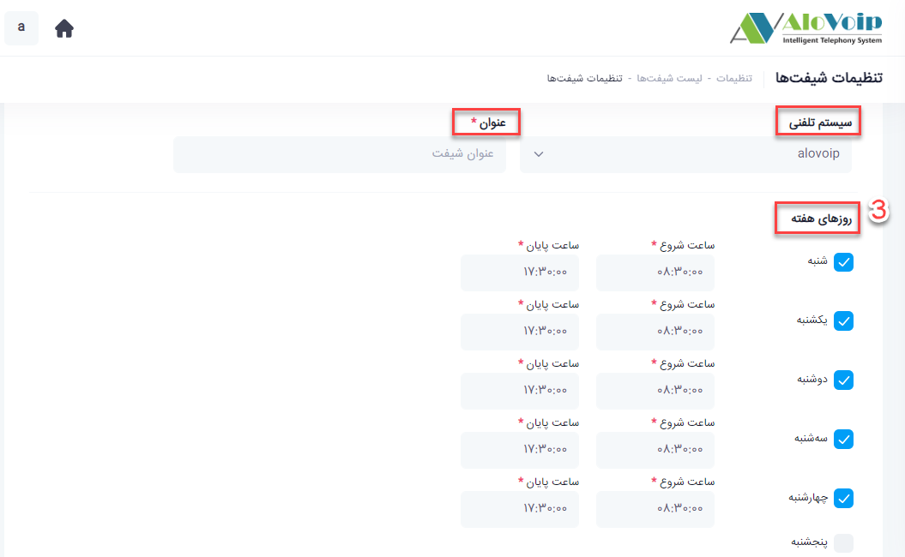
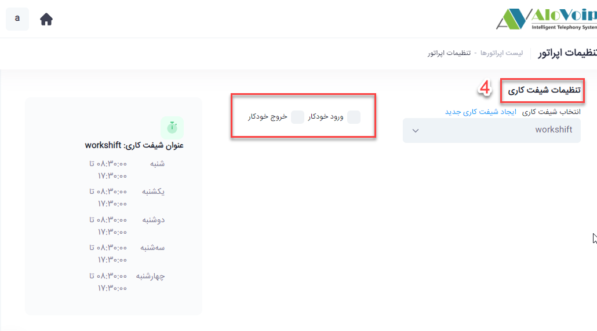

# شیفت کاری

در این بخش به موضوعات زیر می‌پردازیم:
•	[هدف از ایجاد شیفت کاری](#PurposeOfCreatingAShift)
•	[ایجاد شیفت کاری جدید در پنل الوویپ](#CreateAShift)

## هدف از ایجاد شیفت کاری{#PurposeOfCreatingAShift}
شما در سازمان خود می‌توانید برای بخش‌ها و دپارتمان‌های مختلف، تایم‌های کاری مختلفی تعریف کنید. به عنوان مثال واحد پشتیبانی از ساعت 8:30 تا 17:30 پاسخگوی تماس باشد و  واحد فروش هم از ساعت 8:30 تا 17 پاسخگوی تماس ها باشد. با شیفت کاری این امکان را برای خودتان فراهم می‌کنید که داخلی‌ها و یا اپراتورهای این واحدها بصورت اتوماتیک وارد صف  مخصوص به خودشان شوند و  به تماس‌ها پاسخ دهند. یعنی از ساعت 8:30 داخلی اپراتورها و یا کارشناسان وارد دپارتمان و یا صف مخصوص به خودشان می‌شوند و بعد از تایم مورد نظر شما یعنی همان 17:30 آن داخلی‌ها و اپراتورها از آن صف پاسخگویی خارج می‌شوند که با این کار نظارت بهتر و بیشتری روی اپراتورها و داخلی‌ها دارید.

## ایجاد شیفت کاری{#CreateAShift}

1. برای تنظیم یک شیفت کاری جدید در پنل الوویپ قسمت تنظیمات سیستم را انتخاب ‌کنید

2. در صفحه باز شده مدیریت شیفت های کاری را انتخاب و سپس دکمه افزودن را کلیک کنید

3.	اگر از سیستم تلفنی های مختلفی استفاده می‌کنید، در قسمت سیستم تلفنی آن را انتخاب کرده و در بخش عنوان، نام مورد نظر را تایپ و در انتها روزهای هفته مدنظر را مشخص کنید. به عنوان مثال شنبه تا چهارشنبه از ساعت 8:30 تا 17:30 ساعات کاری شما می‌باشد که آنها را انتخاب و دکمه ثبت را بزنید.

4.	برای استفاده از شیفت کاری نیاز دارید اپراتور بسازید و داخلی آن اپراتور را در قسمت داینامیک صف قرار دهید و سپس در پنل اپراتور در قسمت تنظیمات شیفت کاری، شیفت کاری مدنظر را انتخاب کنید.

با انتخاب ورود خودکار و خروج خودکار، این اپراتور می‌تواند در ساعات شیفت کاری خود وارد صف خودش شود و پاسخگوی تماس ها باشد.

