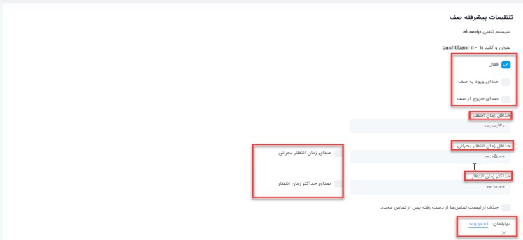

### تنظیم SLA در صف
برای تنظیم sla که در پنل الوویپ قسمت **داشبورد > نمای کلی صف** مشاهده می‌کنید، صف مورد نظرتان را انتخاب کرده و از منوی **عملیات**گزینه **تنظیمات پیشرفته** را انتخاب کنید. 

 
•	**فعال بودن**: وقتی وارد این بخش می‌شوید گزینه هایی مانند فعال بودن را دارید که با کلیک روی آن می‌توانید یک صف را فعال کنید. 
•	**صدای ورود و خروج به صف** : همچنین می‌توانید صدای ورود و خروج به صف را داشته باشید یعنی اگر یک تماس وارد صف شد یا از صف خارج شد یک صدایی پخش شود.این امکان زمانی فراهم می‌شود که شما پنل الوویپ قسمت نمای کلی صف را روی تلویزیون داشته باشید.مثلا مرکز تماسی دارید و می خواهید همه حواسشان به این صف باشد تا اگر تماسی به صف وارد یا از صف خارج شد متوجه شوند. 
•	**حداقل زمان انتظار**: در اینجا می‌توانید مشخص کنید که اگر به یک تماسی تا چند ثانیه جواب ندادید آن تماس به عنوان یک تماس از دست رفته در نظر گرفته شود. به عنوان مثال اگر حداقل زمان انتظار 30 ثانیه در نظر گرفته شود،هر کسی بالای 30 ثانیه تماسش را در صف قطع کند به عنوان تماس از دست رفته در نظر گرفته می‌شود که آن را در نمای کلی صف،قسمت تماس های از دست رفته می‌توانید مشاهده کنید.حالا اگر تماسی  در صف آمده و زیر 30 ثانیه قطع کرده است گزارش آن را در قسمت گزارشات، گزارشات تماس می‌توانید مشاهده کنید. 
•	**حداقل زمان  انتظار بحرانی و حداکثر زمان انتظار**(SLA) : شما وقتی این قسمت ها را بر اساس دقیقه تعیین می‌کنید در نمای کلی صف در قسمت SLA آن را بصورت ثانیه به شما نشان می‌دهد.شما می‌توانید این قسمت ها را بر اساس SLAیی که می‌خواهید برای صف در نظر بگیرید تعیین کنید. 
•	**صدای زمان انتظار بحرانی و صدای حداکثر زمان انتظار**: حتی می‌توانید برای حداقل زمان انتظار بحرانی و حداکثر زمان انتظار صدا هم در نظر بگیرید یعنی اگر یک تماسی آمد و در حالت بحرانی قرار گرفت برای شما یک صدا پخش کند که حتما باید اسپیکری باشد تا شما متوجه صدا شوید 

•   **دپارتمان ها**: در قسمت دپارتمان ها هم می‌توانید دپارتمان صف خود را تعیین کنید  
 

•	برای دیدن SLA یی که برای صف در نظر گرفتید باید  در **نمای کلی صف**،صف مورد نظر را انتخاب کنید و در قسمت SLA می‌توانید موارد مورد نظر را بینید.
 