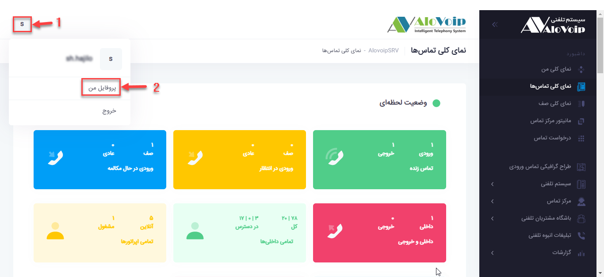
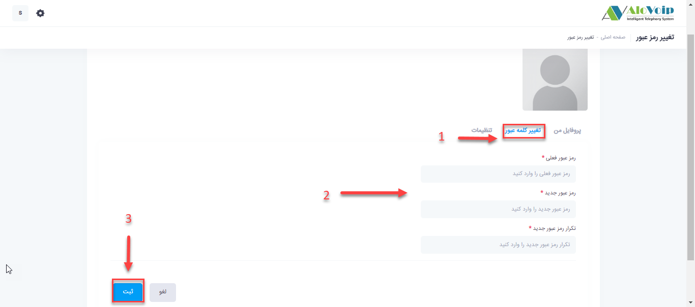

# چگونه پسورد پنل خود را تغییر دهیم؟
1. برای تغییر پسورد وارد پنل شده و سپس در گوشه بالا سمت چپ بر روی **ابتدای حرف نام کاربری** خود کلیک کنید . 

 

2. در مرحله بعد در صفحه باز شده بر روی **تغییر کلمه عبور** کلیک کرده و سپس رمز فعلی و رمز جدید را وارد کرده و دکمه **ثبت** را می فشاریم.

 

و در پایان یکبار از پنل خود خارج شده و مجدد با پسورد جدید وارید شوید.
