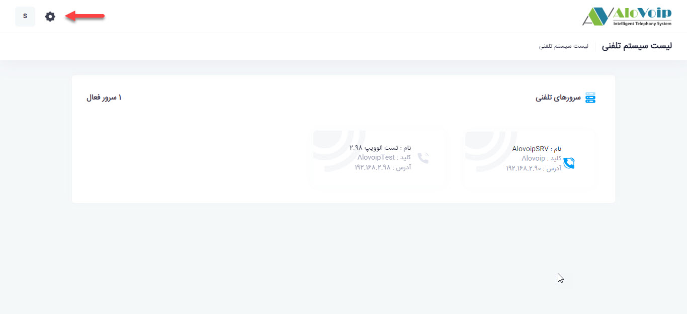
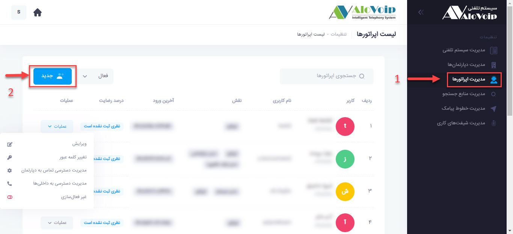

# ایجاد یک اپراتور جدید
برای ایجاد یک اپراتور جدید ابتدا در صفحه اصلی پنل بر روی علامت **تنظیمات** در گوشه بالا سمت چپ کلیک کنید. 

در صفحه باز شده بر رروی گزینه **مدیریت اپراتورها** کلیک کرده و سپس دکمه **جدید** را انتخاب کنید. 

در قسمت تنظیمات عمومی اطلاعات کاربر را وارد میکنیم و سپس  در قسمت نقش های کاربر ابتدا اپراتور یا مدیر سیستم بودن و سپس [نوع دسترسی کاربر]() را تعیین میکنیم.
 <!--- link -->
همچنین با فعال کردن گزینه تولید صدا از روی متن میتوانید متن دلخواه خود را وارد کنید و زمانی که تماس به اپراتور  وصل شد متن وارد شده بصورت صدا پخش میشود.بطور مثال شماره داخلی یا نام و نام خانوادگی اپراتور.
