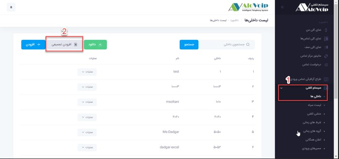
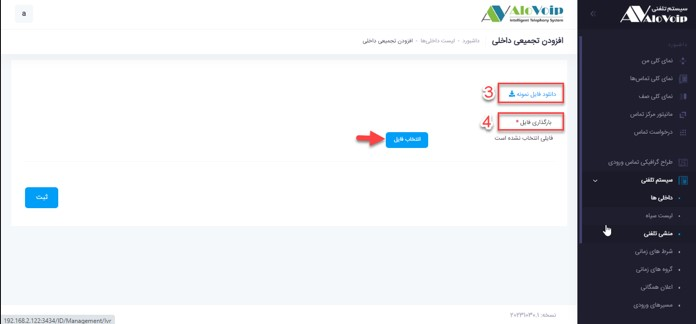

<html dir="rtl" lang="pr">

# ایجاد داخلی

در این بخش به موضوعات زیر می‌پردازیم:

•	[هدف از ساخت یک داخلی در پنل الوویپ](#ThePurposeOfBuildingAnExtention)

•	[ایجاد یک داخلی جدید](#CreateANewExtention)

•	[تعریف داخلی ها از طریق اکسل](#CreateExtentionFromExcel)

## هدف از ساخت داخلی{#ThePurposeOfBuildingAnExtention} 
قصد داریم در مورد نحوه ساخت داخلی در پنل الوویپ صحبت کنیم.وقتی یک سرور ویپ در یک سازمان راه اندازی می ‌‌شود نیاز به این است که کارشناسان داخل سازمان، داخلی داشته باشند تا بتوانند هم با افراد داخل سازمان و هم خارج از سازمان ارتباط برقرار کنند.

## مراحل ایجاد داخلی در پنل الوویپ{#CreateANewExtention} 
با ایجاد داخلی ها شما می‌توانید داخلی به داخلی با همکاران خود در تماس باشید حتی اگر خط های سازمان خود را راه اندازی نکرده باشید.برای ایجاد یک داخلی در پنل الوویپ باید مراحل بصورت زیر طی شود

1. برای ایجاد داخلی جدید در پنل الوویپ از مسیر منو سیستم تلفنی > داخلی‌ها وارد شوید. در این بخش داخلی هایی که در سازمان وجود دارند را میتوانید مشاهده کنید و حتی بصورت اکسل تمام داخلی ها را دانلود کنید

2.	برای اضافه کردن یک داخلی جدید روی  **افزودن** کلیک کنید. 
3.	** انتخاب نوع دستگاه** : در صفحه باز شده انتخاب نوع دستگاه را روی SIP**** بگذارید. چون اکثر دستگاه های در بازار این پروتکل را پشتیبانی می کنند. 
4.	**شماره داخلی** : یک شماره داخلی مانند 5050 در نظر بگیرید. بهتر است به ازای هر دپارتمانی که در سازمان خود دارید رنج متفاوتی انتخاب شود. 
5.	**نام کاربر** : نام کاربر را به عنوان مثال Ms-Dadgar انتخاب کنید. 
6.	**رمز** : در نهایت یک رمز هم برای آن داخلی در نظر بگیرید 

>نکته 
وقتی ثبت را بزنید آن داخلی ساخته می شود و می توانید آن را روی IP Phone ویا Soft Phone تنظیم کنید. وقتی داخلی 5050 با بقیه افراد سازمان تماس میگیرد روی تلفن فرد پاسخ دهنده Ms.Dadgar نمایش داده میشود که همان  Caller IDاست. 

## تعریف داخلی ها از طریق اکسل{#CreateExtentionFromExcel} 

اگر قصد دارید تعداد زیادی داخلی ایجاد کنید بجای اینکه تک به تک این داخلی ها ساخته شود شما میتوانید از طریق اکسل یکجا تمام این داخلی ها را وارد سیستم تلفنی خود کنید.برای این کار کافی است مراحل زیر طی شود. 
1.	در منو سیستم تلفنی > داخلی‌ها وارد شوید 
گزینه افزودن تجمیعی را انتخاب کنید

3.	در صفحه باز شده نمونه فایل اکسل را دانلود کنید و فیلدهای مشخص شده را پر کنید. 
4.	سپس در قسمت بارگذاری فایل ، اکسل مربوطه را انتخاب کنید و دکمه ثبت را بزنید.با این کار تمام داخلی های تعریف شده یکجا به سیستم تلفنی اضافه می شوند.

