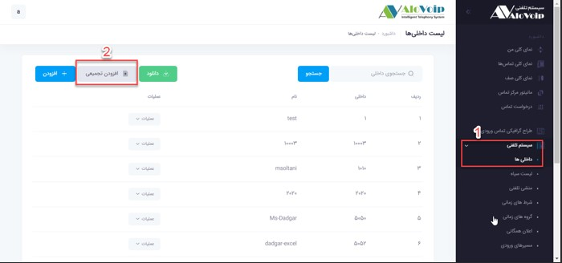
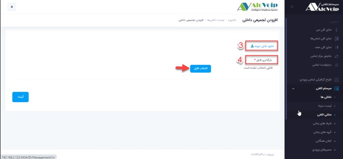

# تعریف داخلی ها از طریق اکسل{#CreateExtentionFromExcel} 

اگر قصد دارید تعداد زیادی داخلی ایجاد کنید بجای اینکه تک به تک این داخلی ها ساخته شود شما میتوانید از طریق اکسل یکجا تمام این داخلی ها را وارد سیستم تلفنی خود کنید.برای این کار کافی است مراحل زیر طی شود. 
1.	در منو سیستم تلفنی > داخلی‌ها وارد شوید 
گزینه افزودن تجمیعی را انتخاب کنید

 
3.	در صفحه باز شده نمونه فایل اکسل را دانلود کنید و فیلدهای مشخص شده را پر کنید. 
4.	سپس در قسمت بارگذاری فایل ، اکسل مربوطه را انتخاب کنید و دکمه ثبت را بزنید.با این کار تمام داخلی های تعریف شده یکجا به سیستم تلفنی اضافه می شوند.
