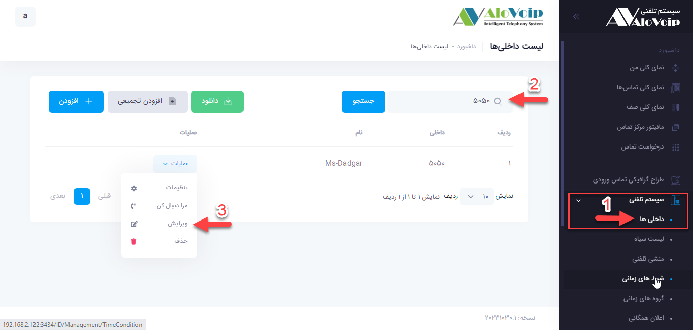
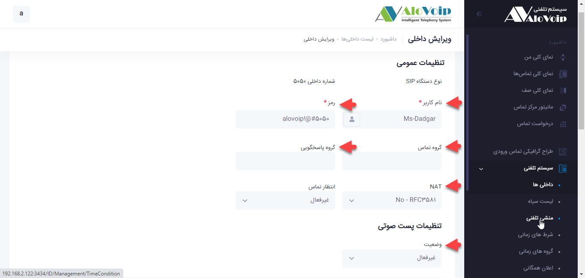
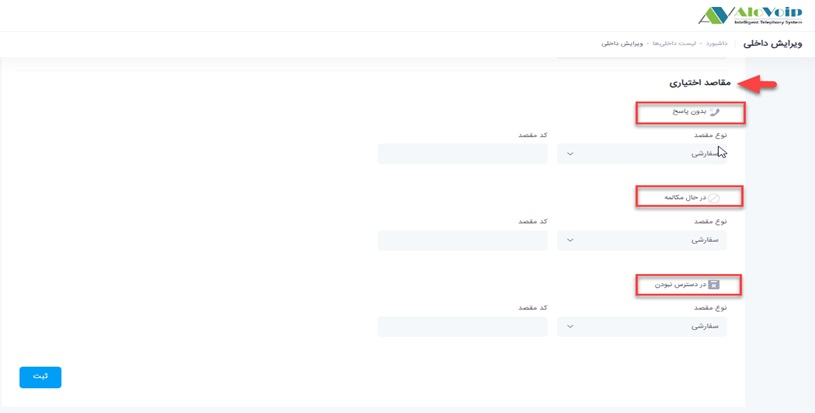

#  ویرایش داخلی

در این بخش به موضوعات زیر می‌پردازیم:
-	[هدف از ویرایش یک داخلی در پنل الوویپ](#Goal-Of-Create-Extention)
-	ویرایش اطلاعات یک داخلی
-	گروه تماس و پاسخگویی
-	مفهوم و عملکرد Nat
-	سناریو مربوط به یک داخلی
## هدف از ویرایش یک داخلی در پنل الوویپ
در این بخش می‌خواهیم در مورد ویرایش داخلی‌ها در پنل الوویپ صحبت کنیم. اگر قبلا داخلی ایجاد کرده‌اید و نیاز به تغییرات در تنظیمات آن دارید، می‌توانید آن را ویرایش کرده و تغییرات مورد نظر را اعمال کنید. این تغییرات می‌تواند شامل نام کاربر و رمز و ... باشد.
## ویرایش اطلاعات یک داخلی
برای ویرایش یک داخلی در پنل الوویپ باید مراحل زیر طی شود:
1.	در پنل الوویپ از مسیر منو سیستم تلفنی > داخلی‌ها وارد شوید. (در این بخش لیست داخلی‌های ایجاد شده را مشاهده  می‌کنید.)
2.	در کادر مربوط به جستجو، داخلی مورد نظرتان را تایپ کرده و سپس روی گزینه جستجو  کلیک کنید.
3.	برای ویرایش آن داخلی روی دکمه عملیات کلیک کرده  و از زیر منوی باز شده گزینه ویرایش را انتخاب کنید.

•	در صفحه باز شده می‌توانید اطلاعاتی مانند نام کاربری و یا رمز آن داخلی را تغییر دهید.
•	میتوانید گروه تماس و پاسخگویی برای آن داخلی در نظر بگیرید.
## گروه تماس و پاسخگویی
      فرض کنید در یک واحدی تعدادی افراد حضور دارند و تلفن یکی از آن کارشناسان زنگ می‌خورد ولی کارشناس مربوطه پشت میزش حضور ندارد تا آن تماس را پاسخ دهد، در نتیجه باعث از دست رفتن  تماس می‌شود ولی با تنظیم گروه تماس و پاسخگویی این امکان را برای همکارانش فراهم می‌کنید  تا بازدن دکمه *8# و یا *8 call بر روی تلفن خود این تماس را پاسخ دهند.
## مفهوم و عملکرد NAT
در برخی از موارد نیاز هست برای داخلی‌هایی که از طریق vpn رجیستر شده‌اند و مشکل صدای یکطرفه دارند می‌توانید با تنظیم Nat این مورد را بر طرف کنید . بنابراین در بخش تنظیمات مقدار NAT را برابرYES قرار می‌دهید.
•	میتوانید پست صوتی و یا ویس میل برای این داخلی فعال کنید

## سناریو مربوط به یک داخلی
در قسمت مقاصد اختیاری می‌توانید سناریو مربوط به آن داخلی را پیاده سازی کنید. به عنوان مثال در قسمت بدون پاسخ مشخص می‌کنید اگر داخلی به هردلیل پاسخگو نبود تماس به چه صف یا داخلی و ... هدایت شود. برای قسمت‌های در حال مکالمه و یا در دسترس نبودن هم این موضوع صدق می‌کند.

**نکته** 
اگر برای داخلی ویس میل فعال شود سناریو مربوط به آن داخلی کار نخواهد کرد. چون وقتی تماس به ویس میل می‌رود دیگر امکان بازگشت آن تماس وجود ندارد.
•	با کلیک بر دکمه ثبت تنظیمات مربوط به داخلی ثبت و اعمال می‌شود.

