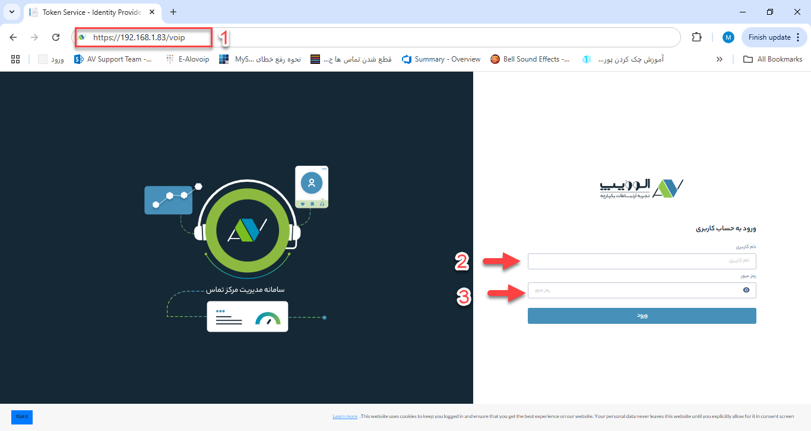

# ورود به الوویپ
در این بخش به نحوه ورود به نرم افزار الوویپ می پردازیم:

1-ابتدا شما باید آدرس ورود به نرم افزار الوویپ را  در قسمت آدرس بار یک مرروگر به صورت زیر وارد میکنیم 
**https://server-ip/voip**
 

 

2\. نام کاربری که از قبل ساخته شده را (می تواند هم نام  و هم شماره موبایل باشد) وارد میکنیم  

3\. رمز عبور را جاگذاری میکنیم  
توجه داشته باشد چند بار اشتباه وارد کردن رمز عبور می تواند منجر به قفل شدن نام کاربری شما تا یک ساعت شود

