# نحوه تنظیم گیتوی گرنداستریم
در این بخش به موضوعات زیر می‌پردازیم:
- [مراحل تنظیم کردن گیتوی FXO گرند استریم ](#FXOGrandstreamGateWaySetupSteps)
- [تنظیمات DTMF و DID در گیتوی Grandstream](#DTMFAndDIDSettingsInGrandstreamGateway)
- [تنظیمات پورت شبکه FXO گرند استریم](#GrandstreamFXONetworkPortSettings)
- [تنظیم زمان در FXO گرند استریم](#TimeAdjustmentInFXOGrandstream)
- [ تغییر پسورد پیشفرض گیتوی FXO گرند استریم](#ChangingTheDefaultPasswordOfTheFXOGrandStreamGateway)
- [تنظیم سیگنال خط های آنالوگ ](#SignalAdjustmentOfAnalogLines)

## مراحل تنظیم کردن گیتوی FXO گرند استریم{#FXOGrandstreamGateWaySetupSteps}
این سخت‌افزارها به‌عنوان گیتوی‌های FXO باقابلیت تبدیل ۴ یا ۸ خط شهری به خطوط دیجیتال بر روی بستر ویپ ازجمله محبوب‌ترین و پرکاربردترین محصولات شرکت گرند استریم شناخته می‌شوند و ما قصد داریم طریقه کانفیگ مدل 4108 گرند استریم را در اینجا آموزش دهیم. 

مدل 4104 گرنداستریم 4 پورت FXO و مدل 4108 گرند استریم 8 پورت FXO دارند. در تصویر زیر مدل 4108 را مشاهده می کنید.

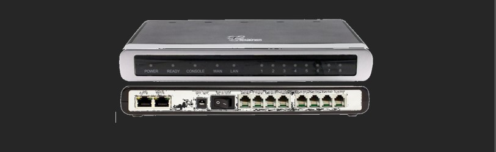

همان‌طور که در تصویر بالا مشاهده می‌کنید این گیتوی باقابلیت ۲ پورت شبکه LAN و WAN امکان اتصال به شبکه داخلی را برای ما فراهم می‌سازد. در نظر داشته باشید جهت دسترسی به پنل کاربری گیتوی خود ابتدا کابل شبکه داخلی را به پورت WAN دستگاه متصل نموده و در ادامه با جستجوی رنج DHCP داخلی‌های شبکه خود می‌توانید آی پی گیتوی گرند استریم خود را جهت دسترسی به پنل کاربری پیدا نمایید.

جهت جستجوی آی پی FXO گرند استریم می‌توانید از نرم‌افزارهای رایج بازار مانند Advance IP Scanner و یا IP Query استفاده نمایید.

پس از یافتن آی پی موردنظر با وارد نمودن آن در مرورگر خود امکان دسترسی به پنل کاربری با کلمه عبور admin مانند شکل زیر برای شما فراهم می‌گردد.

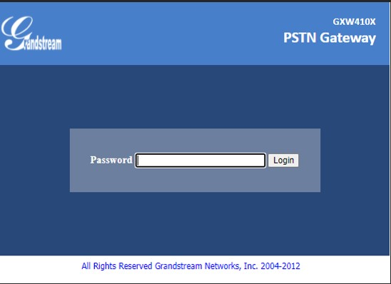

حال که وارد پنل کاربری گیتوی خود شده‌ایم جهت شروع کانفیگ موردنظر وارد سربرگ Accounts در بالای صفحه شده و اطلاعات را طبق تصویر زیر وارد نموده و ذخیره می‌نماییم.

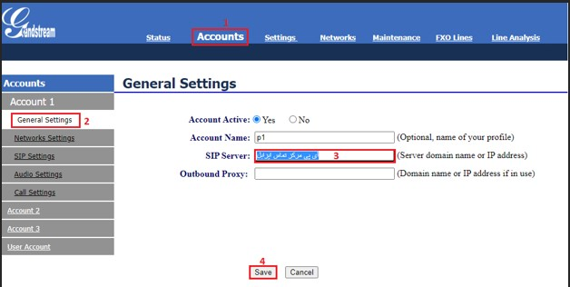

در مرحله بعد مشخص نمایید که هر خط از کدام اکانت می تواند استفاده کند.

1. در همان سربرگ Accounts برروی User Account کلیک کنید. 

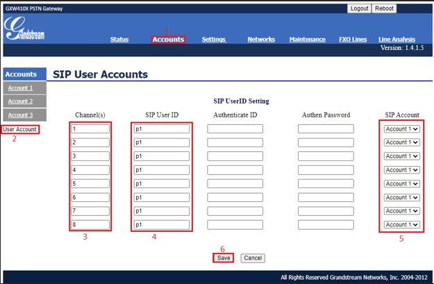

در قسمت Channels شماره پورت های FXO را وارد نمایید. 

4. در قسمت SIP USER ID از Acount Name صفحه قبل وارد نمایید.

5. در قسمت SIP Account هم SIP Account خود را انتخاب نمایید.

6. برروی Save کلیک نمایید.

## تنظیمات DTMF و DID در گیتوی Grandstream{#DTMFAndDIDSettingsInGrandstreamGateway}

1.	پس از ایجاد اکانت و معرفی سرور ویپ وارد سربرگ Settings بشوید.

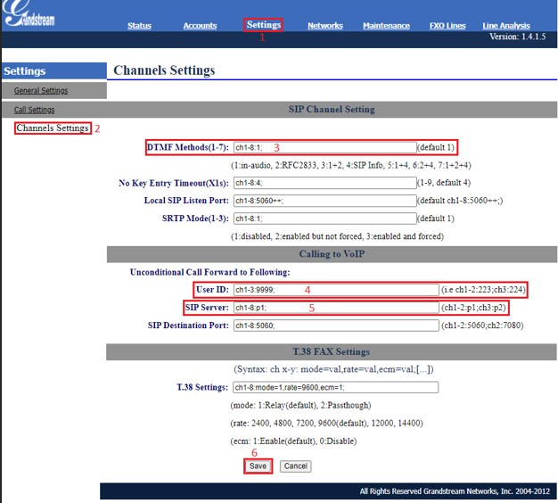

مطابق تصویر فوق تنظیمات مربوط به DTMF و تماس‌های ورودی انجام دهید. در حالت پیشفرض آن را برروی 1 قرار می دهیم. در صورتی که DTMF درستی به سمت سرور ارسال نشود مقدار این قسمت را می توانید تغییر می دهید.

4. در قسمت User ID  مقدار DID را مشخص نمایید. ما در اینجا 9999 را قرار دادیم. در الستیکس یا ایزابل قست Inbound یک Inbound با DID برابر 9999 ایجاد کنید.

5. در قسمت SIP Server باید Account Name که در قسمت Account وارد کرده اید را در این قسمت وارد نمایید.

6. در آخر برروی Save کلیک نمایید.

## تنظیمات پورت شبکه FXO گرند استریم{#GrandstreamFXONetworkPortSettings}

1. وارد سربرگ Networks شوید.

2. روی Basic Settings کلیک نمایید.

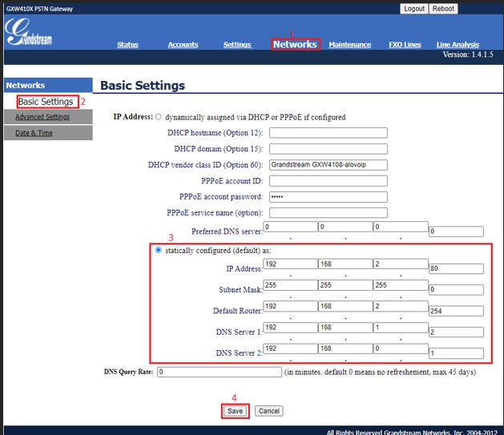

قسمت Statically configured را انتخاب نمایید و IP Address ، Subnet Mask، Defaults Router ، DNS را باتوجه به شبکه وارد نمایید.

4. برروی Save کلیک نمایید تا تنظیم های شما ذخیره بشود.

## تنظیم زمان در FXO گرند استریم{#TimeAdjustmentInFXOGrandstream}

1. وارد سربرگ Networks شوید.

2. روی Date & Time کلیک نمایید.

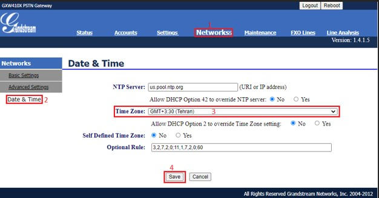

. در قسمت Time Zone تایم مربوط به Tehran  را انتخاب کنید.

4. برروی Save کلیک کنید تا تنظیم های شما ذخیره شود.

## تغییر پسورد پیشفرض گیتوی FXO گرند استریم{#ChangingTheDefaultPasswordOfTheFXOGrandStreamGateway}

1. سربرگ Maintenance را انتخاب کنید.

2. از سمت چپ Web/Telnet Access را کلیک کنید.

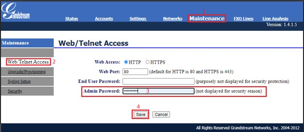

3. در فیلد Admin Password پسورد پیشفرض سخت افزار های الوویپ که alovoip!@# می باشد را وارد کنید.

4. برروی Save کلیک کنید تا تنظیم ها اعمال شود.

## تنظیم سیگنال خط های آنالوگ {#SignalAdjustmentOfAnalogLines}

تنظیم Busy Tone خط های آنالوگ
در مواقعی که خط های آنالوگ PCM هستند این مشکل دارند که بعد از قطع شدن تماس سیگنال برروی خط باقی خواهد ماند و خط قطع نمی شود. در ابتدا کار را با همان تنظیم های پیشفرض پیش ببرید. 

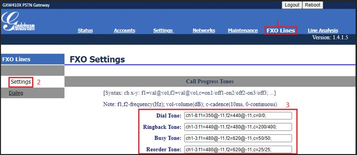

اگر مشکل قطع نشدن تماس را داشتید می توانید از تنظیم های زیر برای این بخش ها استفاده کنید و بعد برروی Save کلیک نمایید تا تنظیم های شما ذخیره شود. 

Dial Tone : ch1-8:f1 = 400 @ -11,f2 = 0@ – 11,c = 0/0; 

Ringbak Tone : ch 1-8 : f1 = 400 @ – 11,f2 = 0 @ – 11,c = 200 / 400; 

Busy Tone : ch 1-8 : f1 = 400 @ -20,f2 = 0 @ -11,c = 38/36; 

Recorder Tone: ch 1-8 : f1 = 400 @ 250,f2 = 0 @ -11,c = 0/0; 

در صورتی که تنظیم سیگنال های هر خط بطور مجزا باشد باید بصورت زیر عمل می کنیم: 

Dial Tone : ch1-2:f1 = 400 @ -11,f2 = 0@ – 11,c = 0/0 ; ch 3-4:f1=500@ -11 , f2=0@ -11,c=0/0; 

Ringbak Tone : ch 1 – 2 : f1 = 400 @ – 11,f2 = 0 @ – 11,c = 200 / 400 ; ch 3-4 :f1=500@-11 ,f2=0@-11,c=250/350; 

Busy Tone : ch 1 – 2 : f1 = 400 @ -20,f2 = 0 @ -11,c = 50/50 ; ch 3-4 : f1=500 @ -20 , f2=0@-11 , c=38/36; 

Recorder Tone: ch 1 – ۲ : f1 = 400 @ 250,f2 = 0 @ -11,c = 0 /0  ; ch 3-4 :f1=500 @ 35 , f2=0 @-11 , c=0/0; 

در مرحله بعد باید Enable Tone Disconnect را برروی Y قرار دهید :

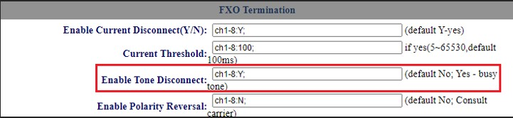

مرحله بعد مشخص کردن کالرآیدی خط های آنالوگ است :

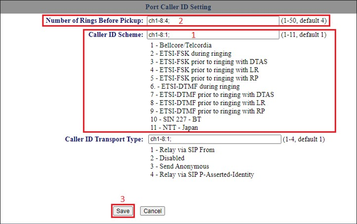

. در صورتی که خط های آنالوگ کالرآیدی را بدرستی دریافت نکردند در قسمت Caller ID Scheme تا 11 کشور را می توانید کالرآیدی را تنظیم کنید.

2. در صورتی که مشکل کالرآیدی با Caller ID Scheme حل نشد با تنظیم Number of Rings Before Pickup می تواند تا حد قابل قبولی مشکل را برطرف کنید.

3. در آخر برروی Save کلیک نمایید تا تنظیم های شما ثبت شود.

نکته مهم: در صورتی خط ها PCM باشند شما هر تنظیمی برای کالر آیندی و سیگنالینگ بدهید ممکن است بعلت تغییر در سیگنالینگ خط های PCM مجددا مجبور بشوید که تنظیم ها را تغییر بدهید.  

تنظیم Dialing در FXO گرند استریم:

1. در سربرگ FXO Lines وارد شوید.

2. برروی Dialing کلیک کنید.

3. در قسمت Stage Method مقدار آن را برروی 1  قرار دهید.

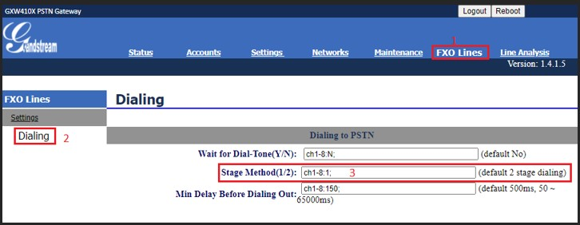

در آخر برروی Save کلیک نمایید و یکبار FXO را Reboot کنید.

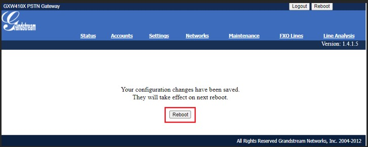

نکته مهم: شما در هر تنظیم بعد از Save میتوانید FXO را Reboot کنید تا تنظیم ها اعمال شود.
پس از انجام تنظیم ها باید در الستیکس یا ایزابل ترانک و inbound تعریف کنید که باید مقاله های مربوط به ترانک مخصوص گرند استریم و inbound مخصوص گرند استریم را مطالعه کنید.
