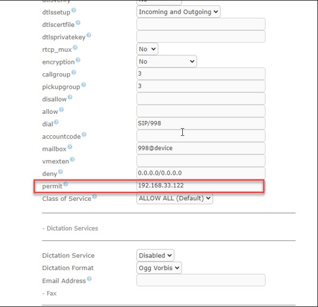

# امنیت سیستم تلفنی

در این بخش به موضوعات زیر می‌پردازیم:
- [هدف از امنیت سیستم تلفنی ](#purposeOfSecurity)
- [قرار دادن رمز بر روی آپاچی، وب ایزابل ](#Appache)
- [امنیت داخلی در ایزابل از طریق محدود کردن IP](#LimitedIP) 
- [محدود کردن Ami جهت امنیت بیشتر مرکز تماس الوویپ ](#AMIConetions)

## هدف از امنیت سیستم تلفنی{#purposeOfSecurity}

جهت جلوگیری از هک شدن سیستم تلفنی از طریق هکرها و سوء استفاده از سیستم تلفنی به منظور استفاده از خطوط تلفنی نیاز به برقراری امنیت در شبکه و بخصوص سیستم تلفنی می‌باشد که از مهمترین این موارد  قراردادن رمز بر روی آپاچی، محدود کردن داخلی، محدود کردن Ami است.

## قرار دادن رمز بر روی آپاچی، وب ایزابل{#Appache}

یکی دیگر از راه های جلوگیری از هک سیستم تلفنی قرار دادن رمز بر روی صفحه وب سرور تلفنی می‌باشد.
1.	در فایل /etc/httpd/conf.d/ssl.conf

در WINSCP  درقسمت :
<VirtualHost _default_:443>

کد زیر را جایگذاری می کنید

<Directory "/var/www/html">
  AuthType Basic
   AuthName "Hi ... "
        AuthUserFile /etc/httpd/conf.d/.htpasswd
        Require valid-user
    </Directory>

1.	در SSH رفتن به مسیر بالا  از طریق دستور زیر

cd /etc/httpd/conf.d

- اجرای دستور ساخت فایل و نام کاربری

htpasswd -c .htpasswd username

- اضافه کردن کاربر جدید

htpasswd .htpasswd password                
        
- در نهاایت service httpd restart

## امنیت داخلی در ایزابل از طریق محدود کردن IP{#LimitedIP}

در تنظیمات Extensions می‌توان داخلی راجهت امنیت فقط به یکIP  محدود کرد.اجازه ندهید داخلی شما از روی هر آی پی آدرسی رجیستر شود. اگر در استریسک (الستیکس، فری پی بی اکس) یک داخلی بسازید، یکی از پارامتر های آن permit و دیگری deny است، که می توانید یک آی پی خاص و یا یک محدوده آدرس تعیین نمایید تا فقط در صورتی که داخلی از روی این آی پی ها درخواست رجیستر شدن ارسال کرد استریسک مجوز آن را بدهد. با این کار اگر داخلی و رمز آن به سرقت برود دیگر کسی از آی پی آدرس های غیر مجاز، نمی تواند با آن داخلی رجیستر شود، فرمت وارد کردن آی پی آدرس ها به شکل زیر است:

permit=<ipaddress>/<network mask>

deny=<ipaddress>/<network mask>

در برخی موارد اگر netmask  را بگذاریم به صورت رنج ای پی شناخنه می شود پس به صورت آزمون خطا بدون نت مسک نیز امتحان کنید.

## محدود کردن Ami جهت امنیت بیشتر مرکز تماس الوویپ{#AMIConetions}
با محدود کردن دسترسی آی پی های مورد نیاز در ami می‌توان سطح امنیت پنل و سرور تلفنی ویپ را ارتقا داد.

ابتدا بعد از ورود به سرور تلفنی ایزابل از طریق winscp به مسیر زیر بروید:

/etc/asterisk/manager.conf
در قسمت manager.conf  :

[admin]

secret = @l0v0ip

;deny=0.0.0.0/0.0.0.0

permit = 127.0.0.1/255.255.255.0

permit = 192.168.1.0/255.255.255.0

permit = 192.168.2.0/255.255.255.0

permit = 192.168.4.0/255.255.255.0

read = system,call,log,verbose,command,agent,user,config,command,dtmf,reporting,cdr,dialplan,originate

write = system,call,log,verbose,command,agent,user,config,command,dtmf,reporting,cdr,dialplan,origi 

writetimeout = 5000 nate

رنج ip permit  را لوکال شبکه قرار دهید.
