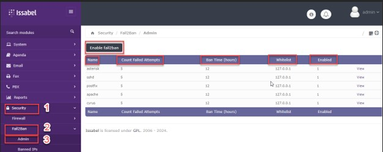

# امنیت خطوط تلفن

در این بخش به موضوعات زیر می‌پردازیم:

•	[هدف از امنیت خطوط تلفن ]()

•	[راه اندازی Fail2ban جهت برقراری امنیت سیستم تلفنی ]()

•	[تغییر پورت 5060 در سیستم تلفنی ویپ ]()

## هدف از امنیت خطوط تلفن

جهت جلوگیری از هک شدن سیستم تلفنی از طریق هکرها و سوء استفاده از سیستم تلفنی به منظور استفاده از خطوط تلفنی نیاز به برقراری امنیت در شبکه و بخصوص سیستم تلفنی می‌باشد که از مهمترین این موارد  Fail2ban وتغییر پورت 5060 می‌باشد.

## راه اندازی Fail2ban جهت برقراری امنیت سیستم تلفنی

احتمال بر روی سرویس های asterisk , ssh, cyrus, apache, postfix وجود دارد که از طریق حملات بروت فورس یا دیکشنری اتک برای نفوذ به این سیستم ها اقدام شود.
روال کاری fail2ban با زبان ساده به این شکل است که اگر تعداد درخواست ها برای ورود به سرویس  در یک زمان مشخص بیشتر از حد تعیین شده باشد، این ماژول آی پی درخواست کننده را جزو آی پی های مخرب قلمداد کرده و در لیست سیاه قرار خواهد داد، به این ترتیب کلیه دسترسی ها از طریق آن  آی پی بر روی سرویس های موجود بسته خواهد شد.
برای استفاده از ماژول fail2ban ایزابل، پس از نصب این سیستم مطابق شکل زیر در  <Security    fail2ban را انتخاب کنید و سپس وارد محیط admin شوید. پس از ورود به محیط admin برروی دکمه Enable fail2ban کلیک کنید تا این ماژول فعال گردد.

در این صفحه پنج ردیف مطابق شکل بالا مشاهده خواهید کرد :

•	Name: نام سرویسی که ماژول fail2ban برروی آن نظارت دارد.

•	Count Failed Attempts: تعداد درخواستی که پس از آن ماژول آی پی را به لیست سیاه خواهد گذاشت.

•	Ban Time: تعداد ساعاتی که ماژول، آی پی مسدود شده را در لیست سیاه نگه خواهد داشت.

•	Whitelist: لیست سفید یا آی پی های مورد اعتماد ما، که پیشنهاد می‌کنم آی پی رایانه خود را در این لیست وارد کنید.

•	Enabled: دارای دو مقدار 0 و 1 است که عدد 1 نشان از فعال بودن ماژول برای نظارت بر آن بخش و عدد 0 نشان از غیرفعال بودن است.

•	View: با کلیک برروی دکمه view می توانید وارد محیط مدیریتی آن سرویس شده و هریک از مقادیر بالا را به دلخواه تغییر دهید.

زیر منو دوم fail2ban بخش Banned IPs یا همان لیست سیاهی است که توسط این ماژول به بخش قرنطینه ارسال شده اند که با کلیک برروی آن می توانید لیست کامل این آیپی ها را مشاهده کنید.

## تغییر پورت 5060 در سیستم تلفنی ویپ

وارد مسیر زیر شوید:
pbx>PBX Configuration>Unembedded IssabelPBX>asterisk sip setting>Bind port
در قسمت bind port می توانید پورت جدید را بگذارید و ذخیره کنید.

بعد از این باید جهت باز کردن صفحه وب پورت جدید را بگذارید.مثال:
192.168.2.90:49254
در تمامی ip phone  ها و سافت فوت ها باید ای پی با فرمت پروت گذاشته شود.
