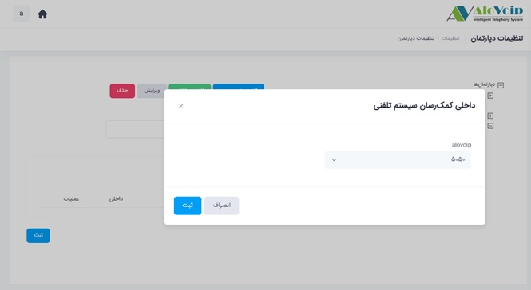

# دپارتمان ها

در این بخش به موضوعات زیر می‌پردازیم:
- [هدف از ساخت دپارتمان](#PurposOfDepartment)
- [ایجاد دپارتمان جدید در پنل الوویپ](#CreateADepartment)
- [ویرایش یک دپارتمان](#EditADepartment)
- [حذف دپارتمان](#DeleteADepartment)

## هدف از ساخت یک دپارتمان{#PurposOfDepartment}
اگر در سازمان خود واحدهای مختلفی مانند پشتیبانی، فروش، مالی و .... داشته باشید می‌توانید به کمک این دپارتمان‌ها دسترسی لازم برای کنترل تماس‌ها را براساس سلسه مراتب تعیین کنید که هر کاربر بتواند تماس‌های واحد خودش را کنترل کند. علاوه بر این، امکانات دیگری که دپارتمان به شما می‌دهد این است که می‌تواند مدیر آن واحد داخلی‌هایی که در دپارتمان خودش قرار دارد  را شنود و نجوا کند و حتی گزارش‌های آن داخلی‌ها را ببیند و فایل ضبط شده مکالمات را دانلود کند.

## ایجاد دپارتمان جدید در پنل الوویپ{#CreateADepartment}
برای ایجاد یک دپارتمان جدید طبق مراحل زیر عمل کنید:
1.	وارد پنل الوویپ ‌شوید و قسمت تنظیمات سیستم را انتخاب کنید.

2.	در صفحه باز شده گزینه **مدیریت دپارتمان‌ها** را انتخاب ‌کنید. 

3.	برای ایجاد یک دپارتمان جدید کافی است روی دپارتمان‌ها کلیک کرده و افزودن زیرمجموعه را انتخاب کنید.

4.	یک اسم برای دپارتمان موردنظر در نظر بگیرید و سپس روی دکمه ثبت کلیک کنید که با این کار دپارتمان ایجاد می‌شود.

حتی می‌توانید برای این دپارتمان زیرمجموعه هم داشته باشید. برای این کار باید روی دپارتمانی که ایجاد کرده‌اید کلیک کرده و افزودن زیرمجموعه را بزنید سپس یک نام را انتخاب کنید و ثبت را بزنید. همانطور که مشاهده می‌کنید بصورت زیر مجموعه ایی ایجاد می‌شود

## ویرایش یک دپارتمان{#EditADepartment}

در قسمت ویرایش هم می‌توانید اسم دپارتمان را تغییر دهید و هم می‌توانید یک داخلی کمک رسان برایش انتخاب کنید. داخلی کمک رسان در واقع این کمک را به دپارتمان می‌کند که اگر اپراتوری نیاز به کمک داشته باشد در صفحه اپراتوری خودش روی **درخواست کمک** کلیک می‌کند و برای مدیر آن دپارتمان و یا داخلی که در این قسمت انتخاب کردید یک تماس ارسال می‌شود و مدیر آن واحد و یا دپارتمان وقتی گوشی را بر می‌دارد با امکان  **نجوا**  می‌تواند به کارشناس خود در حین مکالمه  کمک کند

برای تعیین داخلی کمک رسان روی افزودن داخلی کمک رسان کلیک کنید و دکمه ثبت را بزنید. با این کار داخلی هایی که در این دپارتمان قرار می‌گیرند اگر نیاز به کمک داشته باشند در صفحه اپراتوری خودشان (در قسمت بالا سمت چپ پنل کاربری خودش) یک دکمه به اسم درخواست کمک دارند که در حین صحبت با مشتری می‌توانند روی آن دکمه کلیک کرده و درخواست آنها به سمت داخلی کمک رسان ارسال می‌شود .داخلی مربوطه گوشی را که بر می‌دارد در حالت نجوا می‌تواند به کارشناس کمک کند تا مشتری را به درستی راهنمایی کند

## حذف دپارتمان{#DeleteADepartment}

برای حذف دپارتمانروی دپارتمان مورد نظر کلیک کنید و گزینه حذف را بزنید و دپارتمان‌هایی که مدنظرتان است را حذف کنید

