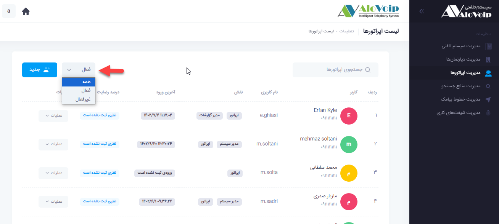

# ایجاد اپراتور

در این بخش به موضوعات زیر می‌پردازیم:
-	[هدف از ساخت اپراتور جدید در الوویپ](#UserCreationAim)
-	[مراحل ساخت یک اپراتور در پنل الوویپ](#HowToCreateOperator)
-	[تعیین نقش اپراتور](#USerPosition)
-	[تغییر وضعیت در صف](#ChangingQeueStatus)
-	[اعلان نام اپراتور](#OpratorAnnouncement)
-	[تعیین عکس اپراتور](#ChangeOpratorProfile)
-	[تنظیمات شیفت کاری اپراتور](#ChangeShiftJob)

## هدف از ساخت اپراتور{#UserCreationAim}
با ساخت اپراتور در پنل الوویپ این امکان برای شما فراهم می‌شود که بتوانید داخلی‌های مربوط به آن اپراتورها را به درستی کنترل کنید. یعنی می‌توانید متوجه شوید یک اپراتور که در یک صف قرار دارد چقدر آنلاین و یا آفلاین بوده، چقدر استراحت کرده و چقدر مشغول به کار بوده است. همچنین با ایجاد اپراتور این امکان را برای خود اپراتور فراهم می‌کنید که متوجه شود در طول مدت کاری  که در شرکت است چقدر تماس ورودی و خروجی داشته، چقدر تماس‌هایش از طریق صف آمده است، با چه شماره‌هایی صحبت کرده، چه مکالماتی داشته و نظرسنجی که برایش تنظیم شده چه رتبه ایی در سازمان و یا  در گروهش بدست آورده است. علاوه بر ایجاد اپراتورهای ساده می‌توانید اپراتور‌هایی با نقش مدیریت داشته باشید. یعنی می‌توانید اپراتورهایی ایجاد کنید و مدیریت بخش‌هایی از پنل را در اختیارش قرار دهید.

## مراحل ساخت یک اپراتور در پنل الوویپ{#HowToCreateOperator}

1.	برای ساخت یک اپراتور  کافی است وارد پنل الوویپ شوید و  قسمت تنظیمات سیستم که در گوشه سمت چپ بالا قرار دارد را انتخاب کنید.

2.	سپس گزینه مدیریت اپراتورها را انتخاب کنید. در صفحه باز شده بطور پیش‌فرض لیست تمام اپراتورهای ساخته شده در پنل الوویپ را نشان می‌دهد. اگر بخواهید فیلتر کنید می‌توانید اپراتور‌های فعال و یا غیرفعال را انتخاب کنید. برای دسترسی آسان به اطلاعات اپراتور، در قسمت جستجوی اپراتور می‌توانید براساس نام و نام کاربری، اپراتور مدنظرتان را جستجو کنید.

-	**اپراتور فعال**
اپراتوری که قادر است از پنل کاربری خودش استفاده کند.
-	**اپراتور غیر فعال**
اپراتوری که قادر به استفاده از پنل کاربری خودش نیست.
3.	گزینه جدید را انتخاب کرده و در صفحه باز شده اطلاعات مرتبط به فیلدهای نام، نام خانوادگی، موبایل،  نام کاربری و کلمه عبور را وارد کنید.

## تعیین نقش اپراتور{#USerPosition}

-	**اپراتور**
اگر فقط تیک اپراتور را بزنید این کاربری که ایجاد کردید فقط می‌تواند دیتای تماس‌های خودش و نظر سنجی را مشاهده کند.
-	**مدیر سیستم**
با انتخاب مدیر سیستم کاربر دسترسی کامل به سیستم تلفنی الوویپ را دارد.
-	**مدیر بخش‌هایی از پنل الوویپ**
اگر بخواهید کاربر فقط مدیریت بخش‌هایی از پنل الوویپ را داشته باشد کافی است گزینه اپراتور و بخش مربوطه که روبروی آن قرار دارد را انتخاب کنید.

## تغییر وضعیت در صف{#ChangingQeueStatus}

اگر یک داخلی در صف‌های مختلفی قرار داشته باشد در صورتیکه بخواهیم وضعیت داخلی از قبیل آنلاین، آفلاین، استراحت و مشغول به کار در تمام صف‌ها اعمال شود باید در قسمت تغییر وضعیت در صف‌ها، گزینه همه را انتخاب کنید. در غیر این صورت هر اپراتور در پنل کاربری خودش در قسمت صف‌ها، صف مورد نظر را انتخاب و وضعیت خود را تغییر می‌دهد.

به عنوان مثال همانطور که در عکس زیر مشاهده می‌کنید داخلی 5050 که به اپراتور خانم دادگر اختصاص پیدا کرده است در دو صف پشتیبانی و مالی در قسمت داینامیک  قرار دارد که می‌توان در قسمت صف‌ها تغییر وضعیت را مشاهده کرد.

## اعلان نام اپراتور {#OpratorAnnouncement}
 در قسمت اعلان نام اپراتور می‌توانید یک متن را بنویسید و یا یک فایل صوتی قرار دهید. کاربرد این صدا در بخش نظرسنجی صف است و این امکان را فراهم می‌کند وقتی یک تماسی وارد صف می‌شود قبل از اینکه به کارشناس متصل شود نام کارشناس به فرد تماس گیرنده اعلام شود به شرطی که برای آن اپراتور یا کارشناس صدایش را آماده کرده باشید.

## تعیین عکس اپراتور {#ChangeOpratorProfile}
می‌توانید با گذاشتن عکس برای اپراتور کار را برای تشخیص آن در بین اپراتورهای دیگر در پنل الوویپ از سمت مدیرانش راحت‌تر کنید.
## تنظیمات شیفت کاری اپراتور {#ChangeShiftJob}
همچنین می‌توانید برایشان شیفت کاری تنظیم کنید که بر اساس شیفت تعریف شده ورود و خروج اتوماتیک انجام شود. در انتها بر روی دکمه ثبت کلیک کنید.

> **نکته** 
در صورتی این گزینه برایتان فعال می‌شود که داخلی این اپراتور در یک صف به صورت داینامیک قرار داده شود.

