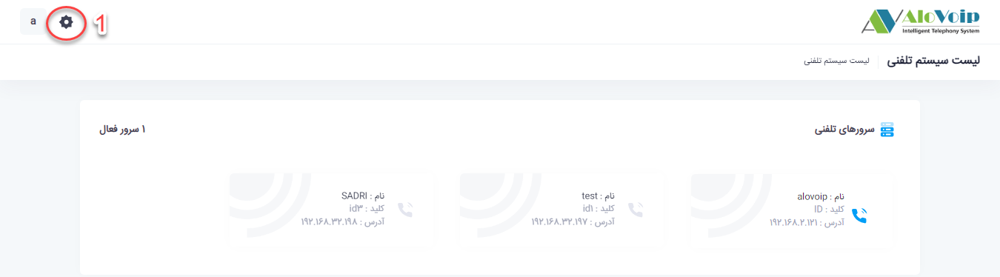
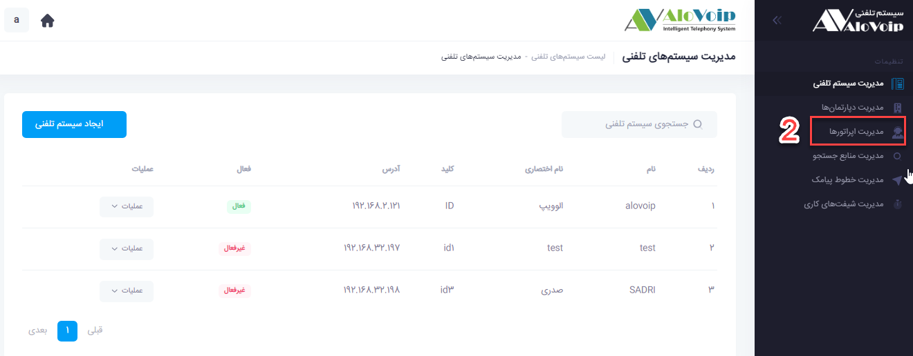

# ویرایش اطلاعات اپراتورها

در این بخش به موضوعات زیر می‌پردازیم:
-	[مقدمه](#Introduction)
-	[ویرایش اطلاعات شخصی](#ChangePErsonalInformations)
-	[ویرایش نقش اپراتور ](#ChangeOperatorRole)
-	[ویرایش رمز عبور](#ChangePersonalPassword)
-	[تعیین داخلی هر اپراتور](#ChooseOperatorExtention)
-	[مدیریت یک دپارتمان](#MangementOFDepartman)

## مقدمه {#Introduction}
وقتی که شما اپراتور ایجاد می‌کنید بعدا ممکن است بخواهید اطلاعات شخصی اپراتور مانند نام، نام خانوادگی، رمز عبور، نقش اپراتور و.... را تغییر دهید و یا داخلی دیگری به آن اپراتور اختصاص دهید برای اعمال هرکدام از این تغییرات باید با رجوع به صفحه اطلاعات اپراتور، فیلدهای مورد نظر را ویرایش کنید.
## تغییر ویرایش اطلاعات شخصی {#ChangePErsonalInformations}
برای تغییر و ویرایش اطلاعات یک اپراتور کافی است مراحل زیر طی شود:
1.	در پنل الوویپ وارد تنظیمات سیستم (سمت چپ، بالای صفحه) شوید.

2. در صفحه باز شده گزینه مدیریت اپراتورها را انتخاب کنید.

3.	اپراتوری که میخواهید اطلاعات آن را ویرایش کنید جستجو کرده و روی دکمه عملیات کلیک کنید و از زیرمنوی باز شده گزینه ویرایش را انتخاب کنید.

4.	در صفحه باز شده در قسمت تنظیمات عمومی‌می‌توانید اطلاعات کاربری را تغییر دهید.

>**نکته** 
نام کاربری اپراتور قابل تغییر نیست و اگر قصد تغییر نام اپراتور را داشته باشد باید توسط ادمین 
پنل این کاربری حذف و  اپراتوری با نام کاربری جدید ایجاد شود.

## ویرایش نقش اپراتور {#ChangeOperatorRole}
شما می‌توانید نقش یک اپراتور را بر اساس دسترسی‌هایی که دارد تغییر دهید نقش‌های یک اپراتور می‌تواند به صورت زیر باشد:
-	اپراتور
اگر فقط تیک اپراتور را بزنید این کاربری که ایجاد کردید فقط می‌تواند دیتای تماس‌های خودش و نظر سنجی را مشاهده کند.

-	مدیر سیستم
با انتخاب مدیر سیستم، کاربر دسترسی کامل به سیستم تلفنی الوویپ را دارد.

-	مدیر بخش‌هایی از پنل الوویپ
اگر بخواهید کاربر فقط مدیریت بخش‌هایی از پنل الوویپ را داشته باشد کافی است گزینه اپراتور و مدیریت بخش مربوطه که روبروی آن قرار دارد را انتخاب کنید.

## ویرایش رمز یک اپراتور {#ChangePersonalPassword}
اگر شما یک اپراتور در پنل الوویپ ایجاد کرده باشید و نیاز به تغییر رمز عبور آن داشته باشید، کافی است در پنل الویپ مراحل زیر را دنبال کنید:
1-	وارد قسمت تنظیمات سیستم > مدیریت اپراتورها شوید. در صفحه باز شده که شامل تمام اپراتورهای ساخته شده در پنل الوویپ است، اپراتور مورد نظر را جستجو کرده و روی گزینه عملیات که در روبروی اپراتور مورد نظر قرار دارد کلیک کنید و از زیر منوی باز شده تغییر کلمه عبور را انتخاب کنید

2-	در صفحه باز شده رمز جدید را انتخاب و تکرار آن را هم وارد کنید و سپس روی دکمه ثبت کلیک کنید.

## تعیین داخلی هر اپراتور {#ChooseOperatorExtention}
برای اینکه اپراتور بتواند آماری از تعداد تماس‌هایش داشته باشد و  یا رکورد تماس‌هایش را مشاهده کند باید به اپراتور، داخلی اختصاص داده شود که بدین منظور مراحل زیر را طی کنید:
1.	در پنل الوویپ وارد تنظیمات سیستم > مدیریت اپراتورها > عملیات >  مدیریت دسترسی به داخلی‌ها  شوید.

2. در صفحه باز شده داخلی یا داخلی‌های مدنظر را به اپراتور تخصیص دهید و دکمه ثبت را بزنید

## مدیریت یک دپارتمان
برای اینکه بتوانید به عنوان مدیر، دسترسی به یک دپارتمان خاص جهت  کنترل و مدیریت  داخلی‌ها داشته باشید به عنوان مثال دسترسی به گزارش تماس ، شنود و نجوا، کنفرانس،مشاهده صف‌هاو... باید در پنل الوویپ مسیر زیر را طی کنید

1.	تنظیمات سیستم > مدیریت اپراتورها > عملیات > مدیریت دسترسی تماس به دپارتمان را انتخاب کنید.

2. در قسمت دپارتمان‌ها بر روی دپارتمانی که می‌خواهید بر روی آن مدیریت داشته باشید کلیک کنید و در قسمت لیست دسترسی‌ها موارد مورد نظر را انتخاب و سپس روی دکمه افزودن کلیک کنید

