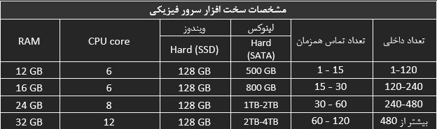
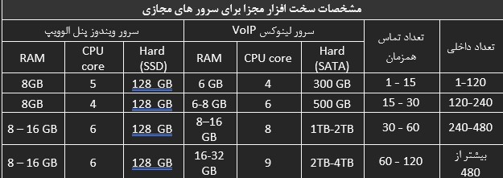

# پیش نیاز های نصب سیستم تلفنی الوویپ

در این بخش به موضوعات زیر می‌پردازیم:

•	مشخصات سخت افزاری سرورها

•	بسترشبکه

•	سخت افزار های مورد نیاز برای ارتباط خطوط به سیستم تلفنی VoIP

•	آمادگی سناریو مدیریت تماس

•	نکات امنیتی

پیش نیازهای نصب و راه اندازی سیستم تلفنی الوویپ مطابق با ماژول ها و تعداد کاربران خریداری شده به شرح زیر می باشد:

## مشخصات سخت افزاری سرورها 
برای نصب نرم افزار نیاز به سیستم عامل ویندوزی و لینوکسی می باشد که شما می توانید برای راه اندازی **یکی** ازگزینه های زیر را انتخاب نمایید:
     الف. **یک سیستم فیزیکی** مستقل با سیستم عامل ویندوز سروربرای پنل الوویپ و سرور لینوکسی **مجازی شده** روی آن برای سیستم تلفنی لینوکسی به شرح ذیل مورد نیاز است

ب.  **یک سیستم فیزیکی/مجازی** مستقل سیستم تلفنی (لینوکسی)  و **یک سیستم فیزیکی/مجازی** مستقل ویندوزی برای پنل الوویپ به شرح ذیل مورد نیاز است:

   سایر موارد مهم:

•	در صورت وجود تعداد تماس های بسیار زیاد لطفاً برای فضای ضبط مکالمات یک هارد مناسب در نظر گرفته شود.

•	در صورت امکان انتی ویروس نصب نگردد ،در صورت نصب انتی ویروس حتما قبل از نصب با پشتیبانی تماس گرفته شود 

•	به تعداد خطوط SIP Trunk, Telc, SIP Phone, E1 … کارت شبکه اضافی برروی سرور سخت افزاری نیازمند است.

•	نصب ویندوز سرور  به همراه پیشنیاز های مورد نیاز برای پنل الوویپ برعهده مجموعه محترم می باشد.

•	در ویندوز سرور از نصب هرگونه Role یاFeature  مانند: DHCP DNS, AD, یا نصب هر گونه نرم افزار غیر مرتبط 
همچون CRM پرهیز گردد.

•	در صورت استفاده از یک سیستم مستقل فیزیکی، لطفاً Virtualization برروی Bios سیستم فعال باشد.

•	در صورت استفاده از سیستم مجازی سازی همچون ESXI لطفاً ماشین های مربوط به سیستم عامل ویندوزی و لینوکسی آماده باشد.

•	در صورت استفاده از سیستم های مجازی سازی همچون  ESXI  لطفا بکاپ از کل ماشین هنگام نصب کامل و تکمیل سناریو گرفته شود.
    پیش نیازهای نرم افزاری سرور داشبورد الوویپ :

•	نصب حداقل Windows Server 2019 data center 

•	آماده بودن حداقل فایل نصب SQL Server Enterprise 2019 ( لطفاً نصب نگردد.)

•	نیازی به نصب سیستم عامل لینوکسی نیست.

## بسترشبکه

لازمه اجرای سیستم تلفنی VoIP وجود بستر شبکه ایستا با IP Switching ، IP Routing و بستر امنیتی مناسب می باشد. با توجه به اینکه کلیه ارتباطات لازم بر روی بستر شبکه موجود می باشد وجود QOS نیز به کیفیت سرویس شما کمک بسزایی خواهد کرد و عدم وجود بستر مناسب شبکه موجب کاهش کیفیت تماس خواهد شد.
پیشنهاد می شود در صورت استفاده از شبکه Wi-Fi ( Wireless) از Access Point های SoHo استفاده نشود . 
لازم به ذکر است برای راه اندازی شبکه مناسب VoIP وجود DHCP برروی شبکه الزامیست. در صورت عدم وجود DHCP مسئولیت تنظیمات ابتدایی IP-Phone ها برعهده همان مجموعه محترم می باشد.

## سخت افزار های مورد نیاز برای ارتباط خطوط به سیستم تلفنی VoIP

•	به منظور تعریف داخلی های مورد نیاز و ایجاد ارتباط با خطوط شهری  تجهیزات زیر با توجه به سناریوی VoIP لازم می باشند:

•	تلفن های سخت افزاری یا IP-Phone

•	هدست مخصوص ویپ (در صورت استفاده از Soft Phone)

•	گیتوی FXO, FXS و یا GSM بر اساس نیاز

•	گیتوی E1 (در صورت وجود خط E1)

•	مودم مخصوص خطوط  SIP Trunk, Telc, SIP Phone, E1 …

•	آماده بودن خطوط تلفن در محل قرار گیری گیتوی به صورت سوکت خورده (قابل ذکر است خطوط PCM در VoIP مشکلات 
متعددی ایجاد خواهند کرد  نظیر: عدم قطع شدن تماس، عدم نمایش کامل کالرآیدی، وجود نویز و ... )

•	در صورت استفاده از کارت های E1 و یا FXO/FXS توجه فرمایید سرور تلفنی لینوکسی نباید به صورت مجازی باشد. 

## آمادگی سناریو مدیریت تماس
        به منظور تسریع امور پیاده سازی و اجرای پروژه می بایست، سناریو مربوط به مدیریت تماس آماده باشد. برای مثال:
•	آماده بودن لیست داخلی ها و افراد مربوطه  بصورت Excel

•	آماده بودن IP هر IP-Phone مربوط به داخلی ها بصورت Excel

•	آماده بودن لیست صف ها و عاملین پاسخگوی صف  بصورت Word یا Excel

•	در صورت نیاز به استفاده از بازه زمانی کاری، بازه زمانی خود را به همراه صوت مورد نظر مهیا نمایید.

•	آماده بودن سناریو های تعقیب تماس برای داخلی های موردنظر بصورت Word یا Excel

•	آماده بودن نحوه اجرای IVR (منشی تلفنی) بصورت کامل روی یک فایل  Word یا Visio

•	آماده بودن صوت های مورد نظر برای نظرسنجی، باشگاه مشتریان، IVR و ...

##  نکات امنیتی 
•	برای برقراری امنیت سرور تلفنی، دسترسی اینترنت سرور را قطع نمایید یا در صورت لزوم برای ارتباط با سایر 
شعب لطفا از VPN استفاده نمایید. همچنین از فعال بودن فایروال نرم افزاری و یا سخت افزاری در مسیر اینترنت شرکت 
و بر روی سرور اطمینان حاصل نمایید.

•	در صورتی که تماس های خارج از کشور برقرار نمی کنید، با مراجعه به اداره مخابرات، برای بستن کد دو صفر (00)  اقدام نمایید.

•	در صورت آماده بودن همه پیش نیاز ها زمان نصب حداکثر تا 72 ساعت پس از دریافت تاییدیه فرم پیش نیاز اعلام خواهد شد. 

•	در صورت مغایرت پیش نیازهای اعلام شده ( CPU،RAM ، Hard و غیره) مسئولیت نصب و پیاده سازی سیستم تلفنی برعهده مجموعه محترم می باشد و  زمان دیگری برای نصب اعلام خواهد شد.  

•	لازم به ذکر است در ایام بیماری کرونا برای حفظ سلامتی، نصب و آموزش بصورت ریموت انجام خواهد شد.

•	می بایست قبل از برگزاری جلسه آموزش پنل الوویپ مبلغ باقیمانده از فاکتور، تسویه شود.

•	خواهشمند است تعداد ماه های جهت ذخیره فایل های صوتی در صورت تایید گذاشتن تنظیمات اتوماتیک را اعلام فرمایید. .......ماه