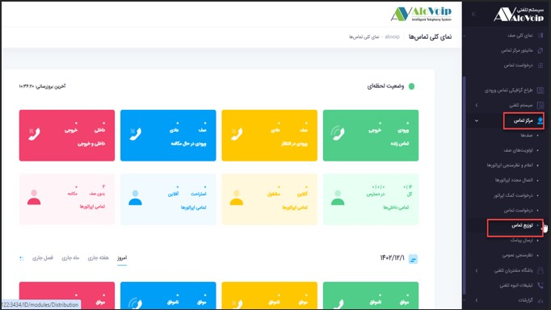
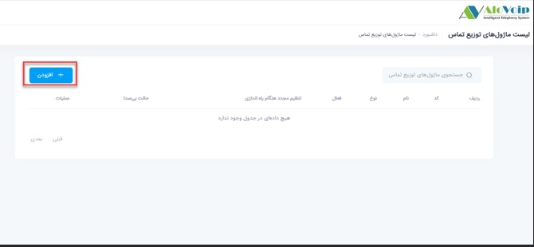
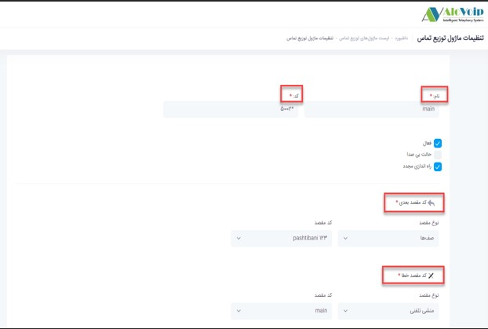
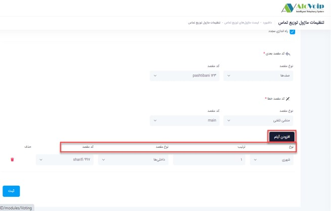
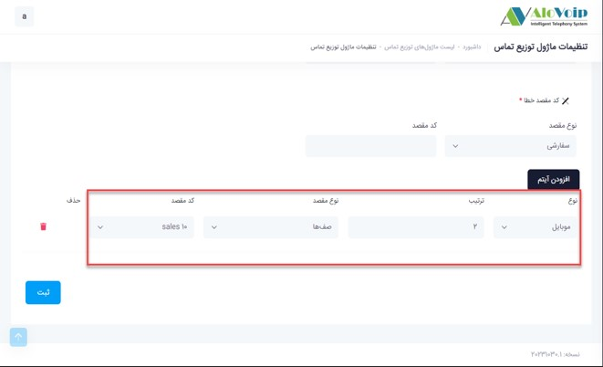
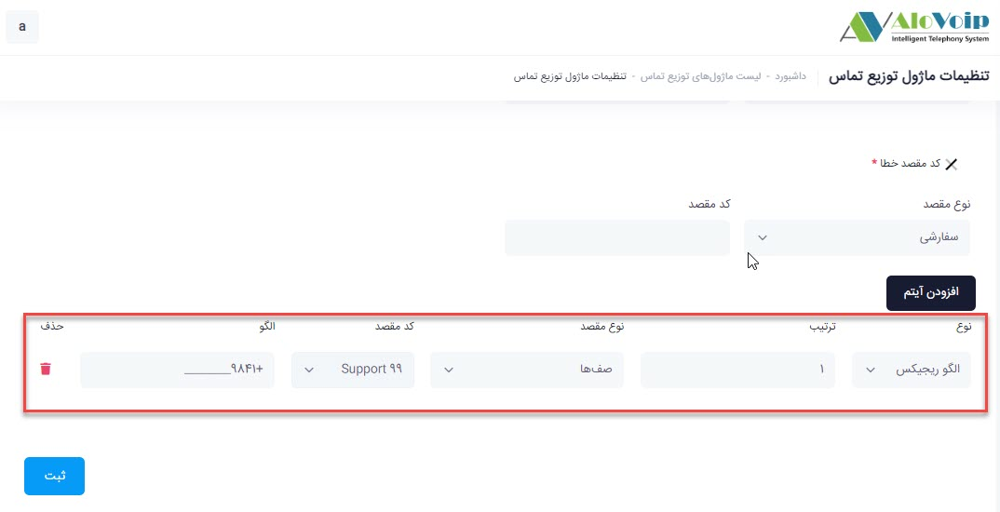
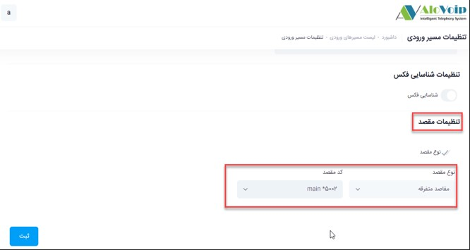

# ماژول توزیع تماس

در این بخش به موضوعات زیر می‌پردازیم:
- [هدف از تنظیم ماژول توزیع تماس ](#ThePurposeOfSettingTheCallDistributionModule)
- [تنظیم ماژول توزیع تماس در پنل الوویپ ](#SettingTheCallDistributionModuleInTheAlovoipPanel)

## هدف از تنظیم ماژول توزیع تماس {#ThePurposeOfSettingTheCallDistributionModule}
فرض کنید سازمان شما مشتریانی از سرتاسر ایران دارد مثل شهرهای ترک زبان، عرب زبان و... می‌خواهید مشتریانی که از تبریز تماس می‌گیرند به کارشناسانی وصل شوند که به زبان آذری مسلط هستند یا مشتریانی که از جنوب کشور و مناطق عرب زبان کشور تماس می‌گیرند به کارشناسی وصل شود که به زبان عربی مسلط است.یا می‌خواهید کاری کنید کسانی که با خط های ایرانسل تماس می‌گیرند به یک کارشناس خاص یا دپارتمان خاص وصل شوند. حتی می‌توانید این محدودیت را کوچکتر کنید و بگویید شماره های خاصی که تماس می‌گیرند به داخلی های خاص متصل شوند.

## تنظیم ماژول توزیع تماس در پنل الوویپ {#SettingTheCallDistributionModuleInTheAlovoipPanel}
برای تنظیم این ماژول در پنل الوویپ در قسمت **مرکز تماس > توزیع تماس** را انتخاب کنید. سپس روی **افزودن** کلیک کنید.

- **نام**و **کد** : در صفحه باز شده یک نام در نظر بگیرید و یک کد منحصر به فرد هم انتخاب کنید.
- **کد مقصد بعدی** :در این قسمت می‌توانید مشخص کنید که بعد از اینکه تماس وارد این ماژول شد و تمام شد به کدام مقصد هدایت شود.
- **کد مقصد خطا** :در کد مقصد خطا می‌توانید مشخص کنید اگر شماره ایی تماس گرفت و در این سناریویی که برای تماس ها تنظیم کردید نبود به کدام بخش وصل شود.

- **افزودن آیتم**:در قسمت افزودن آیتم، الگوهای تماس را تعریف کنید.برای این کار روی **افزودن آیتم** کلیک کنید.
- **الگوی اول** : به عنوان مثال می‌خواهید تمام تماس های شهری که در سیستم تلفنی شما می آید با اولویت یک به داخلی997 وصل شود.برای تنظیم این سناریو باید **نوع** تماس یا همان نوع CallerId که به سیستم تلفنی شما وارد می‌شود را **شهری** انتخاب کنید.در قسمت **ترتیب**، اولویت آن را مشخص کنید که همان یک می‌باشد.در **نوع مقصد و کدمقصد** مشخص ‌کنید به کجا می‌خواهد برود که همان داخلی997 است.

- **الگوی دوم** : می‌خواهید اگر تماس گیرنده با موبایل تماس گرفت با میزان اهمیت دو به صف فروش وصل شود.این سناریو بصورت زیر تعریف می‌شود.

- **الگوی سوم**
اگر بخواهید خودتان شماره خاصی را تعریف کنید باید از الگوی **ریجکس** استفاده کنید.به عنوان مثال می‌خواهید هرکسی از شهر تبریز تماس گرفت به صف پشتیبانی وصل شود.برای این منظور در قسمت **الگو** +9841________ را تعریف ‌کنید(41 کدتبریز است و به تعداد شماره های شهر تبریز آندرلاین می‌گذارید.)در این حالت هرکسی از شهر تبریز تماس گرفت صف پشتیبانی وصل  می‌شود.

بعد از اتمام الگوها دکمه ثبت را بزنید.حالا آن را می‌توانید در مسیر ورودی سیستم تلفنی یا منشی تلفنی تعریف کنید و هر زمان که نخواستید مسیر ورودی دیگری را جایگزین کنید.

- برای تنظیم این ماژول در مسیر ورودی سیستم تلفنی خودبصورت زیر عمل می‌کنید:
در واقع بدین صورت که هرتماسی وارد سیستم تلفنی شما شد اول وارد این ماژول شود و به مقاصد تعریف شده هدایت شود.برای این کار وارد مسیر ورودی شده و در قسمت** تنظیمات مقصد**، **نوع مقصد** را **مقاصد متفرقه** را انتخاب و در **کد مقصد** ماژول توزیع تماسی که ایجاد کرده اید را انتخاب کنید.

