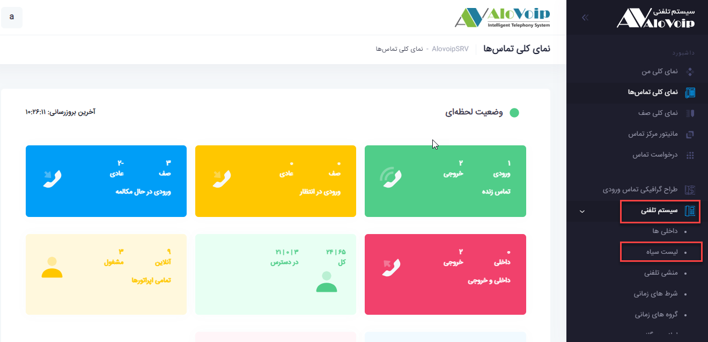
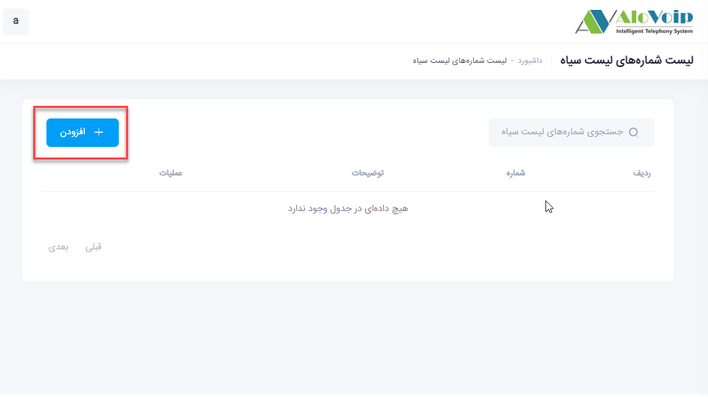
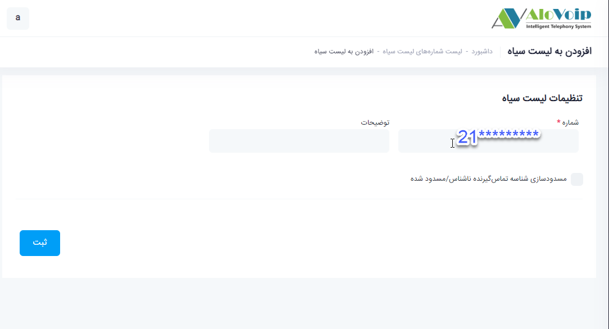

## لیست سیاه

در این بخش به موضوعات زیر می‌پردازیم:

•	[هدف از تنظیم لیست سیاه ](#ThePurposeOfSettingTheBlacklist)

•	[تنظیم لیست سیاه](#SettingTheBlacklist)

## هدف از تنظیم لیست سیاه {#ThePurposeOfSettingTheBlacklist}

با تنظیم یکسری از شماره ها در این بخش این امکان را فراهم می‌کنید که آن شماره ها نتوانند با سازمان شما در تماس باشند.

## تنظیم لیست سیاه{#SettingTheBlacklist}

برای تنظیم لیست سیاه در پنل الوویپ،از قسمت **سیستم تلفنی > لیست سیاه** را انتخاب ‌کنید.سپس روی **افزودن** کلیلک کنید

در صفحه باز شده در قسمت **شماره** ،شماره مد نظر خود را به سه فرمت زیر بصورت جداگانه وارد کنید. به عنوان مثال شما می‌خواهید یک شماره شهری را در لیست سیاه خود قرار دهید.فرمت هایی که باید وارد کنید بصورت زیر می‌باشد:

فرمت اول (شامل کدکشور+کدشهربدون صفر+شماره تلفن) 
فرمت دوم(شامل کد شهر بدون صفر+شماره تلفن)
فرمت سوم(کدشهر با صفر+شماره تلفن)
بعد قسمت توضیحات را پر کنید و در آخر روی دکمه ثبت کلیک کنید.  

اگر این شماره به شرکت شما زنگ بزند نمی‌تواند به منشی تلفنی یا هر آنچه که در ورودی شما تعریف شده  است وصل شود.

