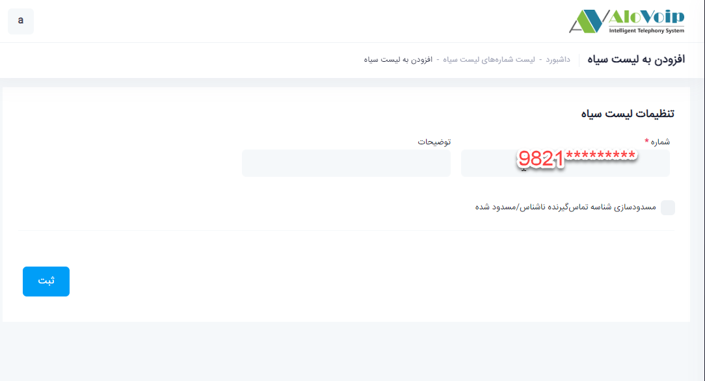

## لیست سیاه

در این بخش به موضوعات زیر می‌پردازیم:
- [  	هدف از تنظیم لیست سیاه   ](#ThePurposeOfSettingTheBlacklist)
- [	تنظیم لیست سیاه در پنل الوویپ ](#SettingTheBlacklist)

## 	هدف از تنظیم لیست سیاه {#ThePurposeOfSettingTheBlacklist}

با تنظیم یکسری از شماره ها در این بخش این امکان را فراهم می‌کنید که آن شماره ها نتوانند با سازمان شما در تماس باشند.

## تنظیم لیست سیاه در پنل الوویپ  {#SettingTheBlacklist}

برای تنظیم لیست سیاه در پنل الوویپ،از قسمت **سیستم تلفنی > لیست سیاه** را انتخاب ‌کنید.سپس روی **افزودن** کلیلک کنید

در صفحه باز شده در قسمت **شماره** ، بسته به فرمتی که در سیستم تلفنی شما  شماره تماس می افتد، اگر از فرمت شماره مدنظر مطمئن هستید آن را وارد کنید در غیر این صورت شماره مد نظر خود را به سه فرمت زیر بصورت جداگانه وارد کنید تا به هیچ طریقی آن شماره نتواند با مجموعه شما ارتباط برقرار کند. به عنوان مثال شما می‌خواهید یک شماره شهری را در لیست سیاه خود قرار دهید.  فرمت هایی که باید وارد کنید بصورت زیر 
می‌باشد: 
فرمت اول (شامل کدکشور+کدشهربدون صفر+شماره تلفن)  
فرمت دوم(شامل کد شهر بدون صفر+شماره تلفن) 
فرمت سوم(کدشهر با صفر+شماره تلفن) 

بعد از وارد کردن هر فرمت، قسمت توضیحات را پر کنید و در آخر روی دکمه ثبت کلیک کنید.  با این کار اگر شماره ایی که وارد کردید به شرکت شما زنگ بزند نمی‌تواند به منشی تلفنی یا هر آنچه که در ورودی شما تعریف شده  است وصل شود.

