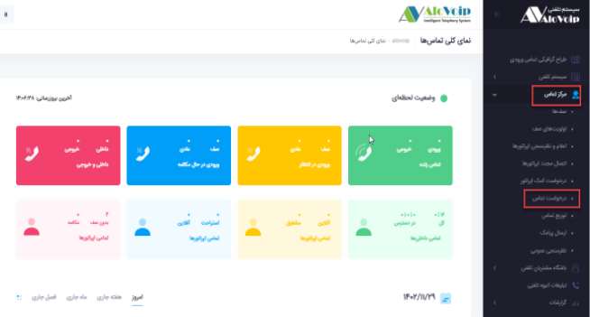
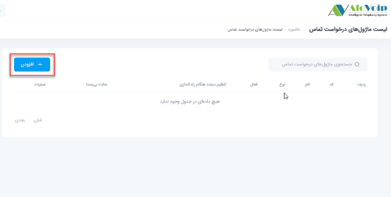
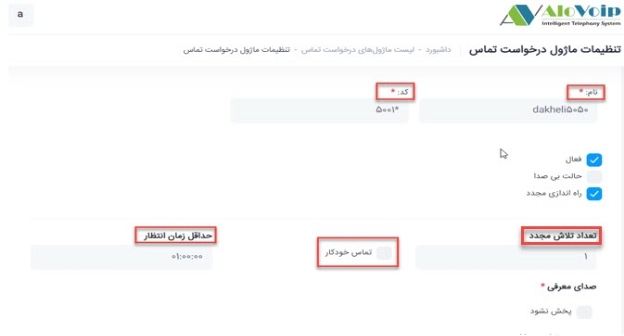
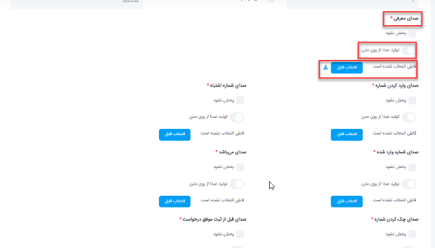
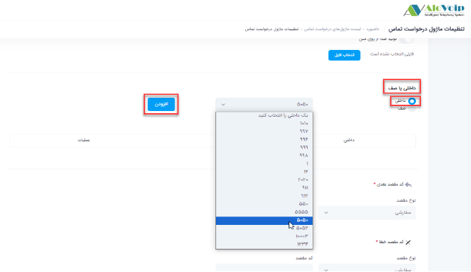
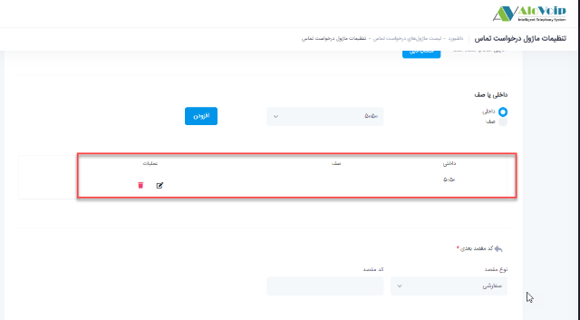
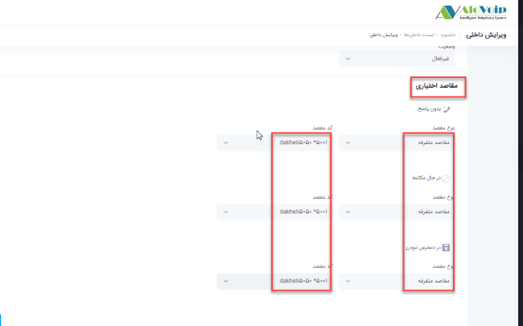
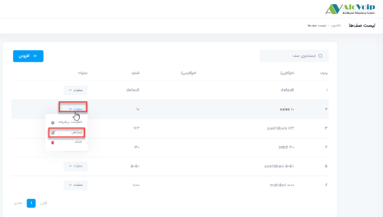
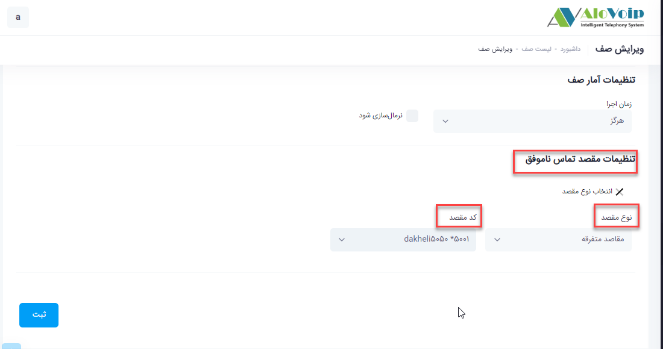

# ماژول درخواست تماس

در این بخش به موضوعات زیر می‌پردازیم:
- [هدف از تنظیم ماژول درخواست تماس ](#ThePurposeOfSettingUpTheCallRequestModule) 
- [تنظیم ماژول درخواست تماس در پنل الوویپ ](#SettingTheCallRequestModuleInTheAlovoipPanel) 

## هدف از تنظیم ماژول درخواست تماس{#ThePurposeOfSettingUpTheCallRequestModule}
این ماژول این امکان را فراهم می‌کند درصورتیکه یک داخلی پاسخگوی تماسی نباشد، تماس گیرنده می‌تواند اطلاع تماس خود را ثبت کرده تا پس از آزاد شدن داخلی مورد نظر با آن تماس گرفته شود.قابلیت درخواست تماس را می‌توان هم برای داخلی و هم برای صف  در دو حالت فعال کرد.

 1. تماس از سمت کارشناس 
اگر درخواست تماس برای صف و یا یک داخلی ثبت شد، زمانیکه کارشناسان  شما خطشان آزاد شد با آن شماره تماس بگیرند.کارشناسان می‌توانند در پنل کاربری خود گزارش درخواست تماس خود را مشاهده کنند. میتوانید به مقاله مربوط به نمای کلی من مراجعه کنید. 

2. تماس خودکار
در این حالت به محض آزاد شدن خط یکی از کارشناسانی که درخواست تماس برایشان ثبت شده  سیستم بصورت خودکار با شماره ایی که در خواست تماس برایش ثبت شده تماس می‌گیرد.

## تنظیمات ماژول درخواست تماس در پنل الوویپ{#SettingTheCallRequestModuleInTheAlovoipPanel}

برای تنظیم این ماژول در پنل الوویپ از قسمت \*\***مرکز تماس\*\*** وارد \*\***درخواست تماس\*\*** شوید، سپس روی \*\***افزودن**\*\*کلیک کرده و وارد تنظیمات این ماژول شوید.  

- **نام** :	در قسمت **نام** یک اسم در نظر بگیرید و یک **کد** منحصر به فرد هم در قسمت کد برایش انتخاب کنید

- **تماس خودکار** : 	با فعال کردن **تماس خودکار** این امکان را می‌دهید که اگر برای یک داخلی درخواست تماسی ثبت شد و آن داخلی خطش آزاد شد بصورت اتوماتیک به آن شماره تماس بگیرد. درصورت عدم انتخاب این گزینه کارشناس خودش باید با شماره ثبت شده تماس بگیرد

- **حداقل زمان انتظار** : 	در قسمت **حداقل زمان انتظار** مشخص کنید تا چه زمانی این تماس خودکار اتفاق بیفتد.در واقع این زمان دادن این امکان را فراهم می‌کند که مثلا اگر داخلی شما مشغول بوده و یا به هر دلیلی به تماس ورودی خود  پاسخ ندادید وقتی تماس را قطع ‌کنید سریعا تماس خودکار اتفاق نیفتد و یک فرصتی به شما دهد که با آن شماره تماس  گرفته شود

- **تعداد تلاش مجدد** : 	در قسمت **تعداد تلاش مجدد** انتخاب میکنید تا چند بار این تماس خودکار اتفاق بیفتد

- در قسمت های **صدای معرفی،صدای وارد کردن شماره،صدای شماره اشتباه،صدای شماره وارد شده،صدای می‌باشد،صدای چک کردن شماره،صدای قبل از ثبت موفق درخواست ،صدای پس از ثبت موفق درخواست** می‌توانید مشخص کنید برای شخصی که قصد ثبت درخواست تماس را دارد  چه صدایی پخش شود . برای این منظور از تبدیل متن به صدا هم می‌توانید استفاده کنید ولی اگر صدا داشته باشید، فایل مورد نظر را انتخاب کرده و آپلود کنید. بقیه بخش های  مربوط  به صدا را هم به همین صورت تنظیم کنید تا تماس گیرنده بر اساس صدایی که برایش پخش می‌شود راهنمایی شود

- در صورت عدم نیاز به هر کدام از بخش های مربوط به تنظیم درخواست تماس، می‌توانید گزینه پخش نشود را انتخاب کنید. 

>نکته: 
اگر صدا را خودتان می‌خواهید ضبط کنید باید طبق همان متنی باشد که در بخش تولید صدا از متن گفته شده است.

- **داخلی یا صف** : در قسمت بعدی باید \*\***داخلی یا صف\*\*** مورد نظر خود را انتخاب کنید.درصوتیکه قصد دارید از این ماژول برای یک داخلی استفاده کنید بر روی گزینه داخلی ها کلیک کنید و از لیست داخلی های نمایش داده شده داخلی مورد نظر را انتخاب  و گزینه \*\***افزودن\*\*** را بزنید.طبق عکس زیر داخلی 5050 انتخاب و در لیست اضافه شده است.همچنین در صورتیکه قصد استفاده از این ماژول برای صف را داشته باشید باید  بر روی گزینه صف کلیک کرده و از لیست صف های نمایش داده شده،صف مورد نظر را انتخاب نمایید. 

- **کد مقصد بعدی** : در قسمت \*\***کد مقصد بعدی\*\*** می‌توانید مشخص کنید که اگر تماس گیرنده درخواست تماسی ثبت کرد بعد از آن تماس به چه مقصدی هدایت شود. 

- **کد مقصد خطا** : در قسمت \*\***کد مقصد خطا\*\*** هم اگر به هردلیلی این سناریو اتفاق نیفتاد به مقصد دیگری وصل شود.این مقصد می‌تواند داخلی،صف و یا... باشد.بعد از تکمیل تنظیمات ثبت را بزنید. 

>**نکته** 
در مراحل بالا ماژول ساخته شد برای اعمال آن در سناریو خود اقدامات زیر را باید انجام دهید. 

- برای اعمال ماژول در داخلی، در قسمت داخلی ها بروید، داخلی که برای این ماژول تنظیم کردید را انتخاب کرده و وارد  قسمت ویرایش آن شوید.در قسمت *مقاصد اختیاری*،  سه حالت بدون پاسخ،درحال مکالمه،در دسترس نبودن وجود دارد که برای هرکدام از این حالت ها می‌توانید این ماژول را انتخاب کنید.برای این کار*نوع مقصد* را مقاصد متفرقه انتخاب کرده و کد مقصد را همان ماژول درخواست تماسی که ایجاد کردید انتخاب کنید

-  اگر برای صف این ماژول را ایجاد کردید در قسمت \***مرکز تماس > صف ها\*** را انتخاب کنید.در صفحه باز شده صف مورد نظر را پیدا کرده و وارد قسمت \***ویرایش**\* آن شوید.در انتهای صف در قسمت \***تنظیمات مقصد تماس ناموفق\***، مقاصد متفرقه را انتخاب کنید و کد مقصد را درخواست تماسی که ساختید قرار دهید. 

>نکته 
توجه داشته پس از مقدار زمانی که برای حداقل زمان انتظار در صف انتخاب کردید، تماس در صف به بخش تنظیمات مقصد تماس هدایت می‌شود.

