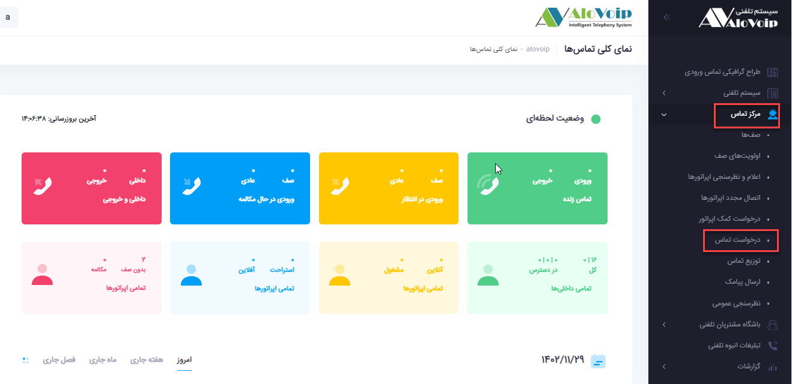
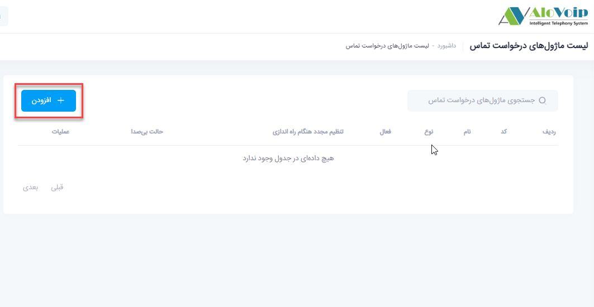
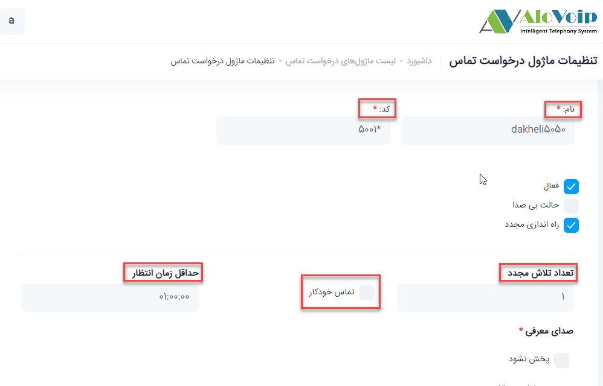
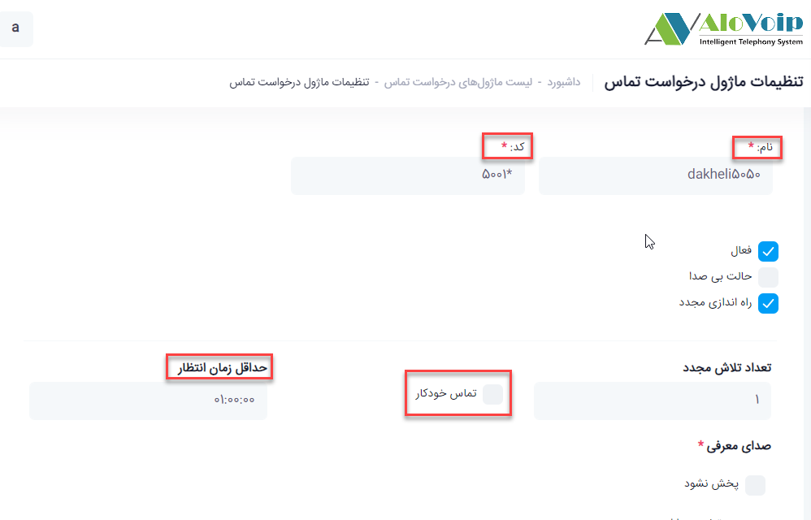
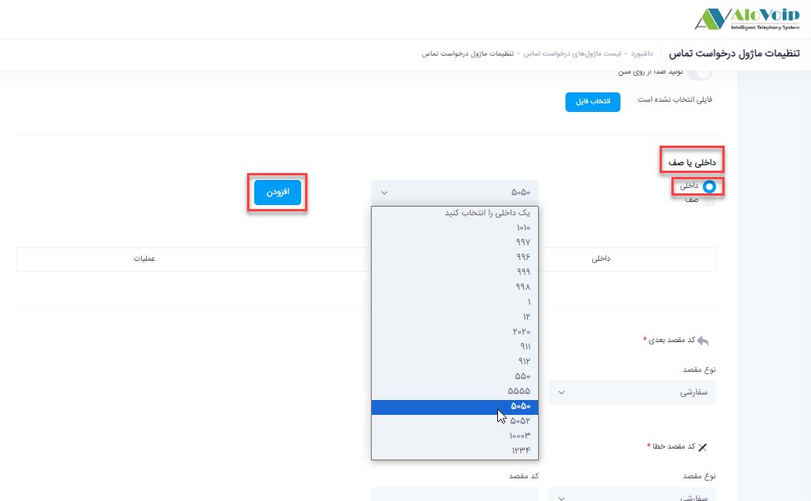
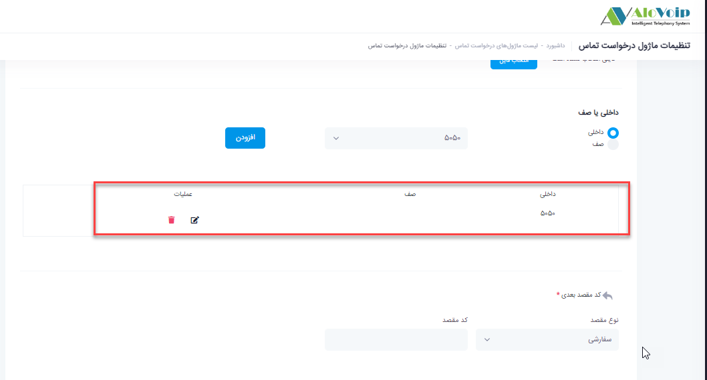
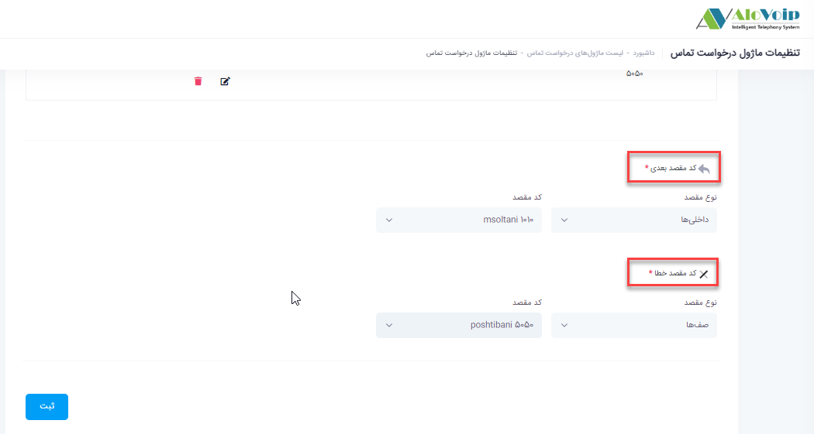
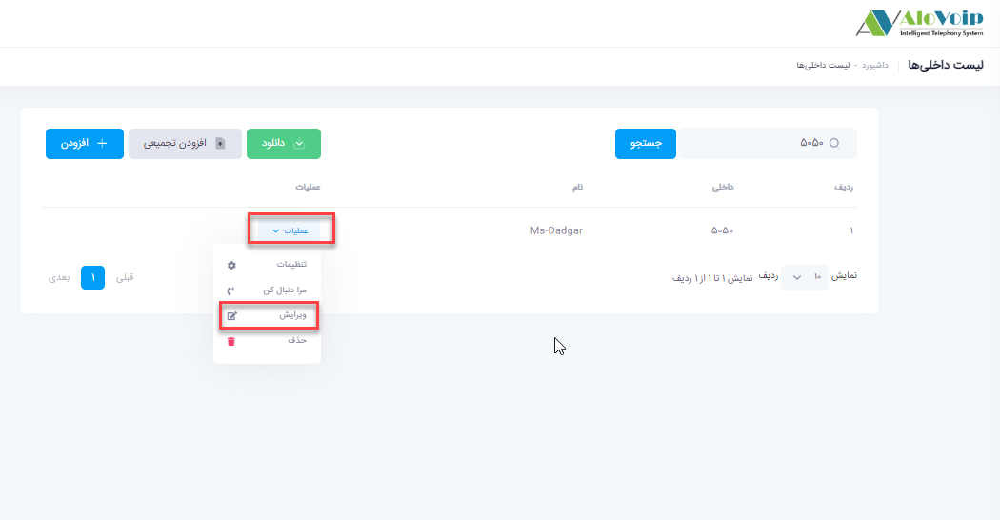
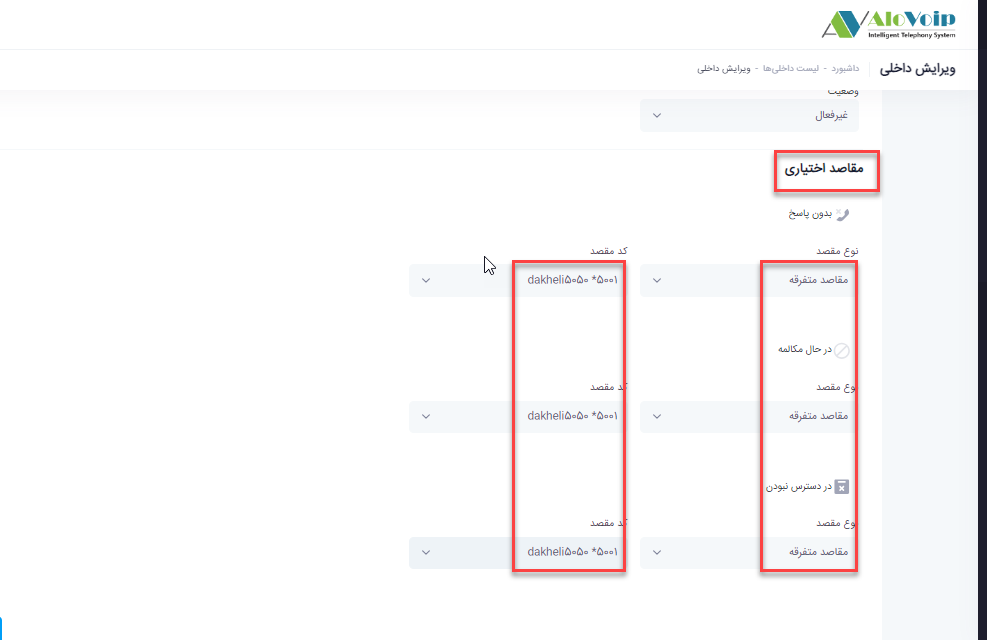
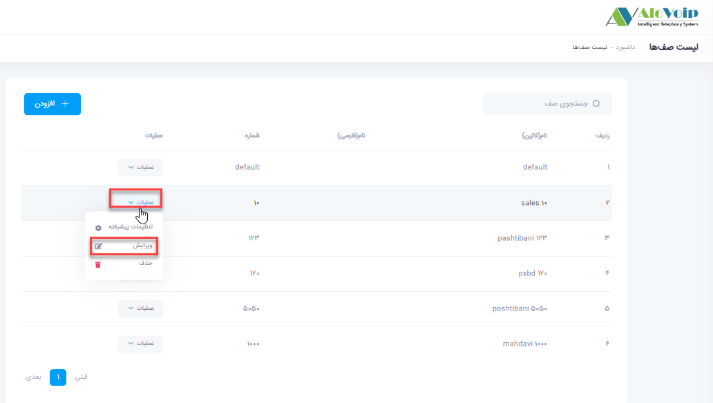

## ماژول درخواست تماس

در این بخش به موضوعات زیر می‌پردازیم:

-	[هدف از تنظیم ماژول درخواست تماس ](#ThePurposeOfSettingUpTheCallRequestModule)

-	[تنظیم ماژول درخواست تماس در پنل الوویپ ](#SettingTheCallRequestModuleInTheAlovoipPanel)

## هدف از تنظیم ماژول درخواست تماس {#ThePurposeOfSettingUpTheCallRequestModule}

این ماژول این امکان را فراهم می‌کند درصورتیکه یک داخلی پاسخگوی تماسی نباشد، تماس گیرنده می‌تواند اطلاع تماس خود را ثبت کرده تا پس از آزاد شدن داخلی مورد نظر با آن تماس گرفته شود.قابلیت درخواست تماس را می‌توان هم برای داخلی و هم برای صف فعال کرد، بدین صورت که وقتی تماس وارد صف می‌شود و  کسی پاسخگوی آن تماس نیست برای اعضای آن صف درخواست تماس ثبت شود تا زمانیکه کارشناسان  شما خط هایشان آزاد شد با آن شماره تماس بگیرند.

## تنظیمات ماژول درخواست تماس در پنل الوویپ {#SettingTheCallRequestModuleInTheAlovoipPanel}
برای تنظیم این ماژول در پنل الوویپ از قسمت **مرکز تماس** وارد **درخواست تماس** شوید، سپس روی **افزودن**کلیک کرده و وارد تنظیمات این ماژول شوید. 

-	در قسمت **نام** یک اسم در نظر بگیرید و یک **کد** منحصر به فرد هم در قسمت کد برایش انتخاب کنید. 

-	با فعال کردن **تماس خودکار** این امکان را می‌دهید که اگر برای یک داخلی درخواست تماسی ثبت شد و آن داخلی خطش آزاد شد بصورت اتوماتیک به آن شماره تماس بگیرد.

-	در قسمت **حداقل زمان انتظار** مشخص کنید تا چه زمانی این تماس خودکار اتفاق بیفتد.در واقع این زمان دادن این امکان را فراهم می‌کند که مثلا اگر داخلی شما مشغول بوده و یا به هر دلیلی به تماس ورودی خود  پاسخ ندادید وقتی تماس را قطع ‌کنید سریعا تماس خودکار اتفاق نیفتد و یک فرصتی به شما دهد که با آن شماره تماس  گرفته شود.

-	در قسمت **صدای معرفی** هم می‌توانید ویس هایی که مدنظرتان است را قرار دهید. اگر صدا نداشته باشید از تبدیل متن به صدا استفاده کنید ولی اگر صدا داشته باشید، فایل مورد نظر را انتخاب کرده و آپلود کنید. بقیه بخش های  مربوط  به صدا را هم به همین صورت تنظیم کنید تا تماس گیرنده بر اساس صدایی که برایش پخش می‌شود راهنمایی برای ثبت درخواست خودش شود.

**نکته** 
>اگر صدا را خودتان می‌خواهید ضبط کنید باید عددهایی که برای راهنمایی اعلام می‌کنید طبق همان متنی باشد که در بخش تولید صدا از متن گفته شده است.
>

-	در قسمت بعدی باید **داخلی یا صف** مورد نظر خود را انتخاب کنید.مثلا داخلی ... را در نظر میگیرید.اگر یک داخلی انتخاب کردید باید در قسمت سناریو داخلی، این ماژول را قرار دهید.اگر صف را انتخاب کنید تا در خواست تماس برای یک صف خاص اجرا شود باید این ماژول را در قسمت مقصد خطای صف انتخاب کنید

-	در قسمت **کد مقصد بعدی** هم می‌توانید مشخص کنید که اگر تماس گیرنده درخواست تماسی ثبت کرد به چه داخلی،صف و... وصل شود.

-	در قسمت **کد مقصد خطا** هم اگر به هردلیلی این سناریو اتفاق نیفتاد به مقصد دیگری وصل شود.این مقصد می‌تواند داخلی،صف و یا... باشد.بعد از تکمیل تنظیمات ثبت را بزنید.

-	بعد از اینکه ثبت انجام شد در قسمت داخلی ها بروید، داخلی که برای  آن این ماژول تنظیم کردید را انتخاب کرده و وارد  قسمت ویرایش آن شوید.در قسمت سناریو یک داخلی*(مقاصد اختیاری)*، *نوع مقصد* را مقاصد متفرقه انتخاب کنید و کد مقصد را همان ماژول درخواست تماسی که ایجاد کردید انتخاب کنید

-	اگر برای صف این ماژول را ایجاد کردید در قسمت * وارد صف ها* شده و در صفحه باز شده صف مورد نظر را پیدا کرده و وارد قسمت *ویرایش* آن شوید.در انتهای صف در قسمت *تنظیمات مقصد تماس ناموفق*، مقاصد متفرقه را انتخاب کنید و کد مقصد را درخواست تماسی که ساختید قرار دهید.

