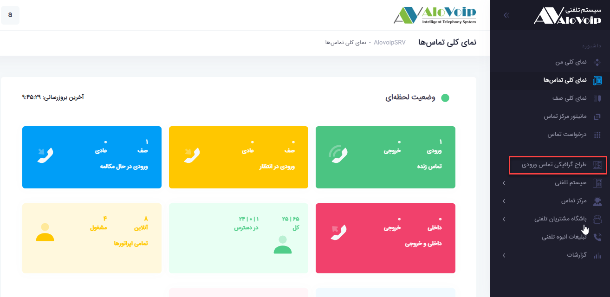
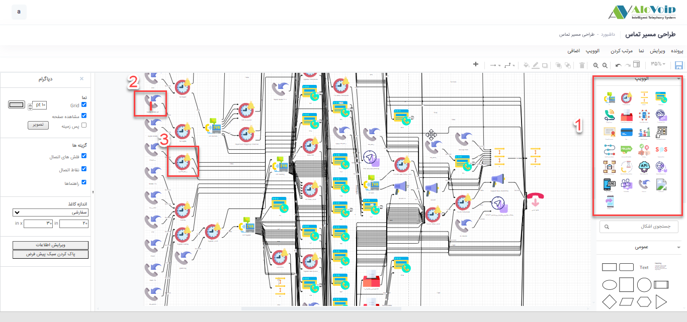

# طراحی گرافیکی تماس ورودی

در این بخش به موضوعات زیر می‌پردازیم:

•	[هدف از ماژول طراحی گرافیکی ](#ThePurposeOfTheGraphicDesign)

•	[تنظیم ماژول طراحی گرافیکی ](#SettingTheGraphicDesignModule)

## هدف از ماژول طراحی گرافیکی {#ThePurposeOfTheGraphicDesign}

با استفاده از ماژول طراحی گرافیکی می‌توانید سناریو تماس های ورودی سازمان خود را بصورت گرافیکی پیاده سازی کنید.این کار باعث می‌شود شما درک راحتی از سناریو تماس های ورودی سازمان خود داشته باشید.

## تنظیم ماژول طراحی گرافیکی {#SettingTheGraphicDesignModule}

برای تنظیم این ماژول در پنل الوویپ گزینه **طراح گرافیکی تماس های ورودی** را انتخاب کنید. در صفحه باز شده شمای گرافیکی سناریو خود را می‌توانید ببینید.مطابق با شکل زیر شما  با کمک از اشکال نمادینی که در سمت راست صفحه وجود دارد (کادر قرمز شماره 1) می توانید سناریو خود را پیاده سازی کنید.برای این کار کافی است هر کدام از این اشکال را با Drag&Drop  در وسط صفحه قرار دهید و آن را در جای مناسب سناریو خود استفاده کنید.وقتی بر روی هرکدام از این اشکال نشان داده شده در سناریو کلیک می‌کنید،برای مثال شکل شماره 2 که مسیر ورودی است می‌توانید از همین جا مسیر ورودی را تغییر دهید و یا در شکل شماره 3 که  نشان دهنده شرط های زمانی است می‌توانید شرط هایی که در سناریو خود اعمال شده است را ببینید و اگر تغییراتی مدنظر داشتید اعمال کنید.
توجه
هرگونه تغییری که در این قسمت اعمال کنید بر روی کل سناریو سیستم تلفنی شما اعمال می‌شود

