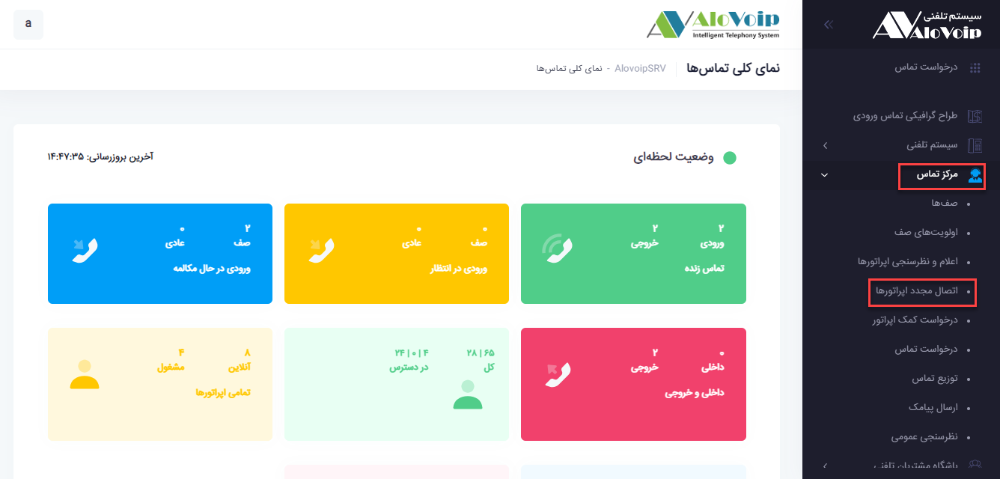
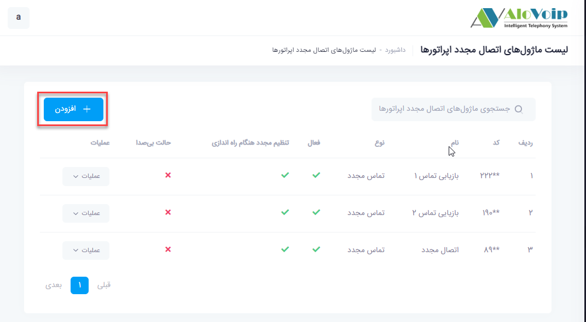
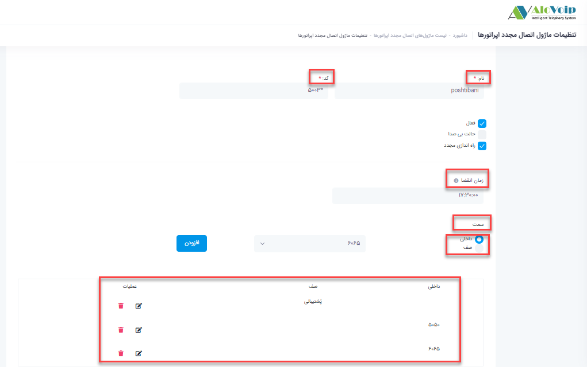
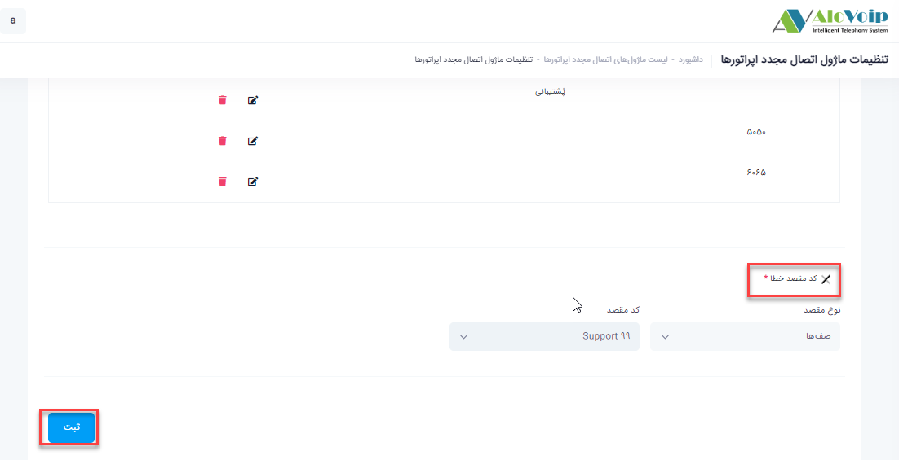
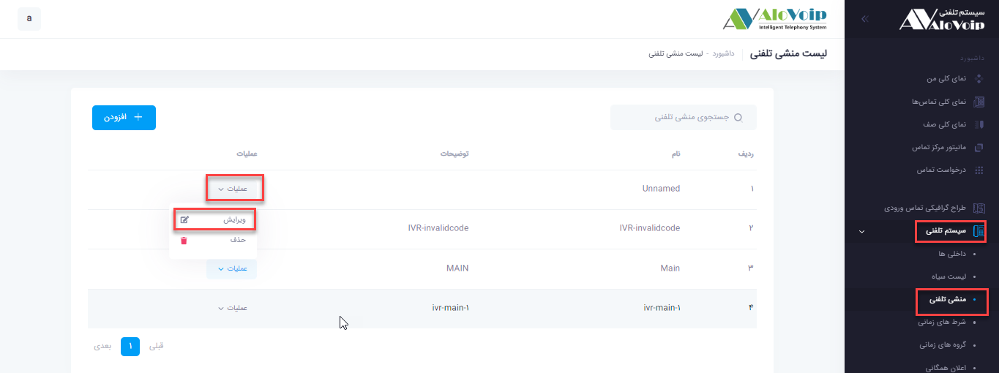
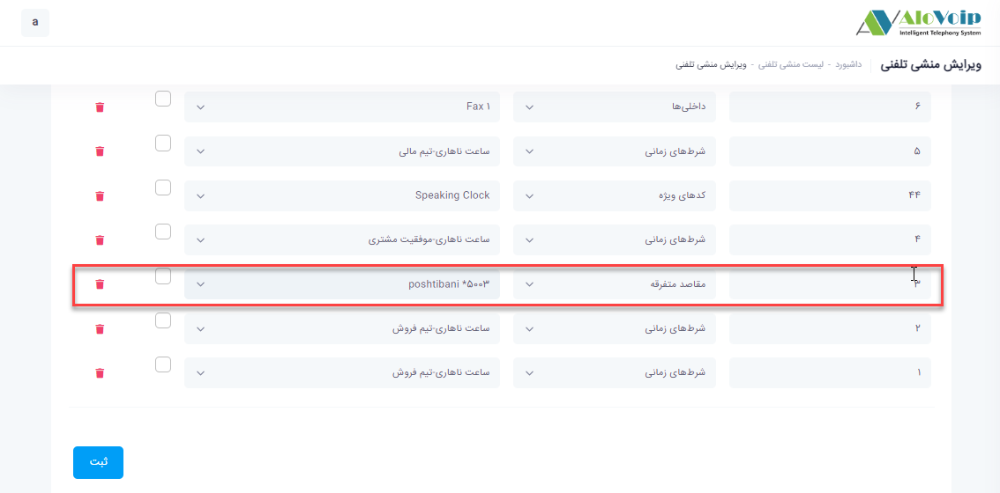

## اتصال مجدد به اپراتور

در این بخش به موضوعات زیر می‌پردازیم:
- [هدف از تنظیم ماژول اتصال مجدد به اپراتور ](#ThePurposeOfSettingTheReconnectionModuleToTheOperator)
- [تنظیم ماژول اتصال مجدد به اپراتور در پنل الوویپ ](#SettingTheModuleToReconnectToTheOperatorInThePanel)

## هدف از تنظیم ماژول اتصال مجدد به اپراتور {#ThePurposeOfSettingTheReconnectionModuleToTheOperator}

هدف از تنظیم این ماژول این است اگر یک تماس ورودی به یک اپراتور داشتیم و آن تماس به پایان رسید و یا به هر دلیلی قطع شد، مجدد فرد تماس بگیرد دوباره به همان اپراتور وصل شود. این  ماژول این امکان را فراهم می‌کند که اگر یک مشتری تماس گرفت و وارد صف شد و با اپراتوری با داخلی مثلا 5050 صحبت کرد اگر تا پایان ساعت کاری همان روز  دوباره تماس بگیرد و وارد همان صف شود، مجدد به همان داخلی 5050 وصل می‌شود.

## تنظیم ماژول اتصال مجدد به اپراتور{#SettingTheModuleToReconnectToTheOperatorInThePanel}

- برای تنظیم این ماژول وارد پنل الوویپ شده و از قسمت **مرکز تماس > اتصال مجدد اپراتورها** را انتخاب کنید.سپس روی **افزودن**کلیک کنید.

- **نام و کد**: در صفحه باز شده در قسمت نام و کد، یک نام دلخواه و یک کد منحصر به فرد  را وارد کنید. 
- **زمان انقضا**: در قسمت زمان انقضا تعیین می‌کنید تا چه زمانی مشتری تماس گرفت به همان اپراتور متصل شود.

>**نکته** حداکثر تا 24 ساعت امکان اتصال مجدد به همان اپراتور وجود دارد

**سمت**: سپس  در این قسمت ، داخلی یا صف مورد نظر خود را باید انتخاب کنید.برای مثال صف پشتیبانی را انتخاب کرده و بعد تمام داخلی هایی که عضو آن صف هستند را هم اضافه کنید..

**کد مقصد خطا**: در قسمت کد مقصد خطا، مجدد صف پشتیبانی را در نظر بگیرید. چون اگر  مشتری برای بار اول تماس گرفته و و هنوز با اپراتوری صحبت نکرده بتواند با بقیه داخلی های عضو صف صحبت کند.بعد از انجام تمام تنظیمات روی دکمه ثبت کلیک کنید.

•	برای استفاده از این ماژول می‌توانید روی منشی تلفنی بدین صورت عمل ‌کنید. برای مثال اگر قبلا تنظیمات بصورتی بود که هر کسی عدد 3 را بر روی آن شماره گیری می‌کرد به صف پشتیبانی وصل می‌شد الان بتواند اول به این ماژول وصل شود.از این رو وارد قسمت **ویرایش** منشی تلفنی شده و  در مقابل عدد 3، در قسمت  **نوع مقصد**، مقاصد متفرقه را انتخاب  و **کد مقصد** را هم ماژول اتصال مجدد را انتخاب کنید و روی ثبت کلیک کنید.

