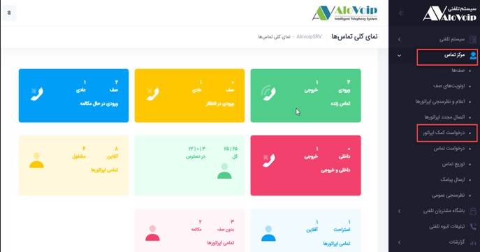
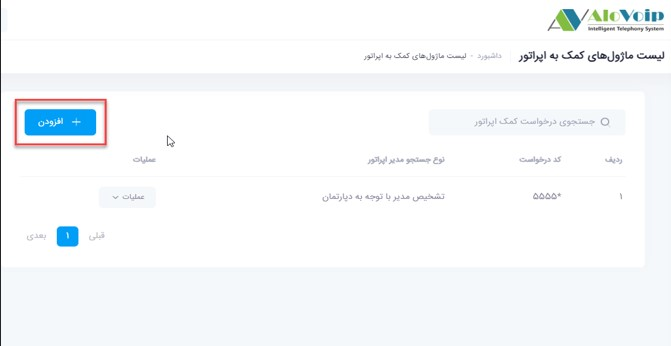
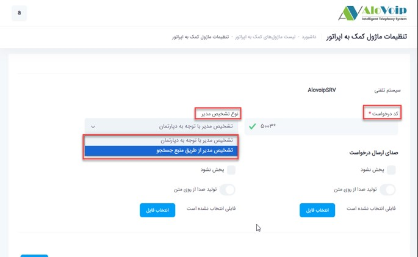
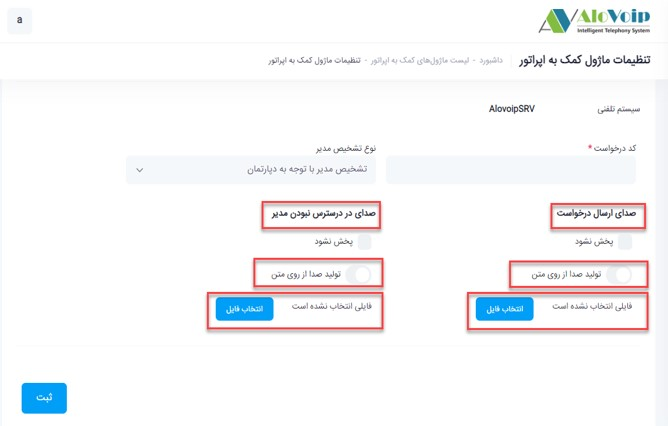
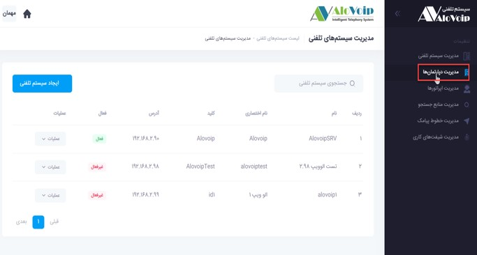
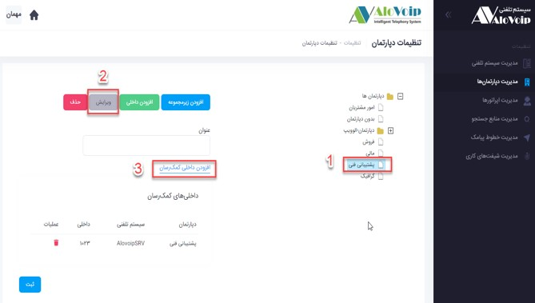
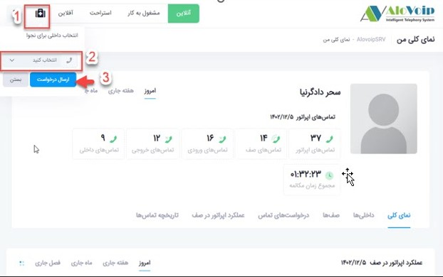

# درخواست کمک اپراتور

در این بخش به موضوعات زیر می‌پردازیم: 
•	هدف از تنظیم ماژول درخواست کمک اپراتور 
•   تنظیم ماژول درخواست کمک اپراتور در پنل الوویپ 
•	تعیین مدیر کمک رسان یک دپارتمان  
•	ارسال درخواست کمک رسان توسط اپراتور 

## هدف از تنظیم ماژول درخواست کمک اپراتور

فرض کنید در سازمان خود  یک واحد پشتیبانی دارید که با مشتریان شما در ارتباط هستند.حال اگر تماسی به کارشناس شما متصل شود و نیاز به کمک داشته باشد،آن کارشناس خیلی راحت وارد پنل اپراتوری خودش می‌شود و از قسمت بالا گوشه سمت چپ روی دکمه درخواست  کمک کلیک کرده و یک تماس به سمت مدیر دپارتمان و یا مدیر واحدش ارسال می‌کند، مدیر تماس خود را پاسخ می‌دهد و خیلی راحت با کارشناس خود بصورت مخفیانه ارتباط برقرار کرده تا بتواند مشتری را به درستی راهنمایی کند.

## تنظیم ماژول درخواست کمک اپراتور در پنل الوویپ

•	برای تنظیم این ماژول وارد پنل الوویپ شوید و از بخش **مرکز تماس > درخواست کمک اپراتور** را انتخاب کنید.سپس روی **افزودن** کلیک کنید. 

•	**کد درخواست** : در صفحه باز شده یک کد درخواست را وارد کنید. به عنوان مثال *5003 .

•	**نوع تشخیص مدیر** :برای نوع تشخیص مدیر دو حالت وجود دارد

حالت اول: **تشخیص مدیر از طریق منبع جستجو**
          مدیر آن واحد یا دپارتمان از طریق نرم افزار CRM شناسایی شود.

حالت دوم: **تشخیص مدیر با توجه به دپارتمان** 

اگر این فیلد را انتخاب کنید باید برای دپارتمان های خود مدیر انتخاب کنید

•	**صدای ارسال درخواست** :  می‌توانید صدا هم برای آن در نظر بگیرید. یعنی می‌توانید تعریف کنید که اگر آن کارشناس روی دکمه درخواست کمک کلیک کرد صدای ارسال درخواست برایش پخش شود. این صدا را می‌توانید هم خودتان ضبط و آپلود کنید و هم  با زدن دکمه تولید صدا از روی متن تنظیم کنید که بصورت رباتیک پخش شود. 

**صدای در دسترس نبودن مدیر** : همچنین می‌توانید اگر مدیر در دسترس نباشد صدای در دسترس نبودن مدیر پخش شود که این مورد را هم بصورت ضبط شده یا رباتیک قابل تغییر است.در انتها روی دکمه ثبت کلیک کنید. 

## تعیین مدیر کمک رسان یک دپارتمان

برای انتخاب مدیر  بصورت زیر باید عمل کنید

•  وارد بخش تنظیمات سیستم تلفنی خود شده و از آنجا **مدیریت دپارتمان ها** را انتخاب کنید

•  1	روی دپارتمانی که می‌خواهید برای آن مدیر انتخاب کنید کلیک کنید.

•	2 سپس گزینه **ویرایش** را انتخاب کنید.

•  3 روی گزینه **افزودن داخلی کمک رسان **کلیک کرده و در صفحه باز شده داخلی مدیر دپارتمان که همان کمک رسان می‌باشد را انتخاب کنید.در انتها روی دکمه ثبت کلیک کنید.

## ارسال درخواست کمک رسان توسط اپراتور

بعد از انجام تنظیمات اگر کارشناسی نیاز به کمک داشته باشد باید مراحل زیر را در پنل اپراتوری خودش انجام دهد:

• 1	روی دکمه **درخواست کمک رسان **کلیک کند.

• 2	  سپس داخلی خودش را انتخاب کند. 

• 3	یک ارسال درخواست تماس به سمت مدیر دپارتمانش ارسال کند

