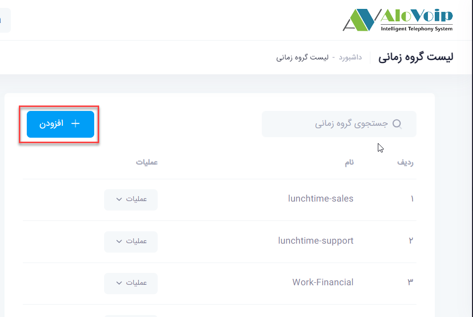
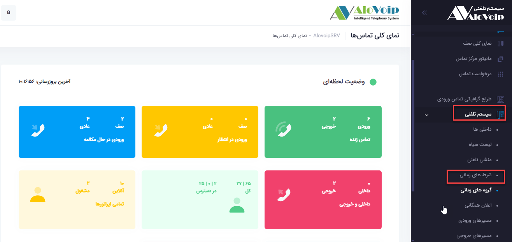
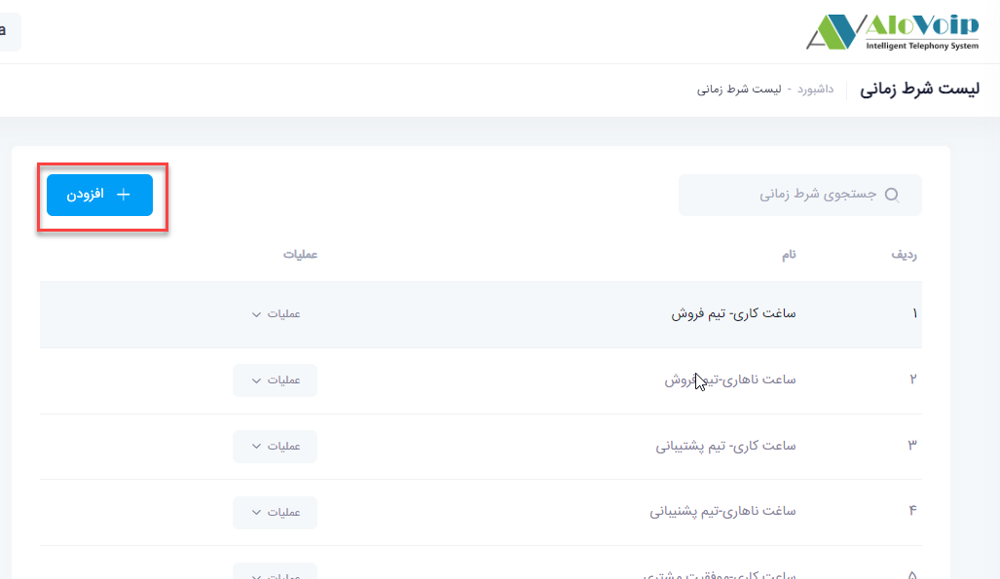
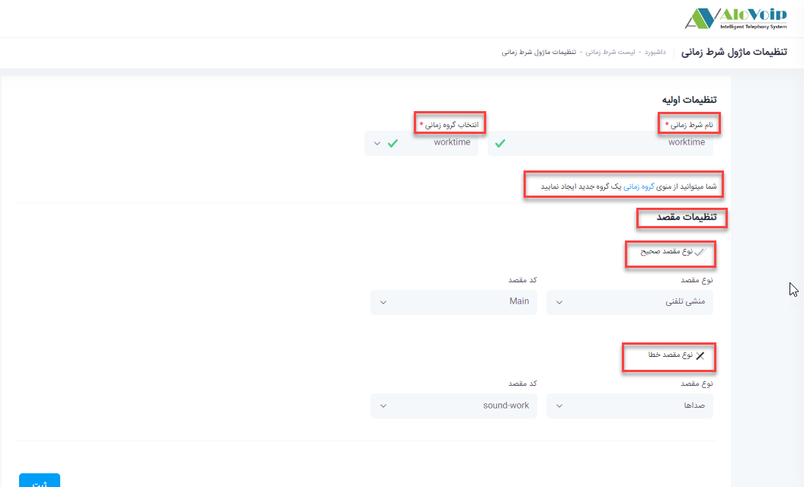
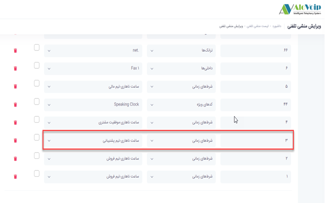
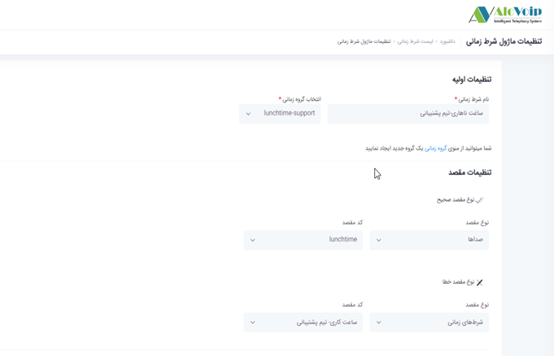

# شرط های زمانی

در این بخش به موضوعات زیر می‌پردازیم:

•	[هدف از تنظیم شرط زمانی ](#ThePurposeOfSettingTheTimeCondition)

•	 [تنظیم گروه زمانی ](#TimeGroupSetting)

•	[ تنظیم شرط زمانی ](#TimeConditionSetting)

•	[ شرط های زمانی تو در تو ](#NestedTimeClauses)

## هدف از تنظیم شرط زمانی{#ThePurposeOfSettingTheTimeCondition}

وقتی در سازمانی کار می‌کنید، آن سازمان ساعت کاری مشخصی دارد.به عنوان مثال ساعت کاری آن  روز های شنبه تا چهارشنبه از 8:30 تا 18 می‌باشد و پنجشنبه و جمعه ها نیز  تعطیل می‌باشند.شما می‌خواهید مشخص کنید افرادی که با سازمان و یا شرکت شما تماس می‌گیرند در ساعت کاری ذکر شده به منشی تلفنی وصل شوند و بعد از ساعت کاری پیغامی پخش شودکه شرکت تعطیل می‌باشد این سناریو را می‌توانید با استفاده از شرط زمانی پیاده سازی کنید.حتی می‌توانید زمان را برای صرف ناهار تعریف کنید که هرکسی در این زمان تماس گرفت صدایی برایش پخش شود که زمان صرف ناهار است.همچنین می‌توانید روزهای تعطیلی را که دارید در شرط زمانی تعریف کنید.

## تنظیم گروه زمانی {#TimeGroupSetting}

برای تنظیم شرط زمانی یک پیش نیازی دارد که اول باید گروه زمانی برای آن تعریف کنید.یعنی در گروه زمانی باید شما زمان کاری خود را تعریف کنید و بعد برای این زمان کاری، شرط تعریف کنید.برای تنظیم آن در پنل الوویپ در قسمت **سیستم تلفنی > گروه زمانی** را انتخاب کنید.سپس روی **افزودن** کلیک کنید

در صفحه باز شده می‌توانید ساعت کاری سازمان خود را تعریف کنید. به عنوان مثال(شنبه تا چهارشنبه از ساعت 8:30تا 18).برای این کار مراحل زیر باید طی شود:

•	ابتدا یک **نام** برای گروه زمانی خود تعریف کنید.به عنوان مثال worktime

•	در قسمت **تنظیمات زمان**، **ساعت شروع**  را 8:30 و **ساعت پایان** را 18  مشخص کنید. 

•	**شروع در روز هفته** را شنبه و **پایان در روز هفته** را چهارشنبه تنظیم کنید.

•	**شروع در روز ماه** را  1 و **پایان در روز ماه** را  31 تعیین کنید
**شروع در ماه** January  و **پایان در ماه**را December مشخص کنید و سپس روی دکمه ثبت کلیک کنید

بعد از ایجاد گروه زمانی به راحتی امکان ویرایش و حذف آن را دارید.

## تنظیم شرط زمانی {}

برای گروه زمانی که در قسمت بالا تعریف کردید به راحتی می‌توانید شرط زمانی تعریف کنید.برای تنظیم آن در منوی **سیستم تلفنی > شرط زمانی** را انتخاب کنید و در صفحه باز شده روی گزینه **افزودن** کلیک کنید

•	در صفحه باز شده یک نام را برای شرط زمانی خود در نظر بگیرید.به عنوان مثال worktime

•	در کادر **انتخاب گروه زمانی**، گروهی که ایجاد کردید و مرتبط با این شرط زمانی است را انتخاب کنید.

•	در قسمت **شما می‌توانید از منوی گروه زمانی یک گروه جدید ایجاد کنید** منظور این است که اگر تا به الان گروه زمانی برای این شرط ایجاد نکردید با کلیک روی **گروه زمانی** به صفحه ایجاد گروه زمانی منتقل شده و گروه خود را بر اساس زمانی که مد نظر دارید ایجاد کنید.

•	در قسمت **تنظیمات مقصد** باید شرط خود را تعریف کنید.در قسمت **نوع مقصد صحیح** مشخص می‌کنید که اگر کسی با سازمان شما تماس گرفت و تماسش با این گروه زمانی تعریف شده  مطابقت داشت به منشی تلفنی وصل شود.و اگر خارج از این زمان تماس گرفت به صدایی وصل شود که اعلام می‌کند ساعت کاری مجموعه به اتمام رسیده است که این قسمت را در **نوع مقصد خطا** تعریف می‌کنید.در نهایت این شرط زمانی را به راحتی می‌توانید در مسیر ورودی سیستم تلفنی خود قرار دهید

## شرط های زمانی تو در تو {#NestedTimeClauses}

شما می‌توانید یک شرط زمانی تو در تو داشته باشید و از آن در منشی تلفنی استفاده کنید.به عنوان مثال قرار است  هرکسی روی منشی تلفنی عدد 3 را زد به صف تیم پشتیبانی وصل شود ولی قبل از اتصال به این صف اول چک کند تایم ناهاری تیم پشتیبانی است یا نه. اگر تایم ناهاری بود یک  صدایی برایشان پخش شود که تایم ناهاری تیم پشتیبانی است و در غیر این صورت برود زمان کاری تیم پشتیبانی چک شود. در این زمان کاری هم تعریف شده است که اگر زمان کاری بود به صف پشتیبانی وصل شود و اگر نبود صدای پایان ساعت کاری پخش شود

