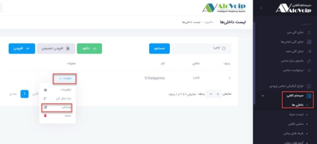
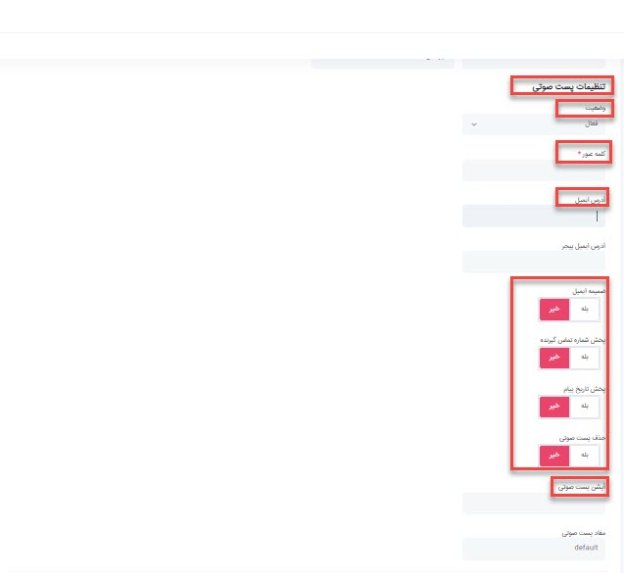

# صندوق صوتی

در این بخش به موضوعات زیر می‌پردازیم:

• [هدف از ایجاد ویس میل](#ThePurposeOfCreatingAVoiceMail)
• [تنظیمات ویس میل  در پنل الوویپ](#VoiceMailSettingsInAlovoip)

## هدف از ایجاد ویس میل{#ThePurposeOfCreatingAVoiceMail}

صندوق صوتی یا voicemail می‌تواند برای شرکت‌های کوچک و یا سازمان‌های بزرگ بسیار کاربردی باشد. شما می‌توانید صدای مشتری را ضبط کنید و به‌ صورت مستقیم با مشتریان در ارتباط باشید و یا انتقادات , پیشنهادات آنها را دریافت کنید.

## تنظیمات ویس میل{#VoiceMailSettingsInAlovoip}

برای تنظیم ویس میل در پنل الویپ از قسمت \*\***سیستم تلفنی > داخلی ها\*\*** را انتخاب کنید.سپس داخلی که می‌خواهید ویس میل برای آن فعال شود را جستجو کرده و روی دکمه \*\***عملیات\*\*** روبه روی داخلی کلیک کنید و از منوی باز  شده گزینه \*\***ویرایش\*\*** را انتخاب کنید.

• در صفحه باز شده در قسمت \*\***تنظیمات پست صوتی**, \*\***وضعیت\*\*** را روی \*\***فعال\*\*** انتخاب کنید تا ویس میل برایتان فعال شود.

• همچنین می‌توانید یک \*\***کلمه عبور\*\*** هم برای آن تعیین کنید تا اگر خواستید از طریق تلفن ویس میل هایتان را گوش کنید باز زدن پسورد هرکسی نتواند به این ویس ها دسترسی داشته باشد. 

•اگر نیاز داشته باشید ویس میل دریافتی به آدرس ایمیل ارسال گردد می‌توانید در بخش \*\***آدرس ایمیل\*\***, ایمیل مورد نظر را قرار دهید.

• همچنین می‌توانید از سایر پارامترهای مربوط به ویس میل از قبیل **ضمیمه ایمیل, پخش شماره تماس گیرنده, پخش تاریخ پیام, حذف پست صوتی** استفاده کنید.

• در قسمت \*\***آپشن پست صوتی\*\*** می‌توانید مدت زمان ضبط و تعداد ویس میل را مشخص کنید.

• در انتها روی دکمه \*\***ثبت\*\*** کلیک کنید.

