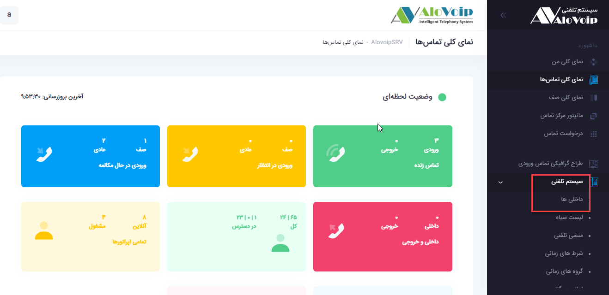
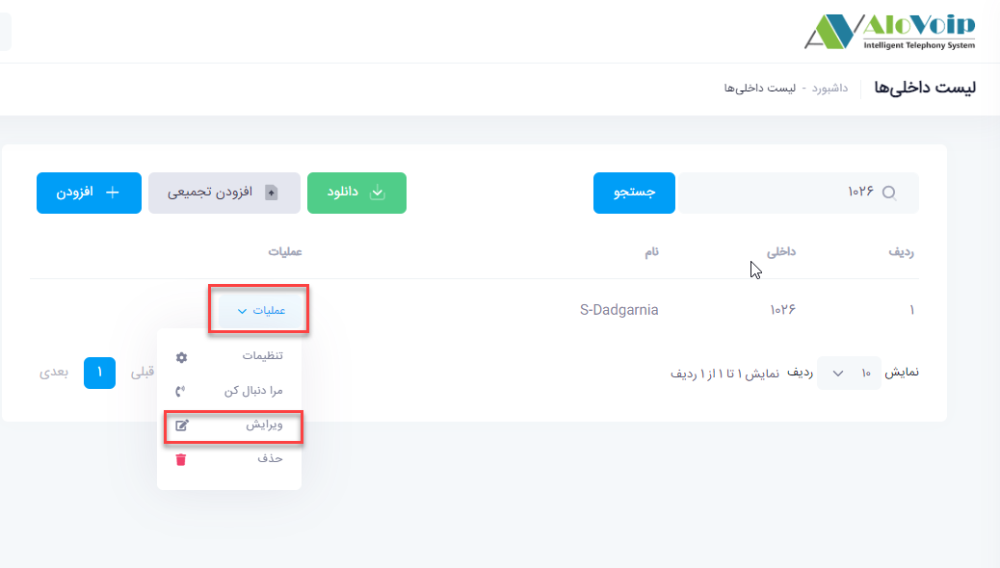
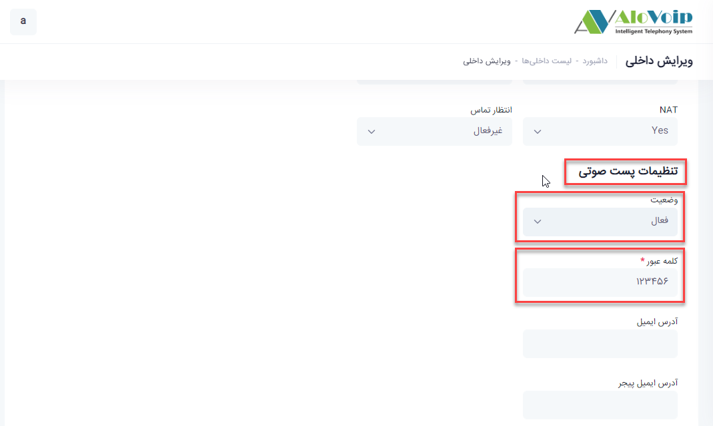
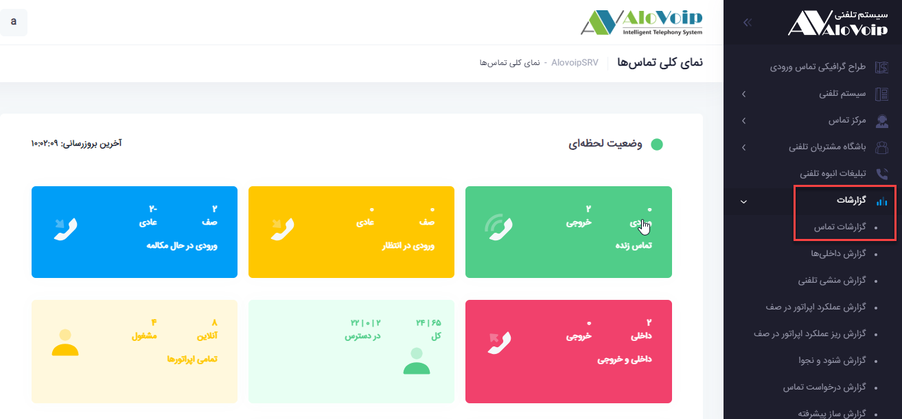
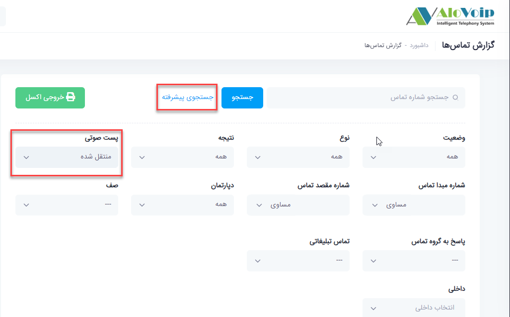

صندوق صوتی

در این بخش به موضوعات زیر می‌پردازیم:
-	[هدف از تنظیم صندوق صوتی ](#PurposeOfSettingvoiceBox)

-	[تنظیم صندوق صوتی در پنل الوویپ ](#SettingVoiceMailboxInAlovoipPanel)

-	[دسترسی به ویس های ضبط شده ](#AccessToRecordedVoices)

## هدف از تنظیم صندوق صوتی {#PurposeOfSettingvoiceBox}

صندوق صوتی یا ویس میل می‌تواند برای شرکت های کوچک و یا سازمان های بزرگ بسیار کاربردی باشد.شما می‌توانید صدای مشتری را ضبط کنید و بصورت مستقیم با مشتریان در ارتباط باشید ویا انتقادات و پیشنهادات آنها را دریافت کنید.به عنوان مثال در ساعات غیر کاری پیغام آنها را بگیرید و در ساعات اداری در اولین فرصت با آنها در ارتباط باشید و میزان رضایتمندی را به حداکثر برسانید.

## تنظیم صندوق صوتی در پنل الوویپ{#SettingVoiceMailboxInAlovoipPanel}

مراحل تنظیم صندوق صوتی در پنل الوویپ  بصورت زیر است:
-	در قسمت **سیستم تلفنی > داخلی ها** را 
انتخاب کنید.

-	در صفحه باز شده داخلی که می‌خواهید روی آن صندوق صوتی فعال شود را جستجو کرده و روی دکمه **عملیات** کلیک کرده و در زیر منوی باز شده گزینه **ویرایش** را انتخاب کنید

در صفحه باز شده در قسمت **تنظیمات پست صوتی**، اگر گزینه **وضعیت** را روی **فعال** قرار دهید صندوق صوتی برای این داخلی فعال خواهد شد.سپس یک **رمز** هم برای این صندوق صوتی در نظر بگیرید که هرکسی با زدن رمز روی تلفن بتواند ویس های ضبط شده را گوش دهد.در آخر روی دکمه ثبت کلیک کنید

## دسترسی به ویس های ضبط شده{#AccessToRecordedVoices}

برای گوش دادن به ویس های ضبط شده در پنل الویپ کافی است در قسمت **گزارشات > گزارش تماس** را انتخاب کنید.در صفحه باز شده در قسمت **جستجوی پیشرفته**،فیلد **پست صوتی** را روی **منتقل شده** بگذارید. با این کار تمام ویس های ضبط شده را به شما نشان می‌دهد

