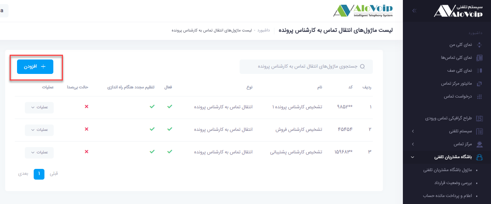

# ماژول انتقال تماس به کارشناس پرونده

در این بخش به موضوعات زیر می‌پردازیم:
- [هدف از ماژول انتقال تماس به کارشناس پرونده ](#ThePurposeOfTheCallTransferModuleToTheCaseExpert)
- [تنظیم سِمَت در هویت مشتریان](#SetThePointInTheIdentityOfTheCustomers)
- [تنظیمات ماژول انتقال تماس به کارشناس پرونده در پنل الوویپ](#TheSettingsOfTheCallForwardingModuleToTheCaseExpertInTheAloVoIPPanel)

## هدف از ماژول انتقال تماس به کارشناس پرونده{#ThePurposeOfTheCallTransferModuleToTheCaseExpert}
ماژول انتقال هوشمند براساس تخصص یکی از کاربردی ترین ماژول ها در سیستم تلفنی الوویپ است. عملکرد این ماژول به این صورت است که تماس را براساس سِمَت، به کارشناس مربوط متصل می‌کند. این ماژول نیازمند یک نرم افزار CRM است. نرم افزار CRM ی که ما از آن استفاده می‌کنیم نرم افزار CRM پیامگستر است. قبل از اینکه بخواهید ماژول انتقال هوشمند براساس تخصص را تنظیم کنید ابتدا باید در نرم افزار CRM مشتریان خودتان را تعریف کنید و در هویت مشتریان، مسئول مربوط به مشتریان را مشخص نمایید.

## تنظیم سمت در هویت مشتریان{#SetThePointInTheIdentityOfTheCustomers}

مشخص کردن " سِمَت " مربوط به مسئول های تعیین شده در پروفایل هویت می باشد. همانطور که در تصویر زیر مشخص شده است، می توان برای هویت سه مسئول به ترتیب زیر تعیین نمود:
- مسئول فروش
- مسئول پشتیبانی
- مسئول متفرقه

>نکته:
تنظیم مسئول هویت ها توسط مسئول CRM انجام می‌شود و همکاران VoIP فقط راهنمایی می‌کنند.

## تنظیمات ماژول انتقال تماس به کارشناس پرونده در پنل الوویپ{#TheSettingsOfTheCallForwardingModuleToTheCaseExpertInTheAloVoIPPanel}

در پنل الوویپ از قسمت **باشگاه مشتریان تلفنی > انتقال تماس به کارشناس پرونده** را انتخاب کنید. سپس روی **افزودن** کلیک کنید.

- در صفحه باز شده یک **نام** و یک **کد** منحصر به فرد  انتخاب کنید.

- **منبع جستجو**

نرم افزار مدیریت مشتری خود را انتخاب کنید.
که ما در اینجا از نرم افزار پیامگستر استفاده می‌کنیم.

- **سِمَت**

در این قسمت باید سِمَتی که در قسمت هویت مشتری مشخص کردید را وارد کنید

لازم به ذکر است در این قسمت تنها می‌توانید از یک سِمَت استفاده کنید.

- **کد مقصد خطا**
در این قسمت مشخص می‌کنید اگر مسئولی که برای هویت مشتری خود تعریف کردید پاسخگو نبود آن تماس به مقصد دیگری متصل شود.

