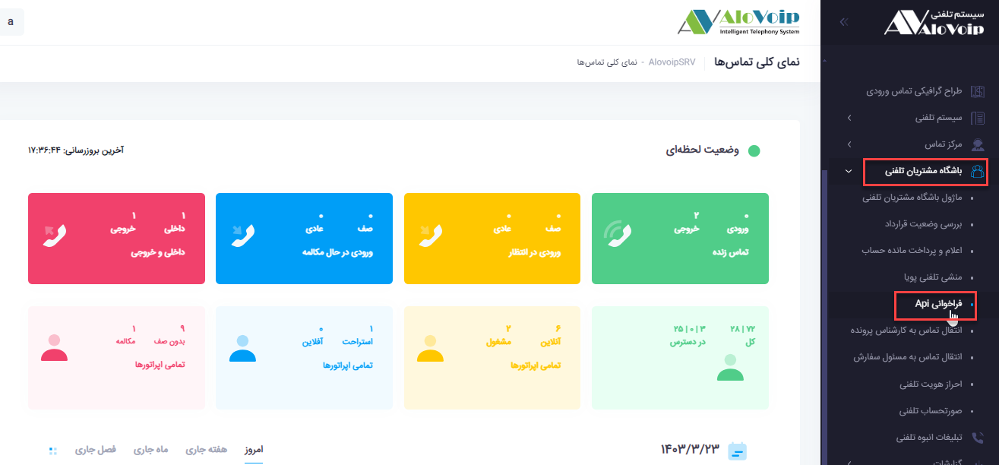
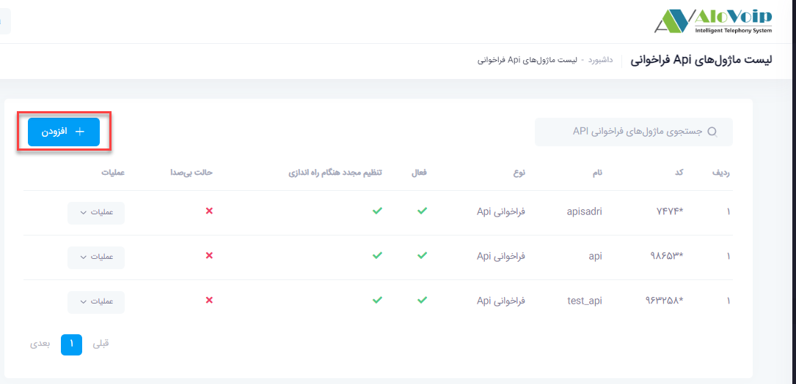
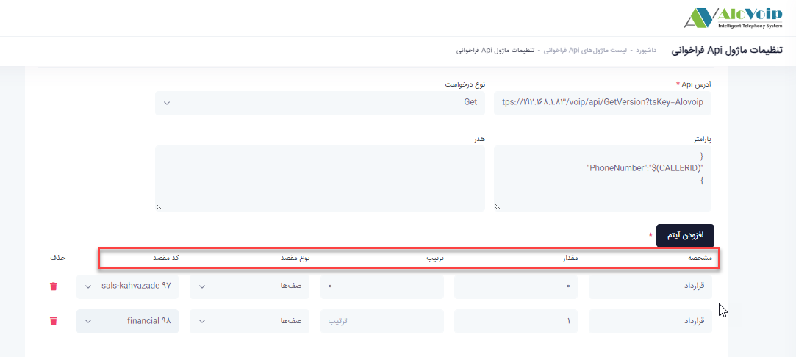
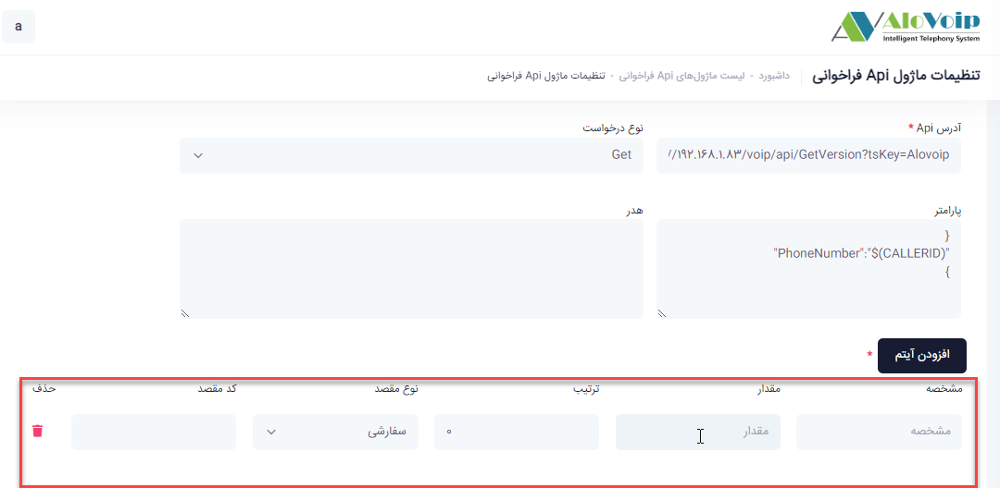
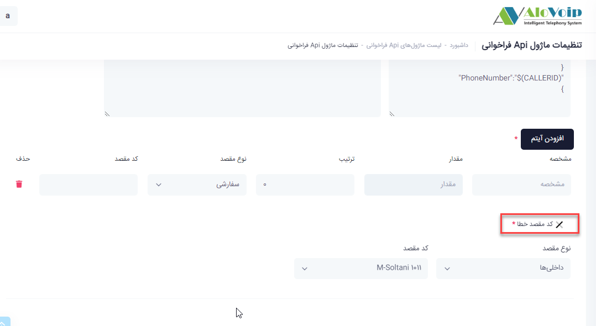

# فراخوانی API

در این بخش به موضوعات زیر می‌پردازیم:

•	[هدف از ماژول  فراخوانی API](#ThePurposeOfTheAPICallModule)

•	[تنظیمات  ماژول فراخوانی API](#APICallModuleSettings)

## هدف از ماژول  فراخوانی API{#ThePurposeOfTheAPICallModule}

مخفف Application Programming Interface است. به زبان ساده، API مجموعه‌ای از پروتکل‌ها، روندها و ابزارهایی است که به نرم‌افزارهای مختلف اجازه می‌دهد تا با یکدیگر ارتباط برقرار کنند API‌ها به عنوان پلی بین دو برنامه عمل می‌کنند و به آن‌ها اجازه می‌دهند داده‌ها و عملکردهای خود را با یکدیگر به اشتراک بگذارند.

## تنظیمات  ماژول فراخوانی API{#APICallModuleSettings}

در پنل الوویپ از قسمت **باشگاه مشتریان تلفنی > فراخوانی** API را انتخاب می‌کنید.در پنجره باز شده روی افزودن کلیک کنید.

•	در صفحه باز شده یک **نام** و یک **کد** منحصر به فرد انتخاب کنید.

•	**آدرس API**
آدرس **API** نرم افزاری که می‌خواهید با آن ارتباط بگیرید.

•	**نوع درخواست**

نوع درخواست می‌تواند get یا post باشد.
:Get اطلاعاتی که توسط الوویپ به درخواست دهنده api ارائه می‌شود.
Post: اطلاعاتی که الوویپ از درخواست دهنده api دریافت می‌کند.

•	**پارامتر**

کدjson  برای ارسال کدمشتری و یا شماره تماس گیرنده می‌باشد.و سمت نرم افزاری که  api آن داده شده است ارسال می‌شود.مانند نرم افزار crm 

**افزودن آیتم**
در **API** که درخواست دهنده به شما می‌دهد یک مشخصه و یک مقدار وجود دارد این مشخصه مثلا می‌تواند یک  قرارداد باشد و بدین صورت می‌توان آن را تعریف کرد.

•	اگر قرارداد داشته باشد مقدار آن را 0 قرار داده و به مسیری که می‌خواهید باداشتن قرارداد هدایت شود انتخاب می‌کنید.

•	اگر قرارداد نداشته باشد مقدار آن را 1 قرار می‌دهید و بعد به مسیری که می‌خواهید تماس وصل شود هدایت می‌کنید

•	اگر هیچ مشخصه ایی در api تعریف نشده باشد و صرفا با کدمشتری یا شماره تلفن قرار است تماس وصل شود یک آیتم خالی اضافه می‌کنید.در این حال آن شماره موبایل و یا کدمشتری به کد مقصد خطا هدایت می‌شود.

**کد مقصد خطا** اگر **API** به هردلیلی اجرا نشود می‌توانید تماس را به این قسمت هدایت کنید.

