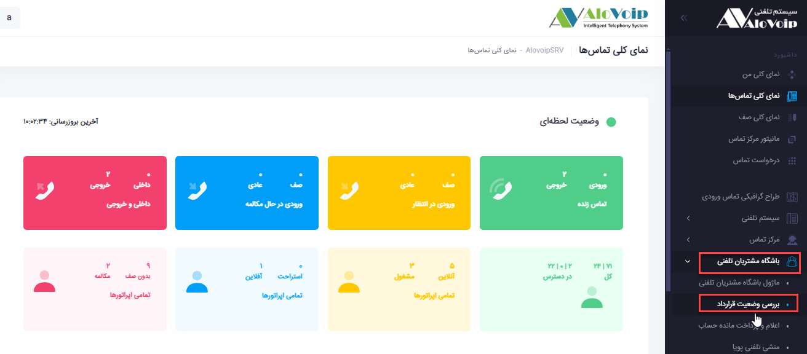
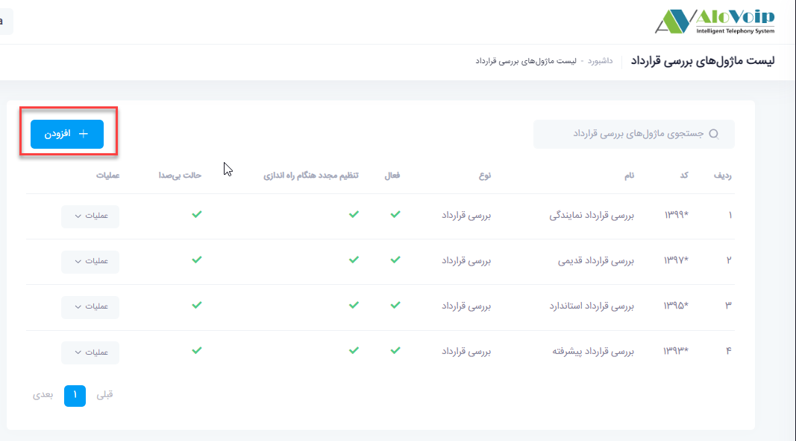
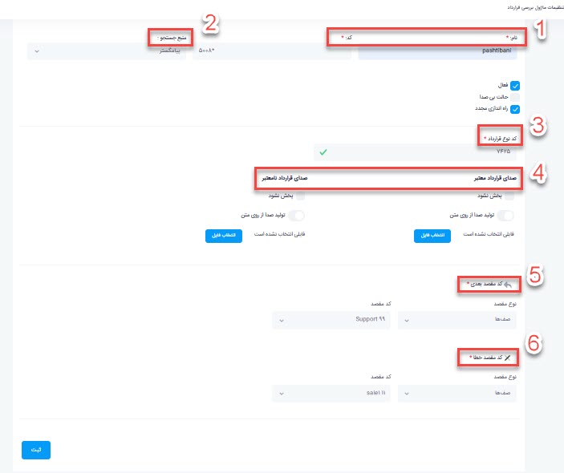

#  بررسی وضعیت قرارداد#  بررسی وضعیت قرارداد

در این بخش به موضوعات زیر می‌پردازیم:  
- [هدف از ماژول بررسی وضعیت قرارداد](#CheckingforQarardad)
- [مثال از سناریو تماس](#ExampleForSenario)     
- [ تنظیمات ماژول بررسی وضعیت قرارداد در پنل الوویپ ](#SettingForCheckingforQarardad)

## هدف از ماژول بررسی وضعیت قرارداد{#CheckingforQarardad}

اگر بخواهید روی تماس هایی که وارد سازمان شما می‌شود نظارت داشته باشید ،جهت تشخیص اینکه مشتری شما  قرارداد دارد یا خیر تماس به ماژول بررسی وضعیت قرارداد وصل می‌شود.پس در واقع دو نوع اعتبار سنجی برای این ماژول وجود دارد:1-داشتن قرارداد:قرارداد در پروفایل مشتری ثبت شده باشد.2-معتبر بودن قرارداد:این قرارداد تاریخش معتبر باشد.با فراهم شدن این دو مورد مشتری به مقصد مربوطه وصل می‌شود. 

# مثال از سناریو تماس{#ExampleForSenario}

- سناریو1: شما می‌توانید سناریوی تماس خود را بدین صورت تعریف کنید که اگر مشتری با سازمان شما تماس گرفت، قرارداد آن مشتری توسط این ماژول چک شود و در صورت داشتن قرارداد و معتبر بودن آن به بخش پشتیبانی وصل شود و در غیر این صورت به بخش فروش شما متصل شود.
- سناریو2: شما می‌توانید چندین قرارداد داشته باشید و در صورت داشتن قرارداد VIPاولویت شما در صف نوبت دهی تماس تغییر و به ابتدای صف منتقل می‌شوید .

## تنظیمات ماژول بررسی وضعیت قرارداد در پنل الوویپ{#SettingForCheckingforQarardad}
در پنل الوویپ در قسمت **باشگاه مشتریان تلفنی > بررسی وضعیت قرارداد** را انتخاب کنید. در صفحه باز شده روی **افزودن**کلیک کنید.

1.	**نام و کد**: در صفحه باز شده یک نام و یک کد منحصر به فرد در نظر بگیرید.
2.	**منبع جستجو**: منبع جستجو را  نرم افزار crm  انتخاب کنید.
3.	**کد نوع قرارداد**: در crm وقتی قرارداد تعریف می‌کنید یکسری کد باید به آن آیتم ها اضافه کنید از اینرو همان کدی که برای قرارداد در نظر گرفتید در این قسمت باید وارد کنید.
4.	**صدای قرارداد معتبر و نامعتبر**: می‌توانید به این ماژول صدا اضافه کنید مانند صدای قرارداد شما معتبر می‌باشد و یا قرارداد شما معتبر نمی‌باشد.
5.	**کد مقصد بعدی**: اگر تماس گیرنده جز مشتریان شما بود و قراردادش معتبر بود به مقصدی که در این قسمت تعریف شده هدایت می‌شود.
6.	**کد مقصد خطا**: اگر قرارداد تماس گیرنده معتبر نبود به مقصد تعریف شده در این قسمت هدایت می‌شود.

- بعد از اتمام تنظیمات روی **ثبت** کلیک کنید.حال می‌توانید ماژول را در قسمت باشگاه مشتریان تلفنی استفاده کنید. به عنوان مثال بعد از احراز هویت مشتری در قسمت کد بعدی به این ماژول هدایت شود.