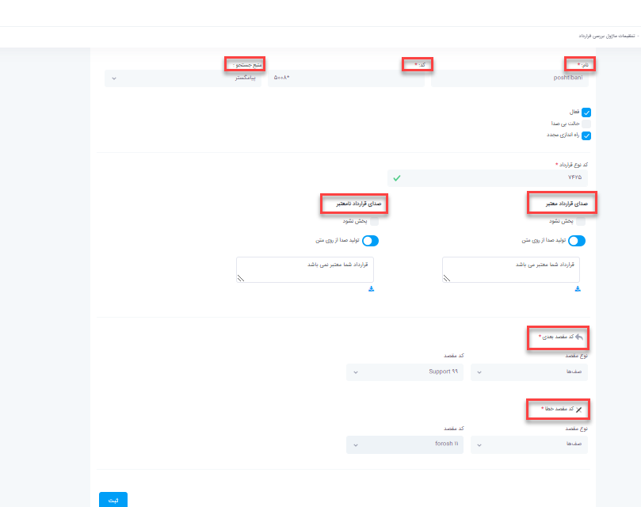

#  بررسی وضعیت قرارداد

در این بخش به موضوعات زیر می‌پردازیم:

•	هدف از ماژول بررسی وضعیت قرارداد

•	تنظیمات ماژول بررسی وضعیت قرارداد در پنل الوویپ

## هدف از ماژول بررسی وضعیت قرارداد

اگر بخواهید روی تماس هایی که وارد سازمان شما می‌شود نظارت داشته باشید مثلا  اگر سازمانی تماس می‌گیرد جز مشتریان شما است یا نه و اگر مشتری شما است آیا قرارداد دارد یا خیر. بدین منظور شما نیاز به نرم افزار crm و ماژول باشگاه مشتریان دارید که با تشخیص اینکه مشتری شما است به ماژول بررسی وضعیت قرارداد وصل شود و در این حالت با داشتن قرار داد به مقصد مربوطه هدایت شود.

## تنظیمات ماژول بررسی وضعیت قرارداد در پنل الوویپ

در پنل الوویپ در قسمت **باشگاه مشتریان تلفنی > بررسی وضعیت قرارداد** را انتخاب کنید. در صفحه باز شده روی **افزودن**کلیک کنید.

در صفحه باز شده یک **نام** و یک **کد** منحصر به فرد در نظر بگیرید.

•	**منبع جستجو** را نرم افزار crm  انتخاب کنید.

•	**کد نوع قرارداد**
در crm وقتی قرارداد تعریف می‌کنید یکسری کد باید به آن آیتم ها اضافه کنید از اینرو همان کدی که برای قرارداد در نظر گرفتید در این قسمت باید وارد کنید.

•	می‌توانید به این ماژول صدا اضافه کنید مانند صدای قرارداد شما معتبر می‌باشد و یا قرارداد شما معتبر نمی‌باشد.

•	**کد بعدی**
اگر تماس گیرنده جز مشتریان شما بود و قراردادش معتبر بود به مقصدی که در این قسمت تعریف شده هدایت می‌شود.

•	**کدخطا**
اگر قرارداد تماس گیرنده معتبر نبود به مقصد تعریف شده در این قسمت هدایت می‌شود.

•	بعد از اتمام تنظیمات روی **ثبت** کلیک کنید.حال می‌توانید ماژول را در قسمت باشگاه مشتریان مشتریان تلفنی استفاده کنید. به عنوان مثال بعد از احراز هویت مشتری در قسمت کد بعدی به این ماژول هدایت شود.