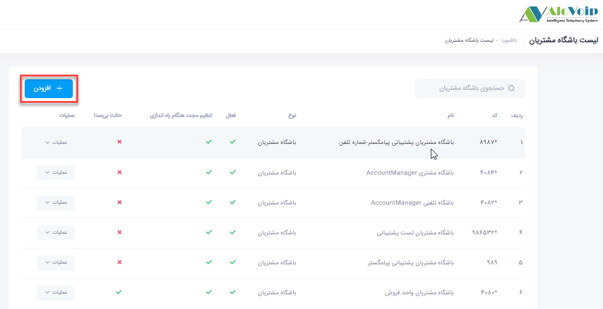

## ماژول باشگاه مشتریان تلفنی

در این بخش به موضوعات زیر می‌پردازیم:

•	[هدف از تنظیم ماژول باشگاه مشتریان تلفنی ](#ThePurposeOfSettingUpTheTelephoneCustomerClubModule)

•	[ تنظیم ماژول باشگاه مشتریان تلفنی ](#SettingUpThePhoneClubModule)

## هدف از تنظیم ماژول باشگاه مشتریان تلفنی{#ThePurposeOfSettingUpTheTelephoneCustomerClubModule}

فرض کنید شما بخش پشتیبانی برای محصول خود دارید و فقط می‌خواهید به کسانی خدمت رسانی کنید که جز مشتریان شما باشند.قبل از راه اندازی این سناریو نیاز به یک نرم افزار دارید که مشتریان خود را در آن ثبت کنید، یکی از آنها نرم افزار crm است.بنابراین پیش نیاز باشگاه تلفنی داشتن یک نرم افزار crm است که مرکز تماس الوویپ  بتواند با آن نرم افزار سینک شود و مشتریان را شناسایی کند.

##  تنظیم ماژول باشگاه مشتریان تلفنی{#SettingUpThePhoneClubModule}

برای وارد شدن به بخش باشگاه مشتریان تلفنی ، در پنل الوویپ  از قسمت **باشگاه مشتریان > ماژول باشگاه مشتریان تلفنی** را انتخاب کنید.سپس بر روی دکمه **افزودن** کلیک کنید.

•	در صفحه باز شده یک **نام و یک کد** منحصر به فرد انتخاب کنید.

•	در قسمت **منبع جستجو** باید  برای این ماژول تعیین کنید از چه طریقی مشتریان را جستجو و شناسایی کند، در اینجا برای مثال crm پیام گستر انتخاب شده است.

•	گزینه **فعال و راه اندازی مجدد** حتما باید انتخاب شده باشد.

•	در قسمت **نوع اعتبارسنجی** به 3 طریق می‌توانید مشتریان را شناسایی کنید:

1.	بر اساس شماره تلفن
اگر احراز هویت مشتریان را بر اساس شماره تلفن قرار دهید، مشتری باید با همان شماره تلفنی که در crm ثبت شده تماس بگیرد. در غیر اینصورت به عنوان مشتری ناشناس شناسایی می‌شود.

2.	بر اساس شماره مشتری 
اگر احراز هویت بر اساس شماره مشتری باشد، مشتری وقتی تماس می‌گیرد باید همان شماره مشتری که در crm ثبت شده است را وارد کند.

3.	بر اساس رمز تلفنی و شماره مشتری
اگر احراز هویت بر اساس رمز تلفنی و شماره مشتری باشد، مشتری وقتی تماس می‌گیرد باید رمز تلفنی و شماره مشتری خودش را وارد کند تا به عنوان مشتری شناسایی شود

•	بر اساس انتخاب هرکدام از 3 احراز هویت بالا باید صداهای مختص به هر کدام در قسمت صدا انتخاب شود. به عنوان مثال اگر احراز هویت را بر اساس شماره تلفن قرار دهید  دیگر صدای وارد کردن شماره مشتری معنی نمی دهد و می‌توانید گزینه پخش نشود را برای آن انتخاب کنید.

•	اگر شماره مشتریان شما  عدد نباشد و شامل یکسری کرکترهای خاصی باشد می‌توانید آن کرکترها را در قسمت کلمه پیشوند شماره مشتری وارد کنید تا وقتی مشتری می‌خواهد شماره اش را وارد کند این کرکترها را از سیستم نگیرد و خودش اتوماتیک آن ها را وارد کند.

•	در اینجا به عنوان مثال  نوع اعتبار سنجی بر اساس رمز تلفن و شماره مشتری قرار می‌دهید ومتن صداهای مربوط به آن را فعال می‌کنید.این صدا ها را خودتان هم می‌توانید رکورد کنید و به سیستم تلفنی بدهید.سپس می‌توانیددر منشی تلفنی خود تعیین کنید که اگر تماس گیرنده عدد 5 را انتخاب کرد وارد ماژول باشگاه مشتریان شود.اولین صدایی که برایش پخش می‌شود صدای معرفی است سپس صداهای خوش آمدگویی، وارد کردن شماره مشتری، شماره مشتری اشتباه، وارد کردن پسورد،پسورد نادرست،  خطای احراز هویت پخش می‌شود. برای هر کدام از این صداها امکان پخش نشدن هم وجود دارد. حتی شما می‌توانید رمز تلفن و شماره مشتری را بازیابی کنید.یعنی اگر رمز تلفن و شماره مشتری خود را فراموش کردید با انتخاب این گزینه می‌توانید به واحد دیگری وصل شوید تا آن کد را به شما اعلام کنند.این واحد را در قسمت کد بعدی  مشخص می‌کنید.

•	اگر مشتری اعتبار سنجی شد و مشخص شد  جز مشتریان شما است به کدام مقصد هدایت شود.این مورد را در کد مقصد بعدی مشخص می‌کنید. اگر در این بخش به هر نحوی پاسخگوی تماس نبودند تماس به مقصدی که در قسمت کد خطا اعلام شده هدایت می‌شود.

•	برای استفاده از این ماژول می‌توانید  در مسیر ورودی و یا  منشی تلفنی از آن استفاده کنید.به عنوان مثال اگر بخواهید تماس گیرنده در منشی تلفنی با وارد کردن عدد 1 به باشگاه مشتریان وصل شود باید نوع مقصد را مقاصد متفرقه و کد مقصد را ماژول باشگاه مشتریان انتخاب کنید. 

