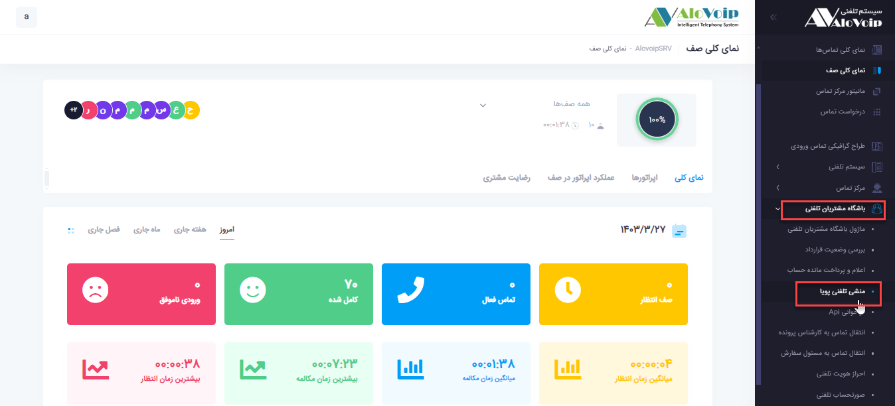
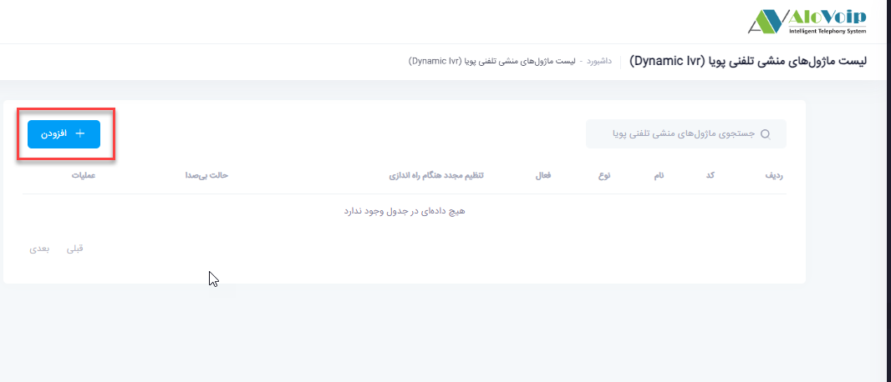
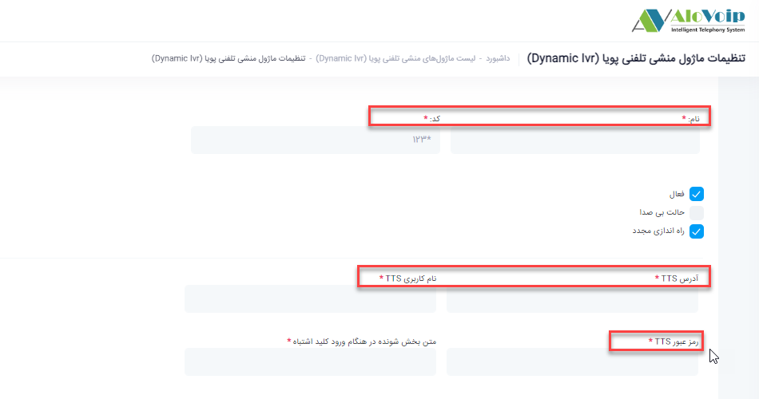
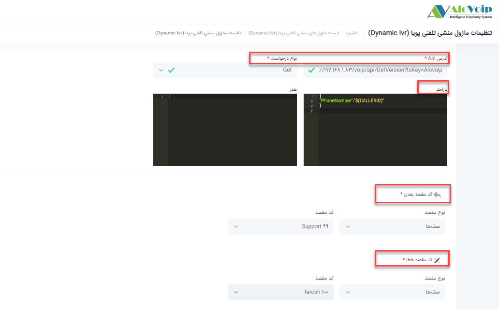

# ماژول منشی تلفنی پویا

در این بخش به موضوعات زیر می‌پردازیم:
- [هدف از تنظیم ماژول منشی تلفنی پویا](#PurposeOfSettingUpTheDynamicAnsweringMachineModule)
- [تنظیم ماژول منشی تلفنی پویا](#DynamicAnsweringModuleSetup)

## هدف از تنظیم ماژول منشی تلفنی پویا{#PurposeOfSettingUpTheDynamicAnsweringMachineModule}
زمانی که با سازمانی تماس گرفته می‌شود اگر ورودی به منشی تلفنی پویا متصل باشد تمام موارد بصورت گویا انجام می‌شود و شما با کاربر حقیقی صحبت نمی‌کنید.مانند اعلام وضعیت آب و هوای یک منطقه و یا اعلام وضعیت صورت حساب.تمامی این موارد از طریق این ماژول تنظیم می‌شود.

## تنظیم ماژول منشی تلفنی پویا{#DynamicAnsweringModuleSetup}
در پنل الوویپ در قسمت **باشگاه مشتریان تلفنی > منشی تلفنی پویا** را انتخاب کنید.در پنجره باز شده روی **افزودن** کلیک کنید.

- در صفحه باز شده یک **نام** و یک **کد** منحصر به فرد انتخاب کنید.
- **آدرس TTS**
آدرس TTS را در این قسمت باید وارد کنید که بتواند عملیات مربوط به تبدیل متن به ویس را انجام دهد. 

- **نام کاربری و رمز عبور مربوط به TTS**را وارد کنید.
- آدرس **API** 
آدرس API یی که در آن منشی تلفنی نوشته شده است
**نوع درخواست**نوع درخواست می‌تواند get یا post باشد.

- **Get**: اطلاعاتی که توسط الوویپ به درخواست دهنده api ارائه می‌شود.

- **Post**: اطلاعاتی که الوویپ از درخواست دهنده api دریافت می‌کند.
- **پارامتر** 
کدjson  برای ارسال کدمشتری و یا شماره تماس گیرنده می‌باشد.و سمت نرم افزاری که  api آن داده شده است ارسال می‌شود. 
- **کد مقصد بعدی** 
بعد از اعلام منشی تلفنی پویا اگر بخواهید تماس به مقصد دیگری هدایت شود در این قسمت تعریف می‌کنید.
- **کد مقصد خطا** 
اگر در هنگام اتصال به منشی تلفنی خطایی رخ داد در این قسمت می‌توانید مشخص کنید تماس به کدام بخش متصل شود.

