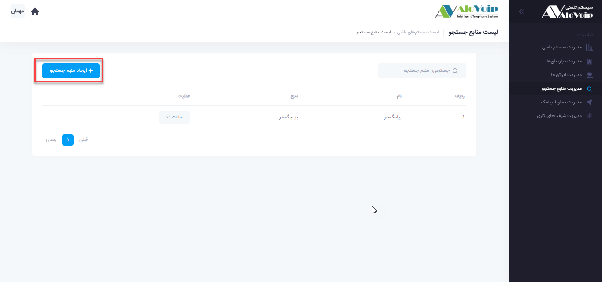

## مدیریت منابع جستجو

در این بخش به موضوعات زیر می‌پردازیم:

-	هدف از مدیریت منابع جستجو

-	 تنظیم مدیریت منابع جستجو

## هدف از مدیریت منابع جستجو

اگر در سازمان خود از نرم افزار مدیریت مشتری مثل crm پیامگستر یا سایر نرم افزارها استفاده می‌کنید می‌توانید پنل الوویپ را به این crm ها متصل کنید و از امکانات آنها استفاده کنید. اضافه کردن crm می‌تواند در مدیریت مشتری به شما کمک کند.از قبیل نمایش گزارشات، popup تماس و...

## تنظیم مدیریت منابع جستجو

در پنل الوویپ از قسمت **تنظیمات سیستم < مدیریت منابع جستجو** را انتخاب کنید.سپس روی **ایجاد منبع جستجو** کلیک کنید. با 2 بخش مواجه می‌شوید:

1.	**پیامگستر**
بخش اول **پیامگستر** را انتخاب و در صفحه باز شده یک **نام** دلخواه انتخاب کنید.در قسمت **هاست**، آی پی پیامگستر را وارد کنید، **نام کاربری** که نقش ادمین را دارد و **رمز عبور** آن را وارد کنید و روی ثبت کلیک کنید

2.	**سایر**
این قسمت برای استفاده کردن از سایر نرم افزار های crm است. با انتخاب گزینه سایر در صفحه ایی که باز می‌شود یک **نام** در نظر بگیرید، آی پی crm را در قسمت **هاست** وارد کنید.**نام کاربری** که نقش ادمین را دارد و **رمز عبور** آن را هم وارد کنید.**احراز هویتشان** را بصورت Basic و یا None  قرار دهید.سپس روی ثبت کلیک کنید.تا ارتباط بین الوویپ با آن نرم افزار برقرار شود

