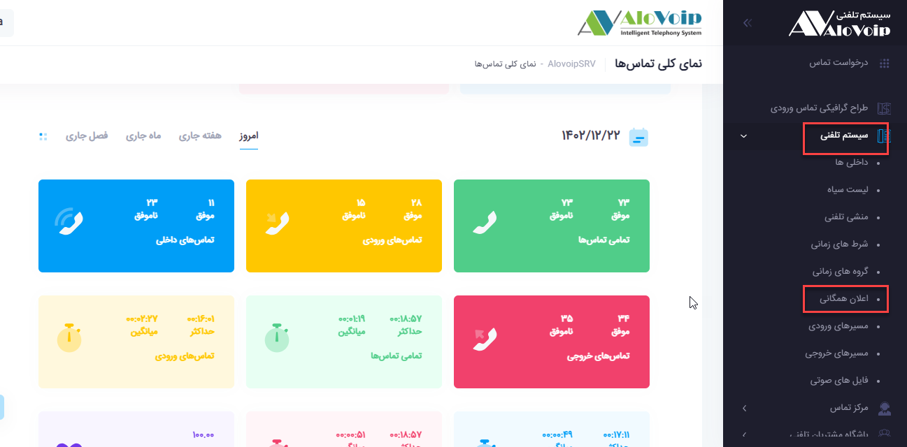
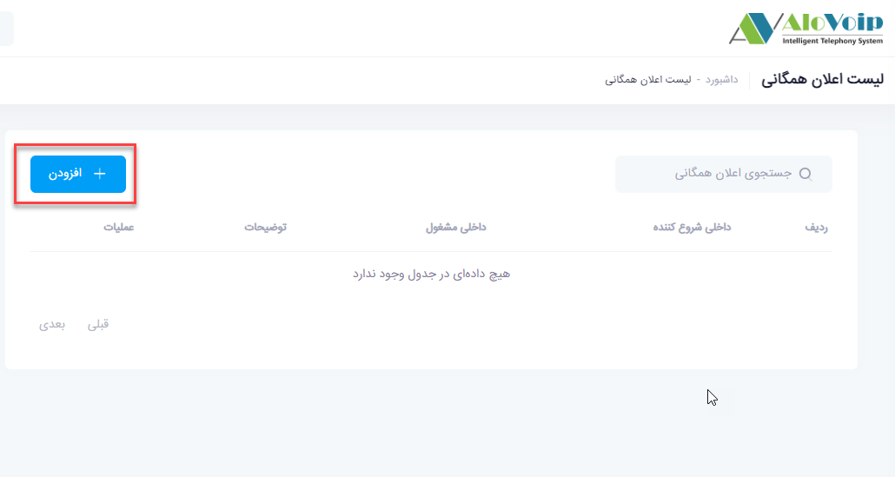
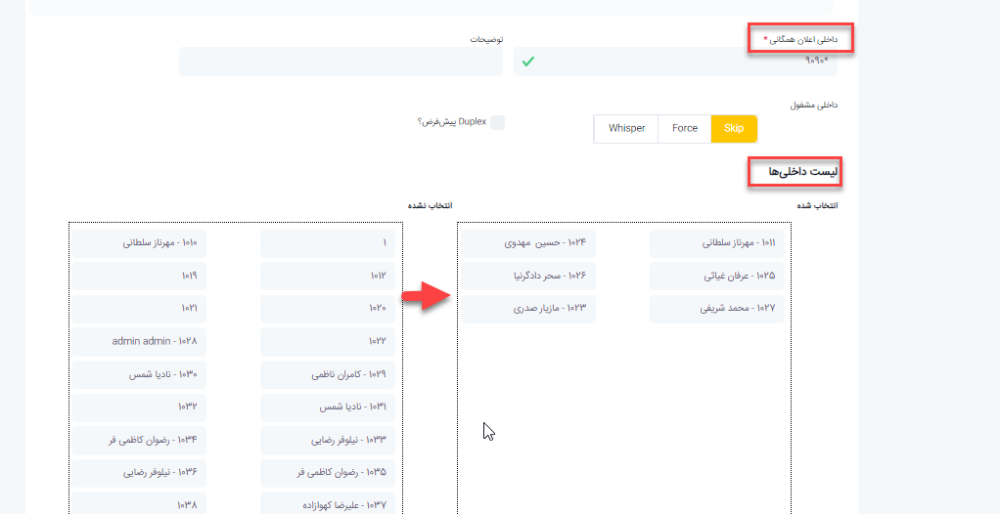
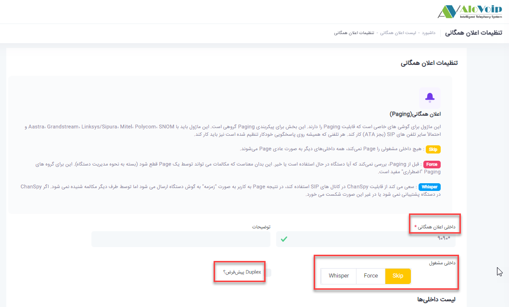

## اعلان همگانی

در این بخش به موضوعات زیر می‌پردازیم:

•	[هدف از تنظیم اعلان همگانی ](#ThePurposeOfPublicNotificationRegulation)

•	 [تنظیم اعلان همگانی در پنل الوویپ ](#SettingPublicNotificationInThePanelAlovoip)

## هدف از تنظیم اعلان همگانی{#ThePurposeOfPublicNotificationRegulation}

هدف از تنظیم اعلان همگانی این است که اگر بخواهید در سازمان خود خبری را بصورت عمومی اعلان و یا page کنید می توانید از این امکان استفاده کنید.

## تنظیم اعلان همگانی در پنل الوویپ{#SettingPublicNotificationInThePanelAlovoip}

برای تنظیم اعلان همگانی در پنل الوویپ از قسمت **سیستم تلفنی > اعلان همگانی** را انتخاب کنید.سپس روی **افزودن** کلیک کنید. 

1.	داخلی اعلان همگانی: در این قسمت باید یک کد را به paging اختصاص دهید تا زمانیکه خواستید page کنید با گرفتن این کد بر روی تلفن خود، تمام داخلی های که عضو paging هستند زنگ بخورند.(برای مثال کد *9090 را در نظر بگیرید)

2.	داخلی مشغول: برای پیج شدن داخلی ها سه حالت وجود دارد  که در ابتدای صفحه توضیحاتی درباره هر کدام از این حالت ها داده شده است که شما را برای تنظیمات راهنمایی می‌کند.

•	Skip : وقتی Skip را انتخاب کنید زمانی  که کد 9090*  گرفته شود اگر داخلی هایی که در لیست داخلی ها انتخاب شده اند مشغول باشند آن داخلی ها برایشان paging اتفاق نمی افتد.

•	Force: در این حالت اگر داخلی ها مشغول باشند تماس آنها قطع و paging برایشان اتفاق می‌افتد.

•	:Whisper در حالت Whisper اگر داخلی ها مشغول  هم باشند هم صدای تماس گیرنده و هم صدای paging را با هم دارند بدین صورت که صدای paging از طریق اسپیکر پخش می‌شود. 

3.	 :Duplexاگر حالت Duplex  را انتخاب کنید، ارتباط paging بصورت دوطرفه برقرار خواهد شد.

4.	لیست داخلی ها: در قسمت لیست داخلی ها، داخلی هایی که می‌خواهید در این اعلان همگانی باشند را انتخاب کنید. در واقع داخلی ها را از قسمت انتخاب نشده با drag&drop به قسمت انتخاب شده انتقال دهید.

>نکته:  توصیه نمی‌شود تمام داخلی ها انتخاب شوند چون هنگام استفاده از اعلان همگانی صدای شما از تمام داخلی ها پخش می‌شود و این باعث ایجاد نویز در سازمان می‌شود.
•	بعد از انجام تنظیمات دکمه ثبت را بزنید.

•	برای پیج شدن داخلی ها سه حالت وجود دارد  که در ابتدای صفحه توضیحاتی درباره هرکدام از این حالت ها داده شده است که شما را برای تنظیمات 
راهنمایی می‌کند.

• **Skip**

وقتی Skip را انتخاب کنید زمانی  که کد 9090*  گرفته شود اگر داخلی هایی که در لیست داخلی ها انتخاب شده اند مشغول باشند آن داخلی ها برایشان paging اتفاق نمی افتد

• **Force**

در این حالت اگر داخلی ها مشغول باشند تماس آنها قطع و paging برایشان اتفاق می‌افتد.

• **Whisper**

در حالت Whisper اگر داخلی ها مشغول  هم باشند هم صدای تماس گیرنده و هم صدای paging را با هم دارند بدین صورت که صدای paging از طریق اسپیکر پخش می‌شود

•	اگر حالت Duplex  را انتخاب کنید، ارتباط paging بصورت دوطرفه برقرار خواهد شد.
•	بعد از انجام تنظیمات دکمه ثبت را بزنید.

