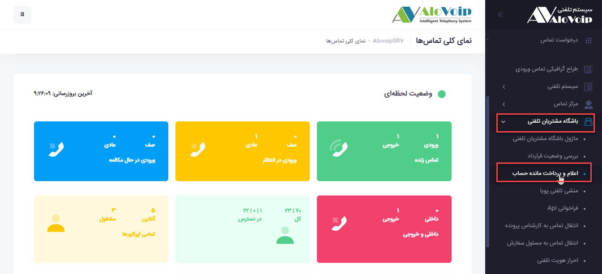
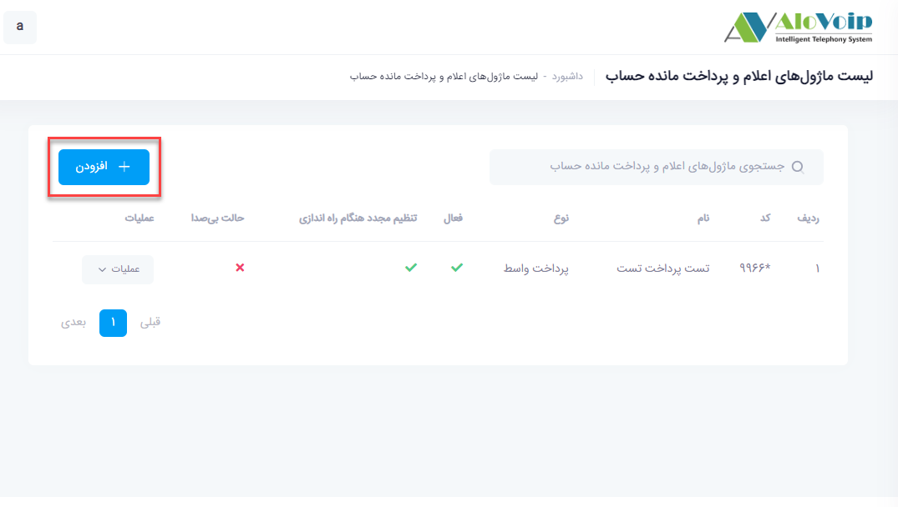
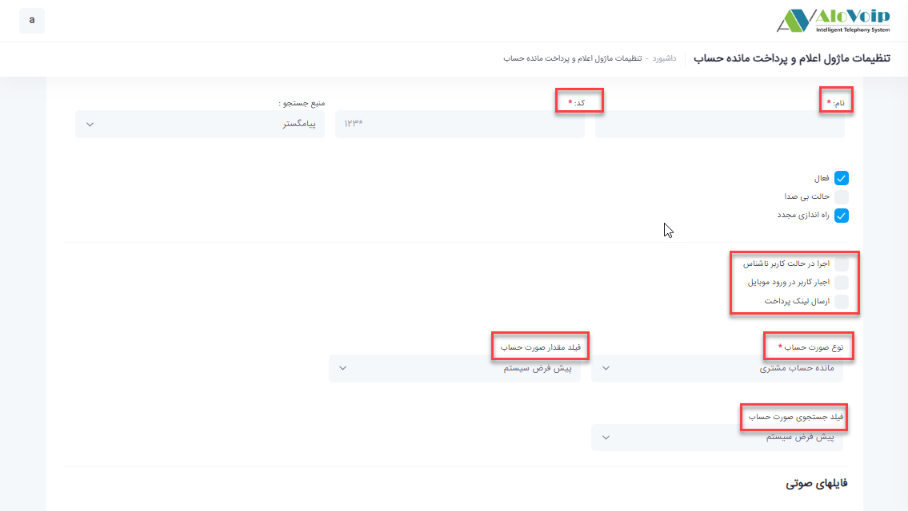
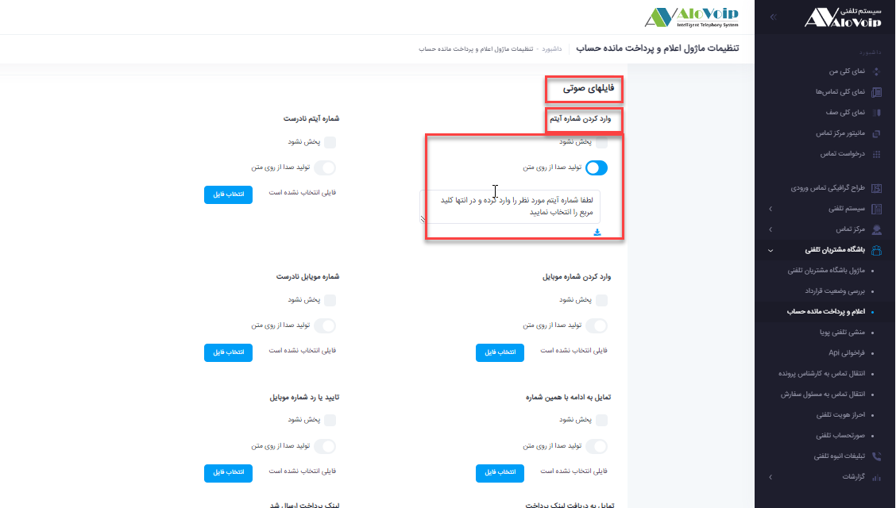
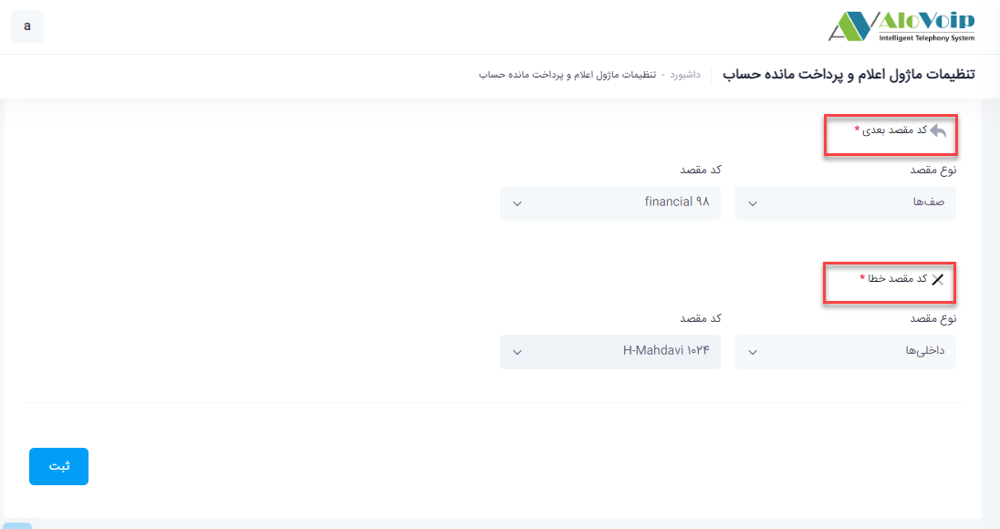

# ماژول اعلام و پرداخت مانده حساب

در این بخش به موضوعات زیر می‌پردازیم:

•	[هدف از تنظیم ماژول اعلام و پرداخت مانده حساب ](#ThePurposeOfSettingUpTheAccountBalanceDeclarationAndPaymentModule)

•	[تنظیم ماژول اعلام و پرداخت مانده حساب ](#SettingUpTheAccountBalanceDeclarationAndPaymentModule)

## هدف از تنظیم ماژول اعلام و پرداخت مانده حساب{#ThePurposeOfSettingUpTheAccountBalanceDeclarationAndPaymentModule}

این ماژول این کمک را به سازمان می‌کند که مشتری شما بتواند از وضعیت حساب خودش مطلع شود.

## تنظیم ماژول اعلام و پرداخت مانده حساب{#SettingUpTheAccountBalanceDeclarationAndPaymentModule}

در پنل الوویپ در قسمت **باشگاه مشتریان**، گزینه **اعلام و پرداخت مانده حساب** را انتخاب کنید. در صفحه باز شده با انتخاب گزینه **افزودن**وارد تنظیمات این بخش شوید.

•	در صفحه باز شده یک **نام و کد** منحصر به فرد انتخاب کنید.
نکته
این ماژول به باشگاه مشتریان وابسته است و اول باید ماژول باشگاه مشتریان را تنظیم کنید و بعد تماس ها را به این ماژول هدایت کنید.

•	در بخش بعدی شما می‌توانید این ماژول را در حالت **اجرا در حالت  کاربر ناشناس** قرار دهید یعنی در حالتی که کاربر جز مشتریان شما نیست کار کند.

•	می‌توانید وارد کردن موبایل را اجبار کنید و بخواهید از مشتری که موبایل خودش را وارد کند.برای این کار گزینه **اجبار کاربر در ورود موبایل** را انتخاب کنید.

•	می‌توانید **ارسال لینک پرداخت** را فعال کنید که با انجام این کار وضعیت حسابی مشتری از حساب مالی که انتخاب می‌کند شناسایی می‌شود و لینک پرداخت برایشان ارسال می‌شود.

> **نکته** 
زمانی که ارسال لینک پرداخت زده می‌شود حتما باید اجبار کاربر در ورود موبایل را انتخاب کنید. تا برای آن شماره موبایل، لینک ارسال شود و این اتفاق از طریق نرم افزار crm می‌افتد.پس این ماژول به crm  هم وابستگی دارد.

•	**نوع صورت حساب**

در این بخش اگر در پیامگستر ماژول های مرتبط با فروش را تهیه کرده باشید مانند آیتم های فاکتور، پیش فاکتور،دریافت و پرداخت، برگشت از فروش، پرداخت آنلاین و...  می‌توان یکی از آیتم های  ذکر شده را انتخاب کرد. قابل ذکر است هر تماسی که از باشگاه مشتریان وارد پروفایل شود مانده حساب مشتری برای تماس گیرنده پخش می‌شود.

فیلد **مقدار صورت حساب** برابر است با مقدار پیش فرضی که در crm قرار داده شده است.همچنین **فیلد جستجوی صورت حساب** نیز به شماره آیتم مربوط به ماژول های فروش اشاره دارد که در اینجا به صورت پیش فرض سیستم انتخاب شده است. **حساب مالی** هم به حساب های ثبت شده در crm اشاره دارد.

در قسمت **فایل های صوتی**، فایل هایی که مدنظر دارید را قرار دهید که می‌توانید یا از طریق تولید صدا از روی متن و یا از طریق آپلود فایل صوتی انجام شود.

•	**کد مقصد بعدی**

در این قسمت مشخص می‌کنید که وقتی مشتری وارد این ماژول شد و از وضعیت حساب خودش اطلاع پیدا کرد به کدام بخش وصل شود.

•	**کد مقصد خطا**

در این قسمت مشخص می‌کنید که اگر مشتری از وضعیت حسابی خودش اطلاع پیدا کرد اما نخواست ارتباط بگیرد و تماس را قطع کرد به کدام بخش وصل شود.یا اگر مشتری به این ماژول وصل شد و هیچ بدهی نداشت بعد از آن به کجا وصل شود.

در آخر روی ثبت کلیک کنید و این ماژول  را در بخش مورد نظر استفاده کنید.مثلا در ماژول باشگاه مشتریان در قسمت کد مقصد بعدی یا کدمقصد خطا استفاده کنید.

