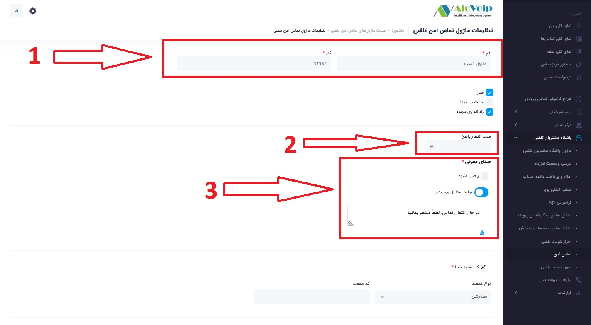
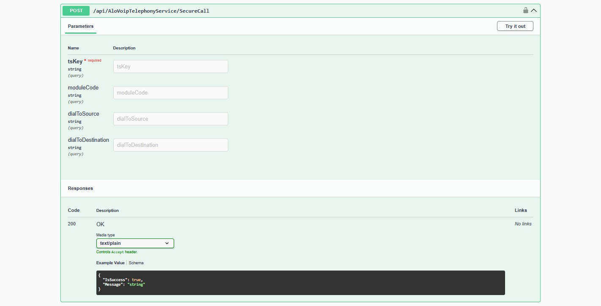

# ماژول تماس امن

- [نحوه راه اندازی ماژول تماس امن](#Installation-SecureCall)

در صورتی که تمایل دارید تماس‌های بین کارشناس و مشتری **بدون افشای شماره تلفن شخصی یکدیگر** برقرار شود و تمامی مکالمات صرفاً از طریق خطوط رسمی سازمان انجام گیرد — به‌گونه‌ای که هر دو طرف تنها **شماره شرکت** را در دفترچه تلفن یا تاریخچه تماس دستگاه خود مشاهده کنند — می‌توانید از **ماژول تماس امن** استفاده نمایید.

این ماژول با حفظ کامل حریم خصوصی شماره‌های شخصی کارشناسان و مشتریان، امکان برقراری ارتباط تلفنی حرفه‌ای و امن را فراهم می‌آورد.

## نحوه راه اندازی ماژول تماس امن {#Installation-SecureCall}

برای راه اندازی ماژول تماس امن ابتدا نیاز است که داخل الوویپ یک ماژول راه اندازی کنید 
و مقادیر زیر را پر کنید  
برای ساختن ماژول تماس امن نیاز از است که نام ماژول و کد ماژول را طبق تصویر زیر وارد کنیم 
سپس زمان انتظار برای پاسخ دهی اولیه تماس را طبق زمان مورد نظرتان وارد میکنید که به صورت پیشفرض 30 ثانیه میباشد 
سپس متن صدای معرفی را وارد میکنیم یا میتوانیم از فایل صورتی موردظرتان استفاده کنید 

سپس پس از تکیمل موارد وارد Swagger میشوید 

و مقادیر زیر را پر میکنید  

- **tsKey** = به صورت پیشفرض تنظیم شده **ID**  
- **ModuleCode** = کد ماژول که در پنل ساخته اید اینجا وارد میکنید  
- **DialtoSource** = شماره مبدا که تماس اول  گرفته شود 
- **DialtoDestination** = شماره مقصد که تماس دوم گرفته میشود 