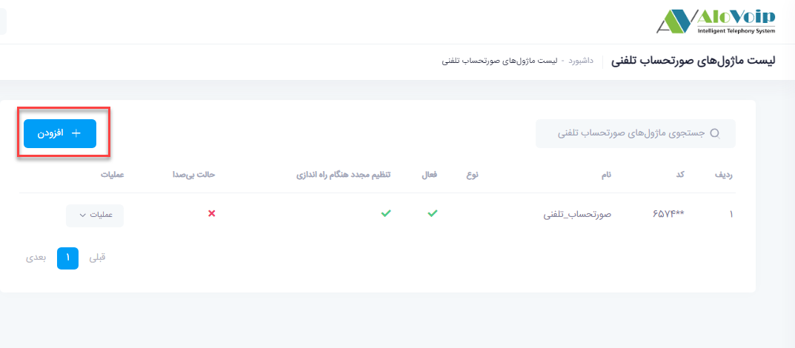
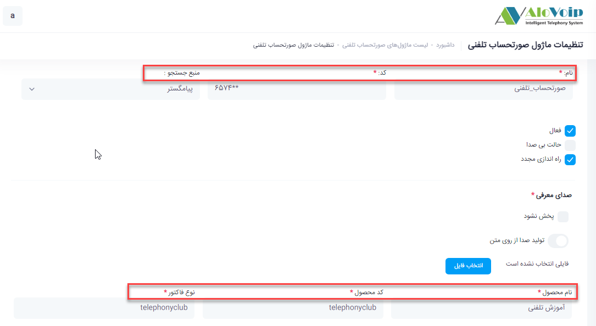
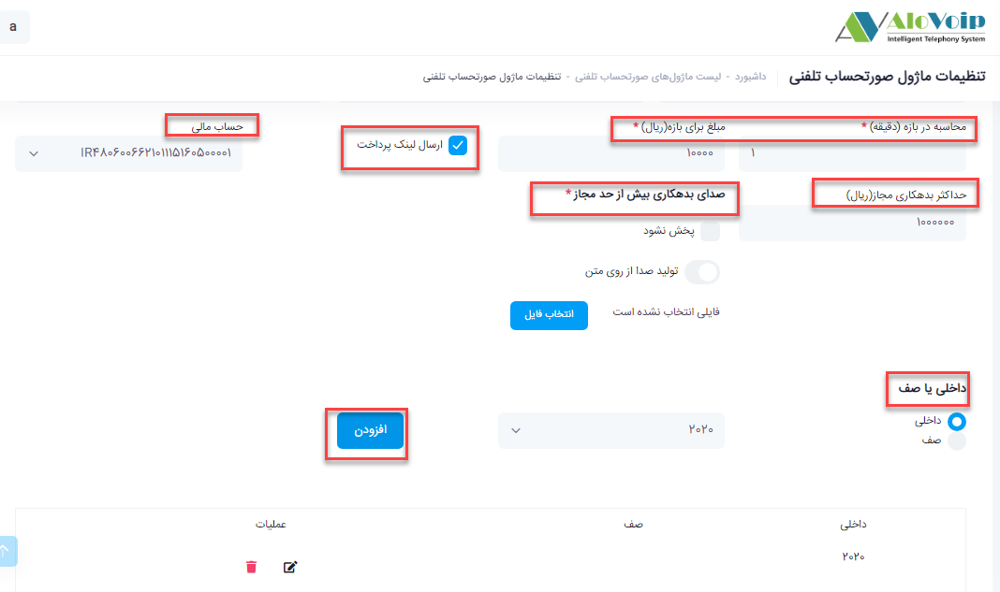
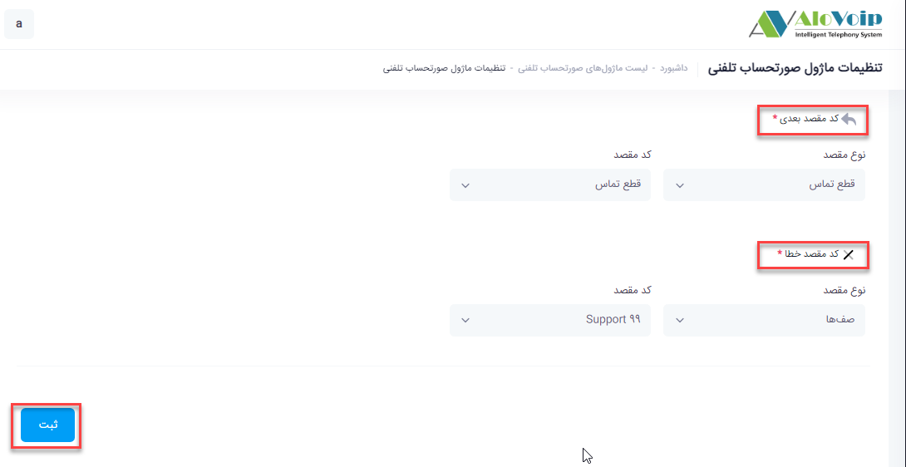

# صورت حساب تلفنی

در این بخش به موضوعات زیر می‌پردازیم:
- [هدف از ماژول  صورت حساب تلفنی ](#PurposeOfTheTelephoneBillModule)
- [تنظیمات  ماژول صورت حساب تلفنی در پنل الوویپ](#SettingsOfTheTelephoneBillModule)

## هدف از ماژول  صورت حساب تلفنی{#PurposeOfTheTelephoneBillModule}
با استفاده از این ماژول سازمان شما می‌تواند  بر اساس مدت زمان مکالمه با مشتریان خود قرارداد داشته باشد.بدین صورت که وقتی تماس وارد صف می‌شود بر اساس مدت زمان  مکالمه ایی که دارد می‌توانید هزینه دریافت کنید و حتی برای مشتری فاکتور صادر کنید.

## تنظیمات  ماژول صورت حساب تلفنی{#SettingsOfTheTelephoneBillModule}
در پنل الوویپ در قسمت **باشگاه مشتریان تلفنی < صورت حساب تلفنی** را ا انتخاب کنید.در صفحه باز شده روی **افزودن** کلیک کنید.

- یک **نام** و یک **کد** منحصر به فرد وارد کنید.
- **منبع جستجو** را crm پیامگستر انتخاب کنید.
- **نام محصول، کد محصول و نوع فاکتور** را بر اساس مقادیری که در پیامگستر تعریف شده وارد کنید.

- در قسمت **محاسبه بر بازه(دقیقه)**، مشخص می‌کنید به ازای هر چند دقیقه مبلغ برای مشتری محاسبه شود.
- مبلغ مورد نظر بر اساس مدت زمان مکالمه ایی که در قسمت قبل مشخص کردید را در قسمت **مبلغ برای بازه( ریال )** وارد کنید.
- با انتخاب **ارسال لینک پرداخت**، یک لینک برای پرداخت مبلغ تعیین شده برای مشتری ارسال می‌شود.
- **حساب مالی** 
می‌تواند یکی از شماره حساب های ثبت شده در crm پیامگستر باشد.
- در قسمت حداکثر بدهکاری مجاز(ریال)، می‌توانید مبلغی را به عنوان حداکثر بدهی برای مشتری تعریف کنید. همچنین در قسمت **صدای بدهکاری بیش از حد مجاز**  با انتخاب صدا از روی متن یا آپلود صدا می‌توان  مبلغ بدهی  به مشتری اعلام شود .
- **داخلی یا صف** 
در این قسمت مشخص می‌کنید که بعد از بررسی ماژول، تماس به کدام داخلی یا صف هدایت شود که با انتخاب داخلی و یا صف مدنظر و انتخاب دکمه **افزودن** این کار انجام می‌شود.

- **کد مقصد بعدی** 
در این قسمت می‌توانید مشخص کنید بعد از ارتباط با داخلی یا صف مربوطه و اتمام مکالمه تماس به کدام بخش هدایت شود.
- **کد مقصد خطا** 
اگر به هر دلیلی تماس به این ماژول متصل نشد می‌توانید در این قسمت مشخص کنید تماس به کدام مقصد هدایت شود.
- بعد از اتمام تنظیمات بر روی دکمه **ثبت** کلیک کنید.

