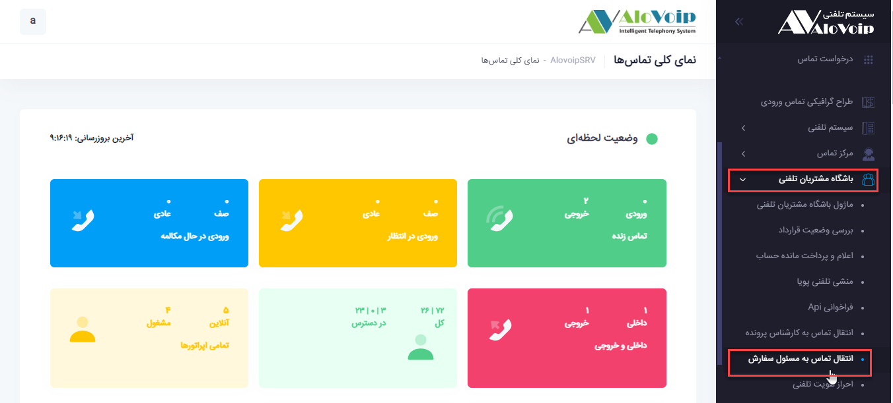

# انتقال تماس به مسئول سفارش

در این بخش به موضوعات زیر می‌پردازیم:

•	[هدف از انتقال تماس به مسئول سفارش](#ThePurposeOfTransferringTheCallToThePersonInChargeOfTheOrder)

•	[تنظیمات  ماژول انتقال تماس به مسئول سفارش](#SettingsOfTheCallForwardingModuleTOTheOrderManager)

## هدف از انتقال تماس به کارشناس سفارش{#ThePurposeOfTransferringTheCallToThePersonInChargeOfTheOrder}
از طریق این ماژول با توجه به فرایندهای موجود در crm، تماس های ورودی به سازمان خود را می‌توانید مدیریت کنید. در واقع باید یک فرایند پیاده سازی شده باشد که این فرایند می‌تواند یک تیکت، پیش فاکتور، فرصت و... باشد.این فرایند در حین گردش کار در دست هر کارشناسی که باشد مشتری زمانی که تماس می‌گیرد به همان کارشناس مربوطه وصل می‌شود.

>>نکته
این ماژول برای پیاده سازی نیاز به فرایندسازی از طریق BPMS دارند در غیر این صورت از این ماژول نمی‌توانید استفاده کنید.
 

## تنظیمات  ماژول انتقال تماس به کارشناس سفارش{#SettingsOfTheCallForwardingModuleTOTheOrderManager}
در پنل الویپ در قسمت **باشگاه مشتریان تلفنی > انتقال تماس به مسئول سفارش** را انتخاب کنید.در پنجره باز شده روی **افزودن** کلیک کنید.

•	در صفحه باز شده یک **نام** و یک **کد** منحصر به فرد انتخاب کنید.

•	**منبع جستجو** را crm خود انتخاب کنید.

•	**کد نوع قرارداد**
با توجه به نوع فرایند که در عکس زیر مشاهده می‌کنید کد قرارداد خود را وارد کنید.این فرایند می‌‌تواند شامل مدیریت فاکتورها، مدیریت درخواست ها و... باشد. در این قسمت توضیحات مربوط به فرایند تیکت ارائه می‌شود.

•	**کد مقصد خطا**
اگر به هر دلیلی تماس گیرنده نتوانست به مسئول فرایند خود وصل شود در این قسمت مشخص می‌کنید تماس به کدام بخش هدایت شود.
