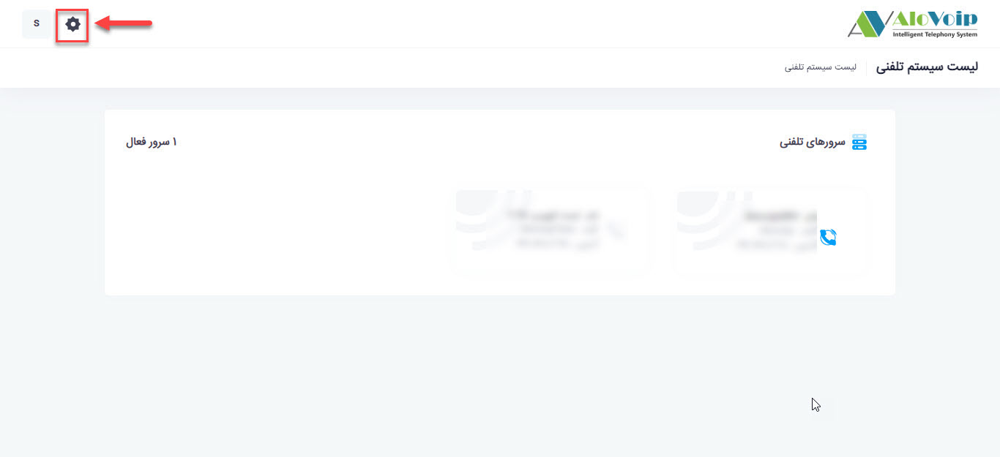

# نحوه تعیین داخلی هر اپراتور
برای تعیین داخلی هر اپراتور پس از ایجاد یک اپراتور جدید در صفحه ورود به پنل بر روی علامت تنظیمات در قسمت بالای صفحه گوشه سمت چپ کلیک می کنیم. 
<!--- link ایجاد یک اپراتور جدید --->

در صفحه باز شده بر روی مدیریت اپراتورها کلیک میکنیم  و میتوانیم اپراتور مورد نظر خود را با استفاده از فیلتر جستجوی اپراتورها پیدا کنیم و سپس گزینه عملیات را نتخاب کرده و بر روی مدیریت دسترسی به داخلی ها کلیک میکنیم. 

در صفحه باز شده تمامی داخلی های ساخته شده و دپارتمان های آنها موجود می باشد و فقط کافیست که شما برای اپراتور مورد نظر خود را در دپارتمانی که در آن مشغول بکار است یک یا چند داخلی را انتخاب کرده و بر روی گزینه ثبت کلیک کنید.

